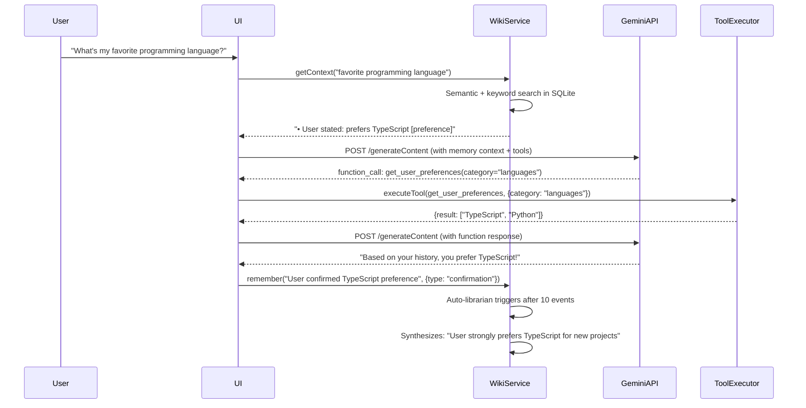

# 🚀 ScopeLab: Client-Side LLM Tool Playground with Memory

Perfect! Here's a complete implementation plan for **ScopeLab** — a GitHub Pages-hosted PWA that uses `@equationalapplications/core-llm-tools` for scoped tools + `@equationalapplications/core-llm-wiki` for client-side memory, all running in-browser with **zero backend**.

---

## 📦 Tech Stack Overview

| Layer | Technology | Why |
|-------|-----------|-----|
| **Framework** | Vite + React + TypeScript | Fast builds, great PWA plugin, TypeScript safety |
| **PWA** | `vite-plugin-pwa` | Service worker, offline support, installable |
| **Database** | `sql.js` (WASM SQLite) | Full SQLite in browser, zero backend [[17]] |
| **Memory** | `@equationalapplications/core-llm-wiki` | Episodic facts, semantic search, hybrid retrieval |
| **Tools** | `@equationalapplications/core-llm-tools` | Strict Gemini schemas + capability scopes |
| **LLM** | Direct Gemini API fetch | User brings their own key, calls go straight from browser |
| **Storage** | `localStorage` + `IndexedDB` | API key, preferences, sql.js DB file persistence |

---

## 🗂️ Project Structure

```
scopelab/
├── public/
│   ├── manifest.json          # PWA manifest
│   ├── icons/                 # App icons (192x192, 512x512)
│   └── wasm/                  # sql.js WASM files (auto-copied)
├── src/
│   ├── components/
│   │   ├── Layout/
│   │   │   ├── AppShell.tsx
│   │   │   └── OfflineBanner.tsx
│   │   ├── Chat/
│   │   │   ├── ChatInterface.tsx
│   │   │   ├── MessageList.tsx
│   │   │   └── InputArea.tsx
│   │   ├── Tools/
│   │   │   ├── ScopeToggle.tsx      # Checkbox UI for capability scopes
│   │   │   ├── ToolEditor.tsx       # JSON/YAML manifest editor
│   │   │   └── SchemaPreview.tsx    # Live view of filtered schema array
│   │   ├── Memory/
│   │   │   ├── MemoryPanel.tsx      # View/edit stored facts
│   │   │   └── MemoryStats.tsx      # Fact count, last accessed, etc.
│   │   └── Settings/
│   │       ├── ApiKeyModal.tsx      # Secure key entry (localStorage)
│   │       └── ExportImport.tsx     # Backup/restore tools + memory
│   ├── lib/
│   │   ├── database/
│   │   │   ├── sqljs-adapter.ts     # SQLiteAdapter impl for sql.js [[1]]
│   │   │   └── wiki-init.ts         # WikiMemory setup + migrations
│   │   ├── llm/
│   │   │   ├── gemini-client.ts     # Direct fetch() to Gemini API
│   │   │   ├── tool-executor.ts     # Client-side tool implementations
│   │   │   └── function-caller.ts   # Orchestrates LLM → tool → response loop
│   │   ├── memory/
│   │   │   ├── wiki-service.ts      # Wrapper around WikiMemory for chat
│   │   │   └── context-builder.ts   # Injects relevant facts into prompt
│   │   ├── tools/
│   │   │   ├── registry.ts          # Pre-built AgentToolManifests
│   │   │   └── scope-filter.ts      # buildAuthorizedSchemaArray wrapper
│   │   ├── storage/
│   │   │   ├── key-manager.ts       # localStorage API key + encryption opt-in
│   │   │   └── db-persister.ts      # Save/load sql.js DB to IndexedDB
│   │   └── utils/
│   │       ├── embed.ts             # Client-side embedding (optional fallback)
│   │       └── safe-eval.ts         # Sandboxed math/code execution
│   ├── hooks/
│   │   ├── useWikiMemory.ts         # React hook for WikiMemory state
│   │   ├── useGeminiChat.ts         # Chat loop with function calling
│   │   └── usePWAInstall.ts         # Detect + prompt for install
│   ├── App.tsx
│   ├── main.tsx
│   └── vite-env.d.ts
├── index.html
├── vite.config.ts          # +vite-plugin-pwa + wasm config
├── package.json
└── .github/workflows/deploy.yml  # Auto-deploy to gh-pages
```

---

## 🔧 Key Implementation Files

### 1. `src/lib/database/sqljs-adapter.ts` — Browser SQLite Adapter
```typescript
import initSqlJs, { Database } from 'sql.js';

// SQLiteAdapter interface is defined locally in sqljs-adapter.ts
export interface SQLiteAdapter {
  execAsync(sql: string): Promise<void>;
  runAsync(sql: string, params?: unknown[]): Promise<{ changes: number; lastInsertRowId: number }>;
  getAllAsync<T>(sql: string, params?: unknown[]): Promise<T[]>;
  getFirstAsync<T>(sql: string, params?: unknown[]): Promise<T | null>;
  withTransactionAsync<T>(fn: () => Promise<T>): Promise<T>;
  closeAsync(): Promise<void>;
}

export class SqlJsAdapter implements SQLiteAdapter {
  private db: Database;

  constructor(db: Database) {
    this.db = db;
  }

  static async create(): Promise<SqlJsAdapter> {
    const SQL = await initSqlJs({ 
      locateFile: (file) => `/sql-wasm.wasm` // Copied to public/ at build time
    });
    // Try load from IndexedDB, or create new
    const db = new SQL.Database(); // Or load persisted bytes
    return new SqlJsAdapter(db);
  }
    // Try load from IndexedDB, or create new
    const db = new SQL.Database(); // Or load persisted bytes
    return new SqlJsAdapter(db);
  }

  async execAsync(sql: string): Promise<void> {
    this.db.run(sql);
  }

  async runAsync(sql: string, params: unknown[] = []): Promise<{ changes: number; lastInsertRowId: number }> {
    const stmt = this.db.prepare(sql);
    stmt.bind(params as any[]);
    stmt.step();
    stmt.free();
    // sql.js doesn't expose lastInsertRowId; WikiMemory uses internal IDs
    return { changes: this.db.getRowsModified(), lastInsertRowId: 0 };
  }

  async getAllAsync<T>(sql: string, params: unknown[] = []): Promise<T[]> {
    const stmt = this.db.prepare(sql);
    stmt.bind(params as any[]);
    const rows: T[] = [];
    while (stmt.step()) rows.push(stmt.getAsObject() as T);
    stmt.free();
    return rows;
  }

  async getFirstAsync<T>(sql: string, params: unknown[] = []): Promise<T | null> {
    const stmt = this.db.prepare(sql);
    stmt.bind(params as any[]);
    const row = stmt.step() ? stmt.getAsObject() as T : null;
    stmt.free();
    return row;
  }

  async withTransactionAsync<T>(fn: () => Promise<T>): Promise<T> {
    this.db.run('BEGIN');
    try {
      const result = await fn();
      this.db.run('COMMIT');
      return result;
    } catch (e) {
      this.db.run('ROLLBACK');
      throw e;
    }
  }

  async closeAsync(): Promise<void> {
    this.db.close();
  }

  // Export for persistence to IndexedDB
  export(): Uint8Array {
    return this.db.export();
  }

  // Import from IndexedDB
  import(bytes: Uint8Array): void {
    this.db = new (this.db.constructor as any)(bytes);
  }
}
```

### 2. `src/lib/memory/wiki-service.ts` — Memory Layer for Chat
```typescript
import { WikiMemory } from '@equationalapplications/core-llm-wiki';
import type { SQLiteAdapter } from '../database/sqljs-adapter';
import { SqlJsAdapter } from '../database/sqljs-adapter';

export class WikiService {
  private wiki: WikiMemory;
  private readonly entityId = 'scopelab-user'; // Single-user for now

  constructor(adapter: SQLiteAdapter) {
    this.wiki = new WikiMemory(adapter, {
      llmProvider: {
        // Optional: use Gemini's embedding API for semantic search
        // Or leave undefined to use keyword-only fallback
        embed: async (text: string) => {
          const key = localStorage.getItem('gemini_api_key');
          if (!key) return null;
          const res = await fetch(
            `https://generativelanguage.googleapis.com/v1beta/models/text-embedding-004:embedContent?key=${key}`,
            {
              method: 'POST',
              headers: { 'Content-Type': 'application/json' },
              body: JSON.stringify({ content: { parts: [{ text }] } }),
            }
          );
          const data = await res.json();
          return data.embedding?.values as number[] | null;
        },
      },
      config: {
        // Auto-maintain memory after N events
        autoLibrarianThreshold: 10,
        autoHealThreshold: 50,
        // Hybrid retrieval: 70% semantic, 30% keyword
        hybridWeight: 0.7,
        preFilterLimit: 50, // Optimize cosine scoring
      },
    });
  }

  async init(): Promise<void> {
    await this.wiki.setup(); // Creates tables + runs migrations
  }

  // Called after each user message to store context
  async remember(message: string, metadata?: Record<string, any>): Promise<void> {
    await this.wiki.write(this.entityId, {
      event_type: 'user_message',
      summary: message,
      metadata,
    });
    // Auto-trigger librarian if threshold hit
  }

  // Retrieve relevant context before sending to LLM
  async getContext(query: string, maxFacts = 5): Promise<string> {
    const memory = await this.wiki.read(this.entityId, query, {
      maxResults: maxFacts,
      hybridWeight: 0.7,
    });

    // Format facts as natural language context
    const contextParts = memory.facts.map(f => 
      `• ${f.title}: ${f.body}${f.tags?.length ? ` [${f.tags.join(', ')}]` : ''}`
    );
    
    return contextParts.length 
      ? `Relevant memory:\n${contextParts.join('\n')}\n\n`
      : '';
  }

  // Expose facts for UI display
  async listFacts(limit = 20) {
    const memory = await this.wiki.read(this.entityId, '', { maxResults: limit });
    return memory.facts;
  }

  // Persist DB to IndexedDB for reloads
  async persist(adapter: SqlJsAdapter): Promise<void> {
    const bytes = adapter.export();
    // Save to IndexedDB via idb library
    // Implementation in src/lib/storage/db-persister.ts
  }
}
```

### 3. `src/lib/llm/function-caller.ts` — The Chat Loop
```typescript
import { buildAuthorizedSchemaArray } from '@equationalapplications/core-llm-tools';
import type { AgentToolManifest } from '@equationalapplications/core-llm-tools';
import { WikiService } from '../memory/wiki-service';
import { executeTool } from './tool-executor';

export async function chatWithMemory({
  userMessage,
  tools,
  enabledScopes,
  apiKey,
  wiki,
  history = [],
}: {
  userMessage: string;
  tools: AgentToolManifest[];
  enabledScopes: string[];
  apiKey: string;
  wiki: WikiService;
  history: Array<{ role: string; content: string }>;
}): Promise<{ response: string; toolCalls?: any[] }> {
  // 1. Store user message in memory
  await wiki.remember(userMessage, { timestamp: Date.now() });

  // 2. Retrieve relevant context from memory
  const memoryContext = await wiki.getContext(userMessage);

  // 3. Build authorized tool schemas (only enabled scopes visible to LLM)
  const toolSchemas = buildAuthorizedSchemaArray(tools, enabledScopes);

  // 4. Construct prompt with memory context
  const systemPrompt = `You are a helpful assistant with access to tools.
${memoryContext ? `\n${memoryContext}` : ''}
When you need to use a tool, respond with a function_call.
Only use tools whose scopes are enabled.`;

  const messages = [
    { role: 'system', content: systemPrompt },
    ...history,
    { role: 'user', content: userMessage },
  ];

  // 5. Call Gemini with function calling
  const response = await fetch(
    `https://generativelanguage.googleapis.com/v1beta/models/gemini-2.0-flash:generateContent?key=${apiKey}`,
    {
      method: 'POST',
      headers: { 'Content-Type': 'application/json' },
      body: JSON.stringify({
        contents: messages.map(m => ({ 
          role: m.role === 'system' ? 'user' : m.role, 
          parts: [{ text: m.content }] 
        })),
        tools: toolSchemas.length ? [{ functionDeclarations: toolSchemas }] : undefined,
        tool_config: { function_calling_config: { mode: 'AUTO' } },
      }),
    }
  );

  const data = await response.json();
  const candidate = data.candidates?.[0];
  
  // 6. Handle function calls
  if (candidate?.content?.parts?.[0]?.functionCall) {
    const fnCall = candidate.content.parts[0].functionCall;
    const tool = tools.find(t => t.name === fnCall.name && enabledScopes.includes(t.scope));
    
    if (tool) {
      // Execute tool client-side
      const result = await executeTool(tool, fnCall.args);
      
      // 7. Send result back to LLM for final response
      const followup = await fetch(
        `https://generativelanguage.googleapis.com/v1beta/models/gemini-2.0-flash:generateContent?key=${apiKey}`,
        {
          method: 'POST',
          headers: { 'Content-Type': 'application/json' },
          body: JSON.stringify({
            contents: [
              ...messages.map(m => ({ 
                role: m.role === 'system' ? 'user' : m.role, 
                parts: [{ text: m.content }] 
              })),
              { role: 'model', parts: [{ functionCall: fnCall }] },
              { role: 'function', parts: [{ functionResponse: { name: fnCall.name, response: { result } } }] },
            ],
          }),
        }
      );
      const finalData = await followup.json();
      const finalText = finalData.candidates?.[0]?.content?.parts?.[0]?.text || 'Tool executed.';
      
      // 8. Store the interaction in memory
      await wiki.remember(`Tool call: ${fnCall.name}(${JSON.stringify(fnCall.args)}) → ${JSON.stringify(result).slice(0, 200)}`, {
        type: 'tool_execution',
        tool: fnCall.name,
      });
      
      return { response: finalText, toolCalls: [{ name: fnCall.name, args: fnCall.args, result }] };
    }
  }

  // Plain text response
  const text = candidate?.content?.parts?.[0]?.text || 'No response.';
  
  // Store assistant response in memory
  await wiki.remember(`Assistant: ${text.slice(0, 500)}`, { type: 'assistant_response' });
  
  return { response: text };
}
```

### 4. `src/components/Tools/ScopeToggle.tsx` — User Controls AI Permissions
```tsx
import { useState } from 'react';
import type { AgentToolManifest } from '@equationalapplications/core-llm-tools';

interface ScopeToggleProps {
  tools: AgentToolManifest[];
  enabledScopes: string[];
  onToggle: (scopes: string[]) => void;
}

export function ScopeToggle({ tools, enabledScopes, onToggle }: ScopeToggleProps) {
  const [localScopes, setLocalScopes] = useState(new Set(enabledScopes));

  const toggleScope = (scope: string) => {
    const next = new Set(localScopes);
    if (next.has(scope)) next.delete(scope);
    else next.add(scope);
    setLocalScopes(next);
    onToggle(Array.from(next));
  };

  // Group tools by scope category
  const scopesByCategory = tools.reduce((acc, tool) => {
    const [category] = tool.scope.split(':');
    if (!acc[category]) acc[category] = new Set<string>();
    acc[category].add(tool.scope);
    return acc;
  }, {} as Record<string, Set<string>>);

  return (
    <div className="space-y-4 p-4 bg-gray-50 rounded-lg">
      <h3 className="font-semibold text-gray-800">🔐 Capability Scopes</h3>
      <p className="text-sm text-gray-600">
        Toggle which abilities the AI can access. Changes apply immediately.
      </p>
      
      {Object.entries(scopesByCategory).map(([category, scopes]) => (
        <div key={category} className="space-y-2">
          <h4 className="text-sm font-medium text-gray-700 capitalize">{category}</h4>
          <div className="flex flex-wrap gap-2">
            {Array.from(scopes).map(scope => (
              <label key={scope} className="flex items-center gap-2 text-sm">
                <input
                  type="checkbox"
                  checked={localScopes.has(scope)}
                  onChange={() => toggleScope(scope)}
                  className="rounded border-gray-300 text-indigo-600 focus:ring-indigo-500"
                />
                <span className={localScopes.has(scope) ? 'text-gray-900' : 'text-gray-400'}>
                  {scope}
                </span>
              </label>
            ))}
          </div>
        </div>
      ))}
      
      <div className="pt-2 border-t">
        <button
          onClick={() => {
            const all = tools.map(t => t.scope);
            setLocalScopes(new Set(all));
            onToggle(all);
          }}
          className="text-xs text-indigo-600 hover:text-indigo-800 mr-4"
        >
          Enable all
        </button>
        <button
          onClick={() => {
            setLocalScopes(new Set());
            onToggle([]);
          }}
          className="text-xs text-gray-500 hover:text-gray-700"
        >
          Disable all
        </button>
      </div>
    </div>
  );
}
```

### 5. `vite.config.ts` — PWA + WASM Setup
```typescript
import { defineConfig } from 'vite';
import react from '@vitejs/plugin-react';
import { VitePWA } from 'vite-plugin-pwa';

export default defineConfig({
  base: '/scopelab/', // GitHub Pages repo name
  plugins: [
    react(),
    VitePWA({
      registerType: 'autoUpdate',
      includeAssets: ['favicon.ico', 'wasm/*.wasm'],
      manifest: {
        name: 'ScopeLab',
        short_name: 'ScopeLab',
        description: 'Client-side LLM tool playground with memory',
        theme_color: '#1e293b',
        background_color: '#0f172a',
        display: 'standalone',
        icons: [
          { src: '/icons/icon-192x192.png', sizes: '192x192', type: 'image/png' },
          { src: '/icons/icon-512x512.png', sizes: '512x512', type: 'image/png' },
        ],
      },
      workbox: {
        // Cache WASM files aggressively
        runtimeCaching: [
          {
            urlPattern: /\.wasm$/,
            handler: 'CacheFirst',
            options: { cacheName: 'wasm-cache', expiration: { maxEntries: 10 } },
          },
        ],
      },
    }),
  ],
  // Configure sql.js WASM loading
  optimizeDeps: {
    exclude: ['sql.js'],
  },
  build: {
    rollupOptions: {
      output: {
        manualChunks: {
          'sql-wasm': ['sql.js/dist/sql-wasm.js'],
        },
      },
    },
  },
});
```

---

## 🔄 Memory Learning Flow



---

## 🚀 Deployment to GitHub Pages

### 1. `package.json` Scripts
```json
{
  "scripts": {
    "dev": "vite",
    "build": "tsc && vite build",
    "preview": "vite preview",
    "deploy": "npm run build && gh-pages -d dist"
  },
  "devDependencies": {
    "gh-pages": "^6.1.1"
  }
}
```

### 2. `.github/workflows/deploy.yml`
```yaml
name: Deploy to GitHub Pages

on:
  push:
    branches: [main]
  workflow_dispatch:

permissions:
  contents: read
  pages: write
  id-token: write

jobs:
  deploy:
    runs-on: ubuntu-latest
    environment:
      name: github-pages
      url: ${{ steps.deployment.outputs.page_url }}
    steps:
      - uses: actions/checkout@v4
      - uses: actions/setup-node@v4
        with: { node-version: 20, cache: 'npm' }
      - run: npm ci
      - run: npm run build
      - uses: actions/configure-pages@v4
      - uses: actions/upload-pages-artifact@v3
        with: { path: './dist' }
      - id: deployment
        uses: actions/deploy-pages@v4
```

### 3. Post-Deploy Setup
```bash
# One-time setup
npm install -D gh-pages
npx gh-pages-init  # Follow prompts to create gh-pages branch

# Deploy manually if needed
npm run deploy
```

Your app will be live at: `https://<username>.github.io/scopelab/` ✨

---

## 🔐 Security Checklist for "Bring Your Own Key"

> **⚠️ CRITICAL: Never store secrets client-side.** XOR + base64 obfuscation (using `passphrase`, `btoa`/`atob`, XOR `String.fromCharCode` on the key, etc.) is **not encryption** — it can be trivially reversed by anyone with browser access. The browser's developer tools, extensions, and any script on the page can read localStorage.
>
> **Secure alternatives:**
> - Use **short-lived tokens** or **OAuth flows** that never expose the raw key to client code
> - Store secrets in a **server-side key management service / vault** and fetch them via an authenticated, rate-limited endpoint
> - For BYOK (Bring Your Own Key) patterns, ask the user to type the key each session and **never persist it**
> - If persistence is required, use the **Web Crypto API** with a user-provided passphrase (`crypto.subtle.encrypt`) — this is still client-side but cryptographically sound

```typescript
// src/lib/storage/key-manager.ts
export const KeyManager = {
  save: (key: string) => {
    // Store the raw key for the current session
    sessionStorage.setItem('gemini_api_key', key);
  },
  
  get: (): string | null => {
    return sessionStorage.getItem('gemini_api_key');
  },
  
  // Clear all key storage
  clear: () => {
    sessionStorage.removeItem('gemini_api_key');
    localStorage.removeItem('gemini_key_hint');
  },
};
```

**UI Warnings to Display:**
```tsx
<div className="bg-amber-50 border-l-4 border-amber-400 p-4 text-sm">
  <p className="font-medium text-amber-800">⚠️ Key Storage Notice</p>
  <ul className="list-disc ml-5 mt-1 text-amber-700">
    <li>Your API key is stored only in your browser's localStorage</li>
    <li>Never share screenshots showing your key or this page</li>
    <li>Use a restricted Gemini API key (limit referrers in Google Cloud Console)</li>
    <li>Click "Clear Key" to remove it from this device</li>
  </ul>
</div>
```

---

## 🎁 Starter Repo Template

I can generate a minimal working starter for you! Would you like me to:

1. **Create a GitHub-ready repo scaffold** with all the files above pre-configured?
2. **Focus on one component first** (e.g., just the chat + memory loop) to iterate faster?
3. **Search for a sql.js + Vite example** to accelerate the WASM setup?

Also: Do you want the memory to use **semantic search** (requires calling Gemini's embedding API) or start with **keyword-only** (fully offline, zero API calls beyond chat)?

Let me know your preference and I'll generate the starter code! 🛠️✨