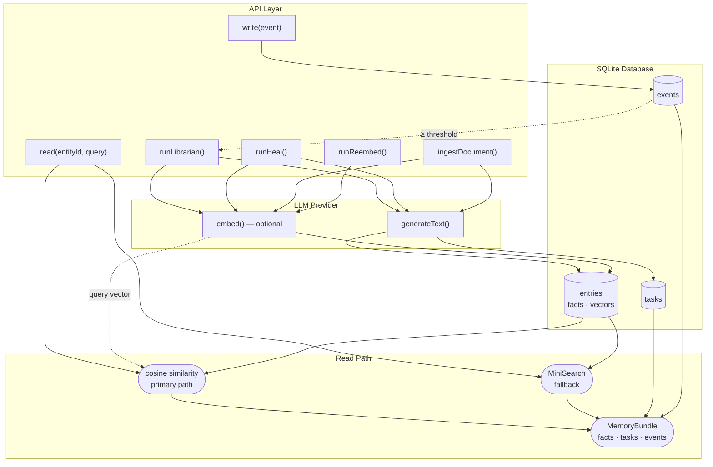
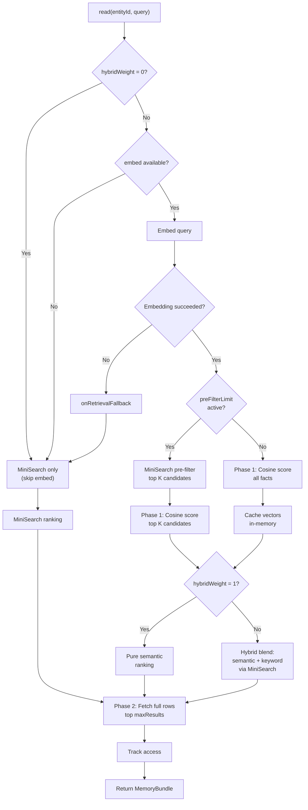
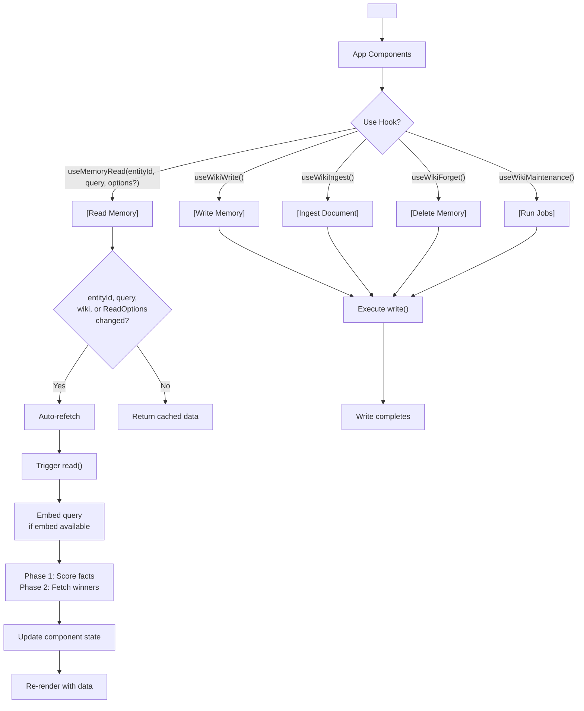

# expo-llm-wiki

[](https://github.com/equationalapplications/expo-llm-wiki/tags)
[](https://www.typescriptlang.org/)
[](LICENSE)

[](https://www.npmjs.com/package/@equationalapplications/expo-llm-wiki) [](https://www.npmjs.com/package/@equationalapplications/expo-llm-wiki) [](https://bundlephobia.com/package/@equationalapplications/expo-llm-wiki)<br>
[](https://www.npmjs.com/package/@equationalapplications/react-llm-wiki) [](https://www.npmjs.com/package/@equationalapplications/react-llm-wiki) [](https://bundlephobia.com/package/@equationalapplications/react-llm-wiki)<br>
[](https://www.npmjs.com/package/@equationalapplications/core-llm-wiki) [](https://www.npmjs.com/package/@equationalapplications/core-llm-wiki) [](https://bundlephobia.com/package/@equationalapplications/core-llm-wiki)

## Persistent, episodic memory for AI Agents.

expo-llm-wiki is a cross-platform TypeScript and SQLite library for long-term LLM memory. It bridges the gap between raw conversation logs and a structured knowledge base, supporting background fact extraction, semantic embedding search, and memory pruning.

> Inspired by [Andrej Karpathy's LLM Wiki memory spec](https://gist.github.com/karpathy/442a6bf555914893e9891c11519de94f).

- **Universal Support:** Expo • React • Vite • Vue • Svelte • Node.js
- **Core Engine:** Pure TypeScript logic with platform-specific adapters.

## Key Principles

- **Bring Your Own Inference (BYOI):** Provide one `generateText` function. The package owns prompt construction, JSON parsing, and database writes.
- **Namespace Safe:** All tables are prefixed (default: `llm_wiki_`) — no collisions with your existing database.
- **Multi-Entity:** Multiple independent "brains" in one database via `entityId`.
- **Semantic Retrieval:** Supply an optional `embed()` function on `LLMProvider` to rank facts by vector cosine similarity. Falls back to MiniSearch keyword search when `embed` is absent or offline.
- **Offline First:** The MiniSearch fallback runs entirely in-process with no network required. The cosine similarity path requires `embed()` to vectorise the query (typically a cloud API call) but falls back to MiniSearch automatically when offline or when `embed` throws.
- **Full Unicode Support:** UTF-8 and UTF-16 (including surrogate pairs for emoji) are fully supported. Chunks are split safely at sentence boundaries; surrogate pairs are never fragmented.
- **Cross-Platform:** Choose the right package for your platform: Expo, React Native, React web, vanilla JS, or Node.js. The core logic is framework-agnostic with platform-specific adapters.

## How It Works



## Monorepo Packages

`expo-llm-wiki` is organized as a monorepo with three packages, each optimized for different platforms:

| Package | Platform | SQLite Adapter | Size | Dependencies |
|---------|----------|---|---|---|
| **`@equationalapplications/core-llm-wiki`** | Node.js, any platform | User-provided (e.g., `better-sqlite3`) | Smallest | `minisearch` |
| **`@equationalapplications/expo-llm-wiki`** | Expo, React Native | `expo-sqlite` (built-in) | Minimal | `expo-sqlite` (peer) |
| **`@equationalapplications/react-llm-wiki`** | Web (React) | User-provided (e.g., `sql.js`) | Small | `react` (peer) |

**Choose your package:**
- **Expo/React Native app?** → `@equationalapplications/expo-llm-wiki`
- **React web app (CRA, Vite + React, Next.js client)?** → `@equationalapplications/react-llm-wiki` + `sql.js`
- **Vanilla JS or non-React framework?** → `@equationalapplications/core-llm-wiki` + `sql.js`
- **Node.js backend?** → `@equationalapplications/core-llm-wiki` + `better-sqlite3`

All packages share the same core API and database schema. The core library is **framework-agnostic**; `@equationalapplications/expo-llm-wiki` injects the Expo adapter, while `@equationalapplications/core-llm-wiki` and `@equationalapplications/react-llm-wiki` require your application to provide a SQLite adapter.

## Installation

Choose the package for your platform:

### Expo / React Native
```bash
npx expo install expo-sqlite
npm install @equationalapplications/expo-llm-wiki
```

### React Web (Vite, CRA, etc.)
```bash
npm install @equationalapplications/react-llm-wiki sql.js
```

### Vanilla JavaScript (any framework or plain HTML)
```bash
npm install @equationalapplications/core-llm-wiki sql.js
```

### Node.js Backend
```bash
npm install @equationalapplications/core-llm-wiki better-sqlite3
```

**Note:** Use `npx expo install` for `expo-sqlite` so Expo's version resolver picks the correct native build for your SDK version.

## Setup

### Expo / React Native

```typescript
import { createWiki } from '@equationalapplications/expo-llm-wiki';
import * as SQLite from 'expo-sqlite';

const db = await SQLite.openDatabaseAsync('my-app.db');

const wiki = createWiki(db, {
  llmProvider: {
    generateText: async ({ systemPrompt, userPrompt }) => {
      // Connect to OpenAI, Gemini, a local model, etc.
      // Must return a raw string (JSON, optionally in a markdown code fence).
      const response = await openai.chat.completions.create({
        model: 'gpt-4o-mini',
        messages: [
          { role: 'system', content: systemPrompt },
          { role: 'user', content: userPrompt },
        ],
      });
      return response.choices[0].message.content ?? '{}';
    },
    // Optional: supply embed() to enable cosine-similarity search.
    // Without it, read() falls back to MiniSearch keyword search.
    embed: async (text) => {
      const response = await openai.embeddings.create({
        model: 'text-embedding-3-small',
        input: text,
      });
      return response.data[0].embedding;
    },
  },
  // Optional: called when embedding-based retrieval is unavailable (e.g. embed() throws,
  // returns non-finite values, or dimension mismatch after a model switch) — use to show "offline" UI.
  onRetrievalFallback: (error) => console.warn('Embedding unavailable, using keyword search:', error),
  config: {
    tablePrefix: 'llm_wiki_',          // optional, default: 'llm_wiki_'
    maxResults: 10,                    // optional, default: 10
    autoLibrarianThreshold: 20,        // optional, default: 20 — events before librarian auto-runs
    autoHealThreshold: 100,            // optional, default: 100 — events before heal auto-runs
    maxChunkLength: 12000,             // optional, default: 12000 (char count per ingestDocument chunk)
    chunkOverlap: 400,                 // optional, default: 400 (overlap between chunks in characters)
    chunkConcurrency: 1,               // optional, default: 1 (parallel LLM calls per ingestDocument)
    pruneRetainSoftDeletedFor: 7,      // optional, default: 7  (days before hard-deleting soft-deleted facts)
    pruneEventsAfter: 30,              // optional, default: 30 (days before hard-deleting old events)
    orphanAfterDays: 30,               // optional, default: 30 (days before runHeal flags sourceless facts; null to disable)
    staleInferredAfterDays: 60,        // optional, default: 60 (days before runHeal downgrades inferred facts; null to disable)
    preFilterLimit: 50,                // optional, default: undefined — MiniSearch pre-filter before cosine scan; recommended for >500 facts
    hybridWeight: 0.7,                 // optional, default: undefined — blend semantic (1.0) ↔ keyword (0.0); pure semantic when unset
  },
});

// Create tables and indexes (call once on app startup)
await wiki.setup();
```

### React Web (Vite + React)

```typescript
import { createWiki } from '@equationalapplications/core-llm-wiki';
import initSqlJs from 'sql.js';

const SQL = await initSqlJs();
const sqlDb = new SQL.Database();

// Wrap sql.js behind the SQLiteAdapter interface required by @equationalapplications/core-llm-wiki
const adapter = {
  execAsync(sql) { sqlDb.exec(sql); return Promise.resolve(); },
  runAsync(sql, params = []) {
    sqlDb.run(sql, params);
    const changes = sqlDb.getRowsModified();
    const [[lastInsertRowId]] = sqlDb.exec('SELECT last_insert_rowid()')[0].values;
    return Promise.resolve({ changes, lastInsertRowId: Number(lastInsertRowId) });
  },
  getAllAsync(sql, params = []) {
    const stmt = sqlDb.prepare(sql); stmt.bind(params);
    const rows = []; while (stmt.step()) rows.push(stmt.getAsObject()); stmt.free();
    return Promise.resolve(rows);
  },
  getFirstAsync(sql, params = []) {
    const stmt = sqlDb.prepare(sql); stmt.bind(params);
    const row = stmt.step() ? stmt.getAsObject() : null; stmt.free();
    return Promise.resolve(row);
  },
  withTransactionAsync(fn) {
    sqlDb.run('BEGIN');
    return fn().then((r) => { sqlDb.run('COMMIT'); return r; }, (e) => { sqlDb.run('ROLLBACK'); throw e; });
  },
  closeAsync() { sqlDb.close(); return Promise.resolve(); },
};

const wiki = createWiki(adapter, {
  llmProvider: {
    generateText: async ({ systemPrompt, userPrompt }) => {
      // Connect to your LLM provider
      const response = await fetch('/api/generate', {
        method: 'POST',
        body: JSON.stringify({ systemPrompt, userPrompt }),
      });
      return response.text();
    },
  },
  config: {
    tablePrefix: 'llm_wiki_',
    // ... other options
  },
});

await wiki.setup();
```

### Vanilla JavaScript (any framework)

```typescript
import { createWiki } from '@equationalapplications/core-llm-wiki';
import initSqlJs from 'sql.js';

const SQL = await initSqlJs();
const sqlDb = new SQL.Database();

// Wrap sql.js behind the SQLiteAdapter interface — see React Web setup above for full adapter
const adapter = { /* sql.js adapter */ };

const wiki = createWiki(adapter, {
  llmProvider: {
    generateText: async ({ systemPrompt, userPrompt }) => {
      // Connect to your LLM provider
      const response = await fetch('/api/generate', {
        method: 'POST',
        body: JSON.stringify({ systemPrompt, userPrompt }),
      });
      return response.text();
    },
  },
});

await wiki.setup();

// Now use the core API
const bundle = await wiki.read('entity-123', 'query');
await wiki.write('entity-123', { event_type: 'observation', summary: '...' });
```

### Node.js Backend

```typescript
import { createWiki } from '@equationalapplications/core-llm-wiki';
import Database from 'better-sqlite3';

// Create a thin adapter wrapper
const db = new Database('memory.db');
const adapter = {
  execAsync: (sql) => { db.exec(sql); return Promise.resolve(); },
  getAllAsync: (sql, params) => Promise.resolve(db.prepare(sql).all(...(params || []))),
  getFirstAsync: (sql, params) => Promise.resolve(db.prepare(sql).get(...(params || [])) ?? null),
  runAsync: (sql, params) => {
    const info = db.prepare(sql).run(...(params || []));
    return Promise.resolve({ changes: info.changes, lastInsertRowId: Number(info.lastInsertRowid) });
  },
  withTransactionAsync: async (fn) => {
    db.exec('BEGIN');
    try {
      const result = await fn();
      db.exec('COMMIT');
      return result;
    } catch (error) {
      db.exec('ROLLBACK');
      throw error;
    }
  },
  closeAsync: () => { db.close(); return Promise.resolve(); },
};

const wiki = createWiki(adapter, {
  llmProvider: {
    generateText: async ({ systemPrompt, userPrompt }) => {
      // Connect to your LLM provider
      const response = await openai.chat.completions.create({
        model: 'gpt-4o-mini',
        messages: [
          { role: 'system', content: systemPrompt },
          { role: 'user', content: userPrompt },
        ],
      });
      return response.choices[0].message.content ?? '{}';
    },
  },
});

await wiki.setup();
```

## Core API

### Read

Semantic search over facts (cosine similarity if `embed` is provided, MiniSearch keyword fallback otherwise), plus open tasks and recent events:

```typescript
const { facts, tasks, events } = await wiki.read('entity-123', 'weekend plans');
// facts: WikiFact[]   — ranked by vector similarity, keyword relevance, or a blend (hybridWeight)
// tasks: WikiTask[]   — pending and in-progress only
// events: WikiEvent[] — 10 most recent, ascending

// Per-call overrides (e.g. for a search settings dashboard):
const overrideResult = await wiki.read('entity-123', 'weekend plans', {
  maxResults: 5,          // override WikiConfig.maxResults for this call
  preFilterLimit: 20,     // limit cosine candidates to top-20 keyword matches
  hybridWeight: 0.5,      // 50/50 semantic + keyword blend
  // preFilterLimit: null — explicitly disable a config-level preFilterLimit for this call
});
```

Pass an empty string to skip search and return the most recently updated facts.

### Write

Log an episodic event. Automatically triggers the librarian pass once enough events accumulate:

```typescript
await wiki.write('entity-123', {
  event_type: 'observation',
  summary: 'User mentioned they love hiking on weekends.',
});
// event_type: 'observation' | 'decision' | 'action' | 'outcome'
```

### Ingest Document

Extract facts from a document (chunked internally). Idempotent — re-calling with the same `sourceRef` replaces the prior extraction. Documents are automatically chunked at sentence boundaries; if a sentence exceeds `maxChunkLength`, it is hard-split.

```typescript
const result = await wiki.ingestDocument('entity-123', {
  // sourceRef is normalized: only [A-Za-z0-9._\- ] are kept, all other characters
  // (including `/`) are stripped. Use underscores or dots as path separators to
  // avoid accidental collisions (e.g. 'docs_preferences.md' not 'docs/preferences.md').
  sourceRef: 'preferences.md',        // stable identifier
  sourceHash: sha256(content),        // for change detection
  documentChunk: content,
  maxChunkLength: 12000,              // optional, character count
  chunkOverlap: 400,                  // optional, overlap in characters
  chunkConcurrency: 1,                // optional, parallel LLM calls per ingest (default: 1)
});
// result: { truncated: boolean; chunks: number }
// truncated: true if at least one hard-split was required (no sentence boundary)
// chunks: number of LLM calls made
```

### Background Maintenance

```typescript
// Consolidate recent events into durable facts (auto-triggered by write, or call manually)
await wiki.runLibrarian('entity-123');

// Resolve contradictions, downgrade stale claims, remove obsolete facts
await wiki.runHeal('entity-123');

// Backfill embeddings after adding embed() to LLMProvider, or after changing embedding models.
// Call with no args to reembed all entities, or pass an entityId to scope it.
const { embedded, skipped, failed } = await wiki.runReembed('entity-123');
```

### Format Context

Convert a `MemoryBundle` into a string ready for LLM prompt injection:

```typescript
// Import from the appropriate package for your platform
import { formatContext } from '@equationalapplications/core-llm-wiki';      // or @equationalapplications/expo-llm-wiki

const bundle = await wiki.read('entity-123', 'weekend plans');
const context = formatContext(bundle, {
  format: 'markdown',        // 'markdown' (default) | 'plain'
  maxFacts: 10,              // default 10
  maxTasks: 10,              // default 10
  maxEvents: 10,             // default 10
  includeConfidence: true,   // default true — appends (certain/inferred/tentative)
  includeTags: true,         // default true — appends [tag1, tag2]
  factWeights: {
    confidence: 1.0,         // default 1.0
    accessCount: 0.3,        // default 0.3 — log(1 + access_count) * weight
    recency: 0.5,            // default 0.5 — decays over 30d
  },
});

// Inject into your system prompt:
const systemPrompt = `You are a helpful assistant.\n\n${context}`;
```

Facts are ranked by a weighted score combining confidence tier, access frequency, and recency. Returns an empty string for an empty bundle.

### Forget

```typescript
const result = await wiki.forget('entity-123', { entryId: 'fact_abc' });    // single fact
// result: { deleted: { entries: number; tasks: number } }

await wiki.forget('entity-123', { taskId: 'task_xyz' });     // single task
// sourceRef is normalized the same way as in ingestDocument (slashes stripped)
await wiki.forget('entity-123', { sourceRef: 'x.md' }); // all facts from a document
await wiki.forget('entity-123', { clearAll: true });          // wipe entity
```

Throws `Error` if `sourceRef` or `sourceHash` is provided but invalid. Soft-deletes are idempotent — calling again with the same parameters returns `{ deleted: { entries: 0; tasks: 0 } }`.

### Check for Changes

Skip re-ingest if a document's content hasn't changed since the last ingest:

```typescript
const changed = await wiki.hasChanged('entity-123', 'preferences.md', sha256(content));
if (changed) {
  await wiki.ingestDocument('entity-123', { sourceRef: 'preferences.md', sourceHash: sha256(content), documentChunk: content });
}
```

Returns `true` if the document has never been ingested, all prior ingest results were forgotten, or the stored hash differs from the supplied one. Returns `false` if the stored hash matches exactly.

Throws `Error` if `sourceRef` or `sourceHash` is invalid (same rules as `ingestDocument`).

### Prune (Hard Delete)

Hard-delete aged soft-deleted entries/tasks and old events to reclaim storage:

```typescript
const result = await wiki.runPrune('entity-123', {
  retainSoftDeletedFor: 7,    // days — hard-delete entries/tasks soft-deleted > 7d ago; null to skip
  retainEventsFor: 30,         // days since created_at — hard-delete old events; null to skip
  vacuum: false,               // set true to VACUUM (slow on mobile, rewrites entire DB)
});
// result: { entries: number; tasks: number; events: number }
```

Defaults: `retainSoftDeletedFor = config.pruneRetainSoftDeletedFor ?? 7`, `retainEventsFor = config.pruneEventsAfter ?? 30`, `vacuum = false`.

Throws `WikiBusyError` if librarian, heal, ingest, prune, or reembed is in-flight for the same entity. `ingestDocument`, `runLibrarian`, `runHeal`, and `runReembed` reciprocally throw `WikiBusyError` if a prune is in-flight.

---

## React Component API

React hooks are available from `@equationalapplications/react-llm-wiki` (web) and `@equationalapplications/expo-llm-wiki` (Expo). Use the React-specific entry points when integrating with React.

### Provider

Wrap once at app root (or any subtree that needs memory access):

**Web (React/Vite):**
```typescript
import { WikiProvider } from '@equationalapplications/react-llm-wiki';
import { createWiki } from '@equationalapplications/core-llm-wiki';
import initSqlJs from 'sql.js';

const SQL = await initSqlJs();
const sqlDb = new SQL.Database();
// Build a sql.js adapter — see React Web setup section above for the full adapter
const adapter = { /* sql.js adapter */ };
const wiki = createWiki(adapter, { llmProvider });
await wiki.setup();

export default function App() {
  return (
    <WikiProvider wiki={wiki}>
      <YourApp />
    </WikiProvider>
  );
}
```

**Expo:**
```typescript
import { WikiProvider, createWiki } from '@equationalapplications/expo-llm-wiki';
import * as SQLite from 'expo-sqlite';

const db = await SQLite.openDatabaseAsync('my-app.db');
const wiki = createWiki(db, { llmProvider });
await wiki.setup();

export default function App() {
  return (
    <WikiProvider wiki={wiki}>
      <YourApp />
    </WikiProvider>
  );
}
```

### `useMemoryRead(entityId, query, options?)`

Reactive read. Fetches on mount and re-fetches whenever `entityId`, `query`, `wiki`, or `ReadOptions` values change. Call `refetch()` to refresh manually. In-flight results always land before a queued re-fetch starts — results are never silently discarded.

```typescript
const { data, isPending, error, refetch } = useMemoryRead('entity-123', 'weekend plans');
// data: MemoryBundle | null
```

### `useWikiWrite()`

```typescript
const { execute, isPending, error } = useWikiWrite();

await execute('entity-123', {
  event_type: 'observation',
  summary: 'User mentioned they love hiking.',
});
```

### `useWikiMaintenance()`

Shared `isPending` — true if any operation is in-flight. See [extended form below](#usewikimaintenance-extended) for `runPrune`:

```typescript
const { runLibrarian, runHeal, runPrune, isPending, error } = useWikiMaintenance();

await runLibrarian('entity-123');
await runHeal('entity-123');
```

### `useWikiIngest()`

```typescript
const { execute, lastResult, isPending, error } = useWikiIngest();
// lastResult: { truncated: boolean; chunks: number } | null

const result = await execute('entity-123', {
  sourceRef: 'preferences.md',  // slashes are stripped by normalizeSourceRef
  sourceHash: sha256(content),
  documentChunk: content,
});
// result.truncated — true if any hard-splits were required
// result.chunks   — number of LLM calls made
```

### `useWikiForget()`

```typescript
const { execute, lastResult, isPending, error } = useWikiForget();
// lastResult: { deleted: { entries: number; tasks: number } } | null

const result = await execute('entity-123', { entryId: 'fact_abc' });
// result.deleted.entries — rows soft-deleted
```

### `useWikiHasChanged()`

```typescript
const { execute, lastResult, isPending, error } = useWikiHasChanged();
// lastResult: boolean | null

const changed = await execute('entity-123', 'preferences.md', sha256(content));
```

### `useWikiMaintenance()` (extended)

`runPrune` is now available alongside `runLibrarian` and `runHeal`. Shared `isPending` is true if any operation is in-flight. `lastResult` is a discriminated union — check `.operation` to narrow the type:

```typescript
const { runLibrarian, runHeal, runPrune, lastResult, isPending, error } = useWikiMaintenance();

await runLibrarian('entity-123');
// lastResult: { operation: 'librarian', result: void }

await runHeal('entity-123');
// lastResult: { operation: 'heal', result: void }

const counts = await runPrune('entity-123', { retainSoftDeletedFor: 7, retainEventsFor: 30 });
// counts: { entries: number; tasks: number; events: number }
// lastResult: { operation: 'prune', result: { entries: number; tasks: number; events: number } }

if (lastResult?.operation === 'prune') {
  console.log(lastResult.result.entries); // type-safe access to prune counts
}
```

The exported `MaintenanceResult` type can be imported for typed consumers:

```typescript
// Web (React/Vite)
import type { MaintenanceResult } from '@equationalapplications/react-llm-wiki';

// Expo
import type { MaintenanceResult } from '@equationalapplications/expo-llm-wiki';
```

All mutation hooks follow the same pattern (`TResult` is specific per hook):

```typescript
{
  execute: (...args) => Promise<TResult>;
  lastResult: TResult | null;  // result of the last successful call; null before first call or after an error
  isPending: boolean;
  error: Error | null;         // cleared on the next execute call
}
```

---

## Retrieval Engine Internals

How `read(entityId, query)` routes through the retrieval pipeline:



1. **Fast-path** when `hybridWeight = 0` (pure keyword, no embed cost)
2. **Fallback paths**: if `embed` is absent, `read()` falls back silently to MiniSearch; if an embedding attempt fails, `onRetrievalFallback` is invoked before using MiniSearch
3. **Pre-filtering** to limit cosine scoring to top-K keyword matches (O(N) → O(K))
4. **Two-phase SELECT**: phase 1 scores all/filtered facts with minimal columns, phase 2 fetches full rows for winners
5. **Hybrid scoring** to blend semantic and keyword rankings
6. **Vector caching** of parsed embeddings to avoid re-parsing on repeated reads

## Security

expo-llm-wiki implements multiple security layers to protect against common vulnerabilities:

### Input Sanitization

- **SQL Injection Prevention**: All user-supplied values (`entityId`, `entryId`, `sourceRef`, `sourceHash`, query text) use parameterized queries. Never concatenated into SQL strings.
- **Source Reference Normalization**: `sourceRef` allowlist restricts to `[A-Za-z0-9._\- ]` — other characters stripped. Prevents path traversal and injection attacks.
- **Source Hash Validation**: `sourceHash` must be a 64-character hex digest. Non-conforming values rejected.

### Data Integrity

- **Defensive Copies**: Query vectors and embedding vectors are defensively copied before passing to VectorRanker adapters. Prevents mutation of WikiMemory's internal vector cache.
- **Embedding Validation**: Vectors checked for finite values. Empty or non-finite vectors skipped (not persisted). Dimension mismatches detected and retrieval falls back to keyword search until runReembed() completes.
- **Error Sanitization**: VectorRanker errors scrubbed of credentials/tokens before propagation (`sanitizeRankerErrors: true` by default).

### GDPR Compliance

- **Deletion Hook Contract**: `forget()` and `runPrune()` reject if `onEmbeddingPersisted` deletion hook fails or times out. Prevents "forgotten" facts from remaining retrievable in external ANN indexes.
- **Timeout Configuration**: `deletionHookTimeoutMs` (default 30s) caps per-row deletion latency. Tune per deployment constraints.
- **Force-Delete Escape Hatch**: `forceDeleteIgnoreRankerHook` bypasses hook failures (use ONLY when ANN backend permanently decommissioned).

See [SECURITY.md](./SECURITY.md) for VectorRanker adapter security guidance (SQL injection, entity isolation, credential scrubbing, resource limits).

## React Component Lifecycle

How React hooks stay in sync with memory state:



1. **Wrap app** with `<WikiProvider wiki={wiki}>` — provides wiki context
2. **Read operations** auto-refetch when `entityId`, `query`, `wiki`, or `ReadOptions` values change; call `refetch()` to refresh manually
3. **Write operations** (write, ingest, forget, maintenance) do not automatically re-trigger `useMemoryRead`; call `refetch()` after a write to refresh read results

---

Made with ❤️ by Equational Applications LLC. [https://equationalapplications.com/](https://equationalapplications.com/)
