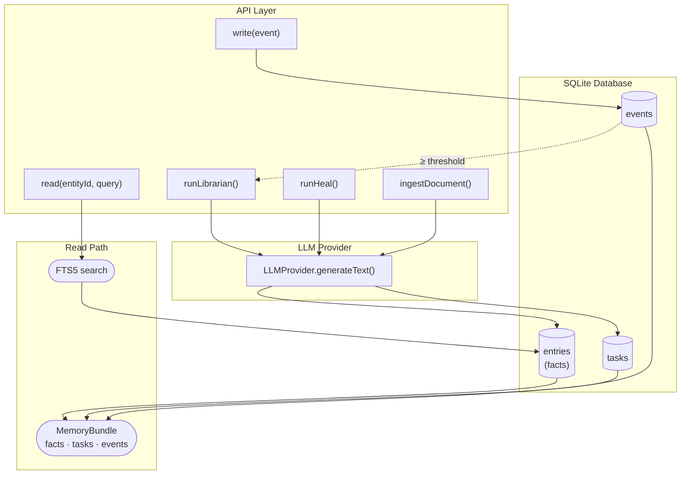

# expo-llm-wiki

[](https://github.com/equationalapplications/expo-llm-wiki/tags)
[](https://www.npmjs.com/package/@equationalapplications/expo-llm-wiki)
[](https://www.npmjs.com/package/@equationalapplications/expo-llm-wiki)
[](LICENSE)

## Persistent, episodic memory for AI Agents.

expo-llm-wiki is a cross-platform SQLite library for long-term LLM memory. It bridges the gap between raw conversation logs and a structured knowledge base, supporting background fact extraction, FTS5 search, and memory pruning.

- **Universal Support:** Expo • React • Vite • Vue • Svelte • Node.js
- **Core Engine:** Pure TypeScript logic with platform-specific adapters.

## Key Principles

- **Bring Your Own Inference (BYOI):** Provide one `generateText` function. The package owns prompt construction, JSON parsing, and database writes.
- **Namespace Safe:** All tables are prefixed (default: `llm_wiki_`) — no collisions with your existing database.
- **Multi-Entity:** Multiple independent "brains" in one database via `entityId`.
- **Offline First:** Reads are fully local via SQLite FTS5, typically under 50ms.
- **Morphological Matching:** Porter stemming enables recall across word forms — queries for `running` match facts about `run`, `runs`, etc., without manual synonym configuration.
- **Full Unicode Support:** UTF-8 and UTF-16 (including surrogate pairs for emoji) are fully supported. Chunks are split safely at sentence boundaries; surrogate pairs are never fragmented.
- **Cross-Platform:** Choose the right package for your platform: Expo, React web, vanilla JS, or Node.js. The core logic is framework-agnostic and dependency-free.

## How It Works



## Monorepo Packages

`expo-llm-wiki` is organized as a monorepo with three packages, each optimized for different platforms:

| Package | Platform | SQLite Adapter | Size | Dependencies |
|---------|----------|---|---|---|
| **`@eq/wiki-core`** | Node.js, any platform | User-provided (e.g., `better-sqlite3`) | Smallest | None |
| **`@eq/wiki-expo`** | Expo, React Native | `expo-sqlite` (built-in) | Minimal | `expo-sqlite` (peer) |
| **`@eq/wiki-react`** | Web, any framework | User-provided (e.g., `sql.js`) | Small | `react` (peer, optional) |

**Choose your package:**
- **Expo/React Native app?** → `@eq/wiki-expo`
- **Web app (React, Vite, CRA)?** → `@eq/wiki-react` + `sql.js`
- **Vanilla JS (any framework)?** → `@eq/wiki-react` + `sql.js`
- **Node.js backend?** → `@eq/wiki-core` + `better-sqlite3`

All packages share the same core API and database schema. The core library is **framework-agnostic and dependency-free**; adapters are injected by the wrapper package.

## Installation

Choose the package for your platform:

### Expo / React Native
```bash
npx expo install expo-sqlite
npm install @eq/wiki-expo
```

### React Web (Vite, CRA, etc.)
```bash
npm install @eq/wiki-react @eq/wiki-core sql.js
```

### Vanilla JavaScript (any framework or plain HTML)
```bash
npm install @eq/wiki-core sql.js
```

### Node.js Backend
```bash
npm install @eq/wiki-core better-sqlite3
```

**Note:** Use `npx expo install` for `expo-sqlite` so Expo's version resolver picks the correct native build for your SDK version.

## Setup

### Expo / React Native

```typescript
import { createWiki } from '@eq/wiki-expo';
import * as SQLite from 'expo-sqlite';

const db = await SQLite.openDatabaseAsync('my-app.db');

const wiki = createWiki(db, {
  llmProvider: {
    generateText: async ({ systemPrompt, userPrompt }) => {
      // Connect to OpenAI, Gemini, a local model, etc.
      // Must return a raw string (JSON, optionally in a markdown code fence).
      const response = await openai.chat.completions.create({
        model: 'gpt-4o-mini',
        messages: [
          { role: 'system', content: systemPrompt },
          { role: 'user', content: userPrompt },
        ],
      });
      return response.choices[0].message.content ?? '{}';
    },
  },
  config: {
    tablePrefix: 'llm_wiki_',       // optional, default: 'llm_wiki_'
    maxFtsResults: 10,              // optional, default: 10
    autoLibrarianThreshold: 20,     // optional, default: 20
    maxChunkLength: 6000,           // optional, default: 6000 (char count, not bytes)
    chunkOverlap: 400,              // optional, default: 400 (overlap between chunks in characters)
    chunkConcurrency: 1,            // optional, default: 1 (parallel LLM calls per ingestDocument)
    pruneRetainSoftDeletedFor: 7,   // optional, default: 7  (days before hard-deleting soft-deleted rows)
    pruneEventsAfter: 30,           // optional, default: 30 (days before hard-deleting old events)
  },
});

// Create tables and FTS5 indexes (call once on app startup)
await wiki.setup();
```

### React Web (Vite + React)

```typescript
import { createWiki } from '@eq/wiki-core';
import initSqlJs from 'sql.js';

const SQL = await initSqlJs();
const sqlDb = new SQL.Database();

// Wrap sql.js behind the SQLiteAdapter interface required by @eq/wiki-core
const adapter = {
  execAsync(sql) { sqlDb.exec(sql); return Promise.resolve(); },
  runAsync(sql, params = []) {
    sqlDb.run(sql, params);
    const changes = sqlDb.getRowsModified();
    const [[lastInsertRowId]] = sqlDb.exec('SELECT last_insert_rowid()')[0].values;
    return Promise.resolve({ changes, lastInsertRowId: Number(lastInsertRowId) });
  },
  getAllAsync(sql, params = []) {
    const stmt = sqlDb.prepare(sql); stmt.bind(params);
    const rows = []; while (stmt.step()) rows.push(stmt.getAsObject()); stmt.free();
    return Promise.resolve(rows);
  },
  getFirstAsync(sql, params = []) {
    const stmt = sqlDb.prepare(sql); stmt.bind(params);
    const row = stmt.step() ? stmt.getAsObject() : null; stmt.free();
    return Promise.resolve(row);
  },
  withTransactionAsync(fn) {
    sqlDb.run('BEGIN');
    return fn().then((r) => { sqlDb.run('COMMIT'); return r; }, (e) => { sqlDb.run('ROLLBACK'); throw e; });
  },
  closeAsync() { sqlDb.close(); return Promise.resolve(); },
};

const wiki = createWiki(adapter, {
  llmProvider: {
    generateText: async ({ systemPrompt, userPrompt }) => {
      // Connect to your LLM provider
      const response = await fetch('/api/generate', {
        method: 'POST',
        body: JSON.stringify({ systemPrompt, userPrompt }),
      });
      return response.text();
    },
  },
  config: {
    tablePrefix: 'llm_wiki_',
    // ... other options
  },
});

await wiki.setup();
```

### Vanilla JavaScript (any framework)

```typescript
import { createWiki } from '@eq/wiki-core';
import initSqlJs from 'sql.js';

const SQL = await initSqlJs();
const sqlDb = new SQL.Database();

// Wrap sql.js behind the SQLiteAdapter interface — see React Web setup above for full adapter
const adapter = { /* sql.js adapter */ };

const wiki = createWiki(adapter, {
  llmProvider: {
    generateText: async ({ systemPrompt, userPrompt }) => {
      // Connect to your LLM provider
      const response = await fetch('/api/generate', {
        method: 'POST',
        body: JSON.stringify({ systemPrompt, userPrompt }),
      });
      return response.text();
    },
  },
});

await wiki.setup();

// Now use the core API
const bundle = await wiki.read('entity-123', 'query');
await wiki.write('entity-123', { event_type: 'observation', summary: '...' });
```

### Node.js Backend

```typescript
import { createWiki } from '@eq/wiki-core';
import Database from 'better-sqlite3';

// Create a thin adapter wrapper
const db = new Database('memory.db');
const adapter = {
  execAsync: (sql) => { db.exec(sql); return Promise.resolve(); },
  getAllAsync: (sql, params) => Promise.resolve(db.prepare(sql).all(...(params || []))),
  getFirstAsync: (sql, params) => Promise.resolve(db.prepare(sql).get(...(params || [])) ?? null),
  runAsync: (sql, params) => {
    const info = db.prepare(sql).run(...(params || []));
    return Promise.resolve({ changes: info.changes, lastInsertRowId: Number(info.lastInsertRowid) });
  },
  withTransactionAsync: async (fn) => {
    db.exec('BEGIN');
    try {
      const result = await fn();
      db.exec('COMMIT');
      return result;
    } catch (error) {
      db.exec('ROLLBACK');
      throw error;
    }
  },
  closeAsync: () => { db.close(); return Promise.resolve(); },
};

const wiki = createWiki(adapter, {
  llmProvider: {
    generateText: async ({ systemPrompt, userPrompt }) => {
      // Connect to your LLM provider
      const response = await openai.chat.completions.create({
        model: 'gpt-4o-mini',
        messages: [
          { role: 'system', content: systemPrompt },
          { role: 'user', content: userPrompt },
        ],
      });
      return response.choices[0].message.content ?? '{}';
    },
  },
});

await wiki.setup();
```

## Core API

### Read

FTS5 full-text search over facts, plus open tasks and recent events:

```typescript
const { facts, tasks, events } = await wiki.read('entity-123', 'weekend plans');
// facts: WikiFact[]   — matched by FTS5, ranked by confidence + access count
// tasks: WikiTask[]   — pending and in-progress only
// events: WikiEvent[] — 10 most recent, ascending
```

Pass an empty string to skip FTS and return the most recently updated facts.

### Write

Log an episodic event. Automatically triggers the librarian pass once enough events accumulate:

```typescript
await wiki.write('entity-123', {
  event_type: 'observation',
  summary: 'User mentioned they love hiking on weekends.',
});
// event_type: 'observation' | 'decision' | 'action' | 'outcome'
```

### Ingest Document

Extract facts from a document (chunked internally). Idempotent — re-calling with the same `sourceRef` replaces the prior extraction. Documents are automatically chunked at sentence boundaries; if a sentence exceeds `maxChunkLength`, it is hard-split.

```typescript
const result = await wiki.ingestDocument('entity-123', {
  // sourceRef is normalized: only [A-Za-z0-9._\- ] are kept, all other characters
  // (including `/`) are stripped. Use underscores or dots as path separators to
  // avoid accidental collisions (e.g. 'docs_preferences.md' not 'docs/preferences.md').
  sourceRef: 'preferences.md',        // stable identifier
  sourceHash: sha256(content),        // for change detection
  documentChunk: content,
  maxChunkLength: 12000,              // optional, character count
  chunkOverlap: 400,                  // optional, overlap in characters
  chunkConcurrency: 1,                // optional, parallel LLM calls per ingest (default: 1)
});
// result: { truncated: boolean; chunks: number }
// truncated: true if at least one hard-split was required (no sentence boundary)
// chunks: number of LLM calls made
```

### Background Maintenance

```typescript
// Consolidate recent events into durable facts (auto-triggered by write, or call manually)
await wiki.runLibrarian('entity-123');

// Resolve contradictions, downgrade stale claims, remove obsolete facts
await wiki.runHeal('entity-123');
```

### Format Context

Convert a `MemoryBundle` into a string ready for LLM prompt injection:

```typescript
// Import from the appropriate package for your platform
import { formatContext } from '@eq/wiki-core';      // or @eq/wiki-expo

const bundle = await wiki.read('entity-123', 'weekend plans');
const context = formatContext(bundle, {
  format: 'markdown',        // 'markdown' (default) | 'plain'
  maxFacts: 10,              // default 10
  maxTasks: 10,              // default 10
  maxEvents: 10,             // default 10
  includeConfidence: true,   // default true — appends (certain/inferred/tentative)
  includeTags: true,         // default true — appends [tag1, tag2]
  factWeights: {
    confidence: 1.0,         // default 1.0
    accessCount: 0.3,        // default 0.3 — log(1 + access_count) * weight
    recency: 0.5,            // default 0.5 — decays over 30d
  },
});

// Inject into your system prompt:
const systemPrompt = `You are a helpful assistant.\n\n${context}`;
```

Facts are ranked by a weighted score combining confidence tier, access frequency, and recency. Returns an empty string for an empty bundle.

### Forget

```typescript
const result = await wiki.forget('entity-123', { entryId: 'fact_abc' });    // single fact
// result: { deleted: { entries: number; tasks: number } }

await wiki.forget('entity-123', { taskId: 'task_xyz' });     // single task
// sourceRef is normalized the same way as in ingestDocument (slashes stripped)
await wiki.forget('entity-123', { sourceRef: 'x.md' }); // all facts from a document
await wiki.forget('entity-123', { clearAll: true });          // wipe entity
```

Throws `Error` if `sourceRef` or `sourceHash` is provided but invalid. Soft-deletes are idempotent — calling again with the same parameters returns `{ deleted: { entries: 0; tasks: 0 } }`.

### Check for Changes

Skip re-ingest if a document's content hasn't changed since the last ingest:

```typescript
const changed = await wiki.hasChanged('entity-123', 'preferences.md', sha256(content));
if (changed) {
  await wiki.ingestDocument('entity-123', { sourceRef: 'preferences.md', sourceHash: sha256(content), documentChunk: content });
}
```

Returns `true` if the document has never been ingested, all prior ingest results were forgotten, or the stored hash differs from the supplied one. Returns `false` if the stored hash matches exactly.

Throws `Error` if `sourceRef` or `sourceHash` is invalid (same rules as `ingestDocument`).

### Prune (Hard Delete)

Hard-delete aged soft-deleted entries/tasks and old events to reclaim storage:

```typescript
const result = await wiki.runPrune('entity-123', {
  retainSoftDeletedFor: 7,    // days — hard-delete entries/tasks soft-deleted > 7d ago; null to skip
  retainEventsFor: 30,         // days since created_at — hard-delete old events; null to skip
  vacuum: false,               // set true to VACUUM (slow on mobile, rewrites entire DB)
});
// result: { entries: number; tasks: number; events: number }
```

Defaults: `retainSoftDeletedFor = config.pruneRetainSoftDeletedFor ?? 7`, `retainEventsFor = config.pruneEventsAfter ?? 30`, `vacuum = false`.

Throws `WikiBusyError` if librarian, heal, ingest, or another prune is in-flight for the same entity. `ingestDocument`, `runLibrarian`, and `runHeal` reciprocally throw `WikiBusyError` if a prune is in-flight.

---

## React Component API

React hooks are available from `@eq/wiki-react` (web) and `@eq/wiki-expo` (Expo). Use the React-specific entry points when integrating with React.

### Provider

Wrap once at app root (or any subtree that needs memory access):

**Web (React/Vite):**
```typescript
import { WikiProvider } from '@eq/wiki-react';
import { createWiki } from '@eq/wiki-core';
import initSqlJs from 'sql.js';

const SQL = await initSqlJs();
const sqlDb = new SQL.Database();
// Build a sql.js adapter — see React Web setup section above for the full adapter
const adapter = { /* sql.js adapter */ };
const wiki = createWiki(adapter, { llmProvider });
await wiki.setup();

export default function App() {
  return (
    <WikiProvider wiki={wiki}>
      <YourApp />
    </WikiProvider>
  );
}
```

**Expo:**
```typescript
import { WikiProvider, createWiki } from '@eq/wiki-expo';
import * as SQLite from 'expo-sqlite';

const db = await SQLite.openDatabaseAsync('my-app.db');
const wiki = createWiki(db, { llmProvider });
await wiki.setup();

export default function App() {
  return (
    <WikiProvider wiki={wiki}>
      <YourApp />
    </WikiProvider>
  );
}
```

### `useMemoryRead(entityId, query)`

Reactive read. Fetches on mount and whenever `entityId` or `query` changes. In-flight results always land before a queued re-fetch starts — results are never silently discarded.

```typescript
const { data, isPending, error, refetch } = useMemoryRead('entity-123', 'weekend plans');
// data: MemoryBundle | null
```

### `useWikiWrite()`

```typescript
const { execute, isPending, error } = useWikiWrite();

await execute('entity-123', {
  event_type: 'observation',
  summary: 'User mentioned they love hiking.',
});
```

### `useWikiMaintenance()`

Shared `isPending` — true if any operation is in-flight. See [extended form below](#usewikimaintenance-extended) for `runPrune`:

```typescript
const { runLibrarian, runHeal, runPrune, isPending, error } = useWikiMaintenance();

await runLibrarian('entity-123');
await runHeal('entity-123');
```

### `useWikiIngest()`

```typescript
const { execute, lastResult, isPending, error } = useWikiIngest();
// lastResult: { truncated: boolean; chunks: number } | null

const result = await execute('entity-123', {
  sourceRef: 'preferences.md',  // slashes are stripped by normalizeSourceRef
  sourceHash: sha256(content),
  documentChunk: content,
});
// result.truncated — true if any hard-splits were required
// result.chunks   — number of LLM calls made
```

### `useWikiForget()`

```typescript
const { execute, lastResult, isPending, error } = useWikiForget();
// lastResult: { deleted: { entries: number; tasks: number } } | null

const result = await execute('entity-123', { entryId: 'fact_abc' });
// result.deleted.entries — rows soft-deleted
```

### `useWikiHasChanged()`

```typescript
const { execute, lastResult, isPending, error } = useWikiHasChanged();
// lastResult: boolean | null

const changed = await execute('entity-123', 'preferences.md', sha256(content));
```

### `useWikiMaintenance()` (extended)

`runPrune` is now available alongside `runLibrarian` and `runHeal`. Shared `isPending` is true if any operation is in-flight. `lastResult` is a discriminated union — check `.operation` to narrow the type:

```typescript
const { runLibrarian, runHeal, runPrune, lastResult, isPending, error } = useWikiMaintenance();

await runLibrarian('entity-123');
// lastResult: { operation: 'librarian', result: void }

await runHeal('entity-123');
// lastResult: { operation: 'heal', result: void }

const counts = await runPrune('entity-123', { retainSoftDeletedFor: 7, retainEventsFor: 30 });
// counts: { entries: number; tasks: number; events: number }
// lastResult: { operation: 'prune', result: { entries: number; tasks: number; events: number } }

if (lastResult?.operation === 'prune') {
  console.log(lastResult.result.entries); // type-safe access to prune counts
}
```

The exported `MaintenanceResult` type can be imported for typed consumers:

```typescript
// Web (React/Vite)
import type { MaintenanceResult } from '@eq/wiki-react';

// Expo
import type { MaintenanceResult } from '@eq/wiki-expo';
```

All mutation hooks follow the same pattern (`TResult` is specific per hook):

```typescript
{
  execute: (...args) => Promise<TResult>;
  lastResult: TResult | null;  // result of the last successful call; null before first call or after an error
  isPending: boolean;
  error: Error | null;         // cleared on the next execute call
}
```

---

Made with ❤️ by Equational Applications LLC. [https://equationalapplications.com/](https://equationalapplications.com/)
