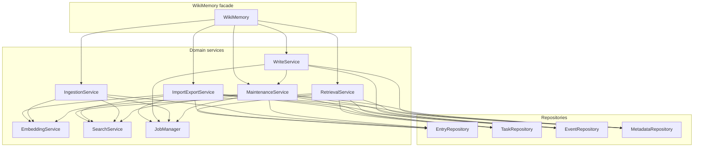

# Spec: Phase 3.5 — WikiMemory service extraction

**Date:** May 15, 2026  
**Status:** Implemented

## Motivation

Phase 3 introduced repositories and moved raw SQL behind `EntryRepository` and friends, but `WikiMemory` still concentrated orchestration for reads/ranking, import/export, embeddings, and writes. Phase 3.5 splits those responsibilities into focused services so `WikiMemory` stays a thin facade (constructor wiring + pass-through methods), consistent with how `IngestionService` and `MaintenanceService` were already used.

## Final architecture

**Source of truth:** implementation lives under `packages/core/src/services/` (`RetrievalService.ts`, `ImportExportService.ts`, `EmbeddingService.ts`, `WriteService.ts`, etc.). This document does not embed service source code so it cannot drift from the repo.

## Decisions

| Area | Decision |
|------|----------|
| Read path | `RetrievalService` owns `read()`, ranking, hybrid search, hydration helpers. |
| Dump I/O | `ImportExportService` owns import/export, LWW merge, normalization, transactions; receives `EmbeddingService` instead of ad hoc callbacks. |
| Vectors | `EmbeddingService` owns embed/reconcile/notify paths; ingestion and maintenance depend on it. |
| Writes | `WriteService` owns `write()` and librarian/heal orchestration after events. |
| Tests | `WikiMemory.__testAccess` (type `WikiMemoryTestAccess`) exposes composed services without `(wiki as any)`. Consumers that need service class types for mocks should import from `@equationalapplications/core-llm-wiki/testing`. |
| Internal hooks | Package-internal job hooks use names `doRunLibrarian`, `doRunHeal`, `doImportEntity`. |

## Execution order (historical)

1. `ImportExportService` — isolated, large transactional block.  
2. `RetrievalService` — read-only dependency edges.  
3. `EmbeddingService` — unbind `embedFact` / dimension hooks from ingestion and maintenance.  
4. `WriteService` — write path and post-write jobs.

## See also

- File history on this path retains earlier drafts; prefer this document as the maintained summary.
