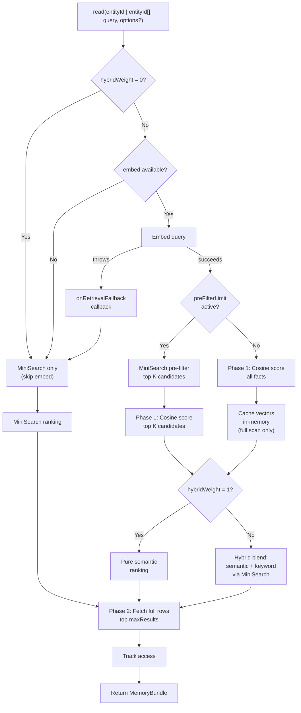

# @equationalapplications/core-llm-wiki

Platform-agnostic TypeScript engine for hybrid LLM memory. Features episodic fact extraction, semantic vector search, and multi-agent architectures over SQLite. Bring your own adapter.

[](https://www.npmjs.com/package/@equationalapplications/core-llm-wiki) [](https://www.npmjs.com/package/@equationalapplications/core-llm-wiki)
[](https://www.typescriptlang.org/)
[](https://github.com/equationalapplications/expo-llm-wiki/blob/main/packages/core/LICENSE)

**[GitHub](https://github.com/equationalapplications/expo-llm-wiki)** · **[ScopeLab](https://equationalapplications.github.io/expo-llm-wiki/scopelab/)** · **[WikiDemo](https://equationalapplications.github.io/expo-llm-wiki/wiki-demo/)** · **[Changelog](https://github.com/equationalapplications/expo-llm-wiki/blob/main/CHANGELOG.md)** · **[Issues](https://github.com/equationalapplications/expo-llm-wiki/issues)**

> Inspired by [Andrej Karpathy's LLM Wiki memory spec](https://gist.github.com/karpathy/442a6bf555914893e9891c11519de94f).


## Features

- **Platform-agnostic** — Zero runtime dependencies; works with any SQLite driver via the `SQLiteAdapter` interface
- **Semantic search** — Vector embeddings via your LLM's `embed` function, ranked by cosine similarity
- **Keyword fallback** — [MiniSearch](https://github.com/lucaong/minisearch) in-memory index for offline/degraded scenarios when embeddings unavailable
- **Retrieval tuning** — Per-call overrides for `maxResults`, `preFilterLimit`, `hybridWeight`, `tierWeights`, `tierFloors`, and `includeZeroWeightEntities`
- **Multi-entity reads** — Search across multiple `entity_id` namespaces in one pass with per-entity score multipliers (`tierWeights`); `tierFloors` reserves each namespace's top-N matching results; optional `factScores` and `metadata` for explainability
- **Immutable vs mutable facts** — Use `WikiFact.source_type` to distinguish document-sourced facts (`immutable_document`) from derived or user-provided facts (`librarian_inferred`, `user_stated`, `user_confirmed`). Immutable document facts are not rewritten by `runLibrarian()` or `runHeal()` and can only be removed by `forget()` or re-ingesting.
- **Full-featured memory** — Facts, tasks, events, maintenance jobs (librarian, heal, reembed, prune)
- **Type-safe** — Built with TypeScript, full type exports
- **Interoperability:** Supports [Open Knowledge Format (OKF)](https://github.com/GoogleCloudPlatform/knowledge-catalog/tree/main/okf) v0.1 + v0.2 import and export via the [llm-wiki OKF profiles](https://github.com/equationalapplications/expo-llm-wiki/blob/main/docs/okf-profile.md) (default `llm-wiki/2`, back-compat `llm-wiki/1`).
- **Per-entity seeded ontology** — Optional Strict, Emergent, or Off modes govern LLM graph extraction; seed taxonomies per entity and persist typed facts with inline edges.

## GraphRAG & Multi-Modal Retrieval

`@equationalapplications/core-llm-wiki` exposes three complementary retrieval modes, each addressing a different shape of query:

| Mode | API | Best for |
|---|---|---|
| **Semantic** (vector cosine) | `wiki.read(entityId, query)` with `embed` configured | Open-ended natural-language questions; "what do I know about X" |
| **Keyword** (MiniSearch) | `wiki.read(entityId, query)` with `embed` absent or offline | Exact terms, identifiers, names; offline fallback |
| **GraphRAG** (recursive CTE) | `wiki.traverseGraph(entityId, options)` + `formatGraphContext(result)` | Structural questions; "what connects to X", "everything two hops from this fact", "summarise the people, places, and projects linked to Alice" |

The GraphRAG path is structurally distinct: it doesn't rank by relevance to a query string, it walks `llm_wiki_edges` from a known anchor fact. The result is dense and connected — subgraphs, not loose top-K hits.

### Graph traversal APIs

```typescript
import { WikiMemory, formatGraphContext } from '@equationalapplications/core-llm-wiki';

const graph = await wikiMemory.traverseGraph('user-123', {
  sourceId: '<anchor-fact-id>',
  maxDepth: 2,
  direction: 'both',          // 'inbound' | 'outbound' | 'both'
  edgeTypes: ['reports_to'],   // optional filter
  excludeSourceTypes: ['immutable_document'],
  minTraversalConfidence: 'inferred',
  maxTraversalNodes: 20,
});

const promptContext = formatGraphContext(graph);
// → dense text block ready for prompt injection
```

`traverseGraph` runs as a single recursive CTE in SQLite (see the root README's ["The SQL: how traversal works in one query"](../../README.md#the-sql-how-traversal-works-in-one-query) for the query shape). No external graph database.

### Deterministic graph seeding (no LLM)

For programmatic pipelines — importing pre-classified data, building a GraphRAG corpus from a CSV, or seed-loading from a JSON file — use `upsertGraph()`. It writes nodes and edges directly under the same `(sourceRef, sourceHash)` ownership semantics as `ingestDocument()`, but skips the LLM extraction step. See [Direct Graph Write](#direct-graph-write) for the canonical signature, including the required `SQLiteAdapter` argument and transactional semantics.

This is the GraphRAG seed path: load a corpus, walk it.

## Installation

```bash
npm install @equationalapplications/core-llm-wiki
```

## Semantic Search with Embeddings

Provide an `embed` function in `llmProvider` to enable vector-based retrieval:

```typescript
import { WikiMemory } from '@equationalapplications/core-llm-wiki';

const wikiMemory = new WikiMemory(db, {
  llmProvider: {
    generateText: async ({ systemPrompt, userPrompt }) => {
      // Your LLM call for extracting facts, tasks
      return 'Model output';
    },
    maxOutputTokens: 4096, // optional — lets runHeal/runOntologyBackfill size their first LLM call correctly instead of discovering the ceiling via a truncated response and retrying smaller
    embed: async (text: string) => {
      // Your embedding service (e.g., OpenAI, Cohere, local)
      const response = await fetch('https://your-app.example.com/api/embed', {
        method: 'POST',
        body: JSON.stringify({ text }),
      });
      const { embedding } = await response.json();
      return embedding; // number[]
    },
  },
});

await wikiMemory.setup();

// Query with semantic matching
const memory = await wikiMemory.read('user-123', 'What should I do this weekend?');
// Returns facts semantically similar to the query, not lexical matches
// E.g., fact "Saturday hiking trip" ranks high even though no lexical overlap
```

When `embed` is unavailable, `read()` silently falls back to MiniSearch keyword search. If an embedding attempt throws, `read()` falls back and calls `onRetrievalFallback` if provided:

```typescript
const wikiMemory = new WikiMemory(db, {
  llmProvider: {
    generateText: async () => { /* ... */ },
    embed: undefined, // or throws on network error
  },
  onRetrievalFallback: (error) => {
    console.warn('Embedding retrieval unavailable, using keyword search:', error);
  },
});

// read() returns MiniSearch results, onRetrievalFallback not called (embed absent is expected)
// read() returns MiniSearch results, onRetrievalFallback called (embed threw)
```

## Configuration

All `WikiConfig` fields are optional:

```typescript
const wikiMemory = new WikiMemory(db, {
  llmProvider: { /* ... */ },
  config: {
    tablePrefix: 'llm_wiki_',          // default: 'llm_wiki_'
    maxResults: 10,                    // default: 10
    autoLibrarianThreshold: 20,        // default: 20 — events before librarian auto-runs
    autoHealThreshold: 100,            // default: 100 — events before heal auto-runs
    maxChunkLength: 12000,             // default: 12000 (char count per ingestDocument chunk; exported as DEFAULT_MAX_CHUNK_LENGTH)
    chunkOverlap: 400,                 // default: 400 (overlap between chunks in characters; exported as DEFAULT_CHUNK_OVERLAP)
    chunkConcurrency: 1,               // default: 1 (parallel LLM calls per ingestDocument)
    maxEmbedChars: 6000,               // default: 6000 (chars of title+body+tags sent to embed(); hard ceiling 16000; exported as DEFAULT_MAX_EMBED_CHARS)
    pruneRetainSoftDeletedFor: 7,      // default: 7 (days before hard-deleting soft-deleted facts)
    pruneEventsAfter: 30,              // default: 30 (days before hard-deleting old events)
    orphanAfterDays: 30,               // default: 30 (days before runHeal flags sourceless facts; null to disable)
    staleInferredAfterDays: 60,        // default: 60 (days before runHeal downgrades inferred facts; null to disable)
    preFilterLimit: 50,                // default: undefined — MiniSearch pre-filter before cosine scan; recommended for >500 facts
    hybridWeight: 0.7,                 // default: undefined — blend semantic (1.0) ↔ keyword (0.0); pure semantic when unset
    enableOutbox: false,               // default: false — when true, entry/task mutations write to an internal SQLite outbox table for external sync (e.g. via @equationalapplications/prisma-outbox)

    // Global prompt overrides — librarianSystemPrompt and healSystemPrompt apply to write() auto-runs;
    // ingestSystemPrompt applies only to explicit ingestDocument() calls.
    // ⚠ Overrides replace the entire default prompt, including the JSON output contract.
    // See "JSON Output Contracts" in the Prompt Management & Overrides section below.
    prompts: {
      ingestSystemPrompt: `Extract core facts from this document: {{documentChunk}}\n\nReturn ONLY valid JSON: { "facts": [{ "title": "string", "body": "string", "tags": ["string"], "confidence": "certain|inferred|tentative" }] }. No markdown.`,
      librarianSystemPrompt: `You are an expert curator. Synthesize these thoughts:\n{{events}}\n\nCurrent Facts:\n{{currentFacts}}\n\nReturn ONLY valid JSON: { "facts": [{ "title": "string", "body": "string", "tags": ["string"], "confidence": "certain|inferred|tentative" }], "tasks": [{ "description": "string", "priority": 0 }] }. No markdown.`,
      healSystemPrompt: `Fix the memory graph based on these candidates: {{healCandidates}}\n\nReturn ONLY valid JSON: { "downgraded": ["factId"], "deleted": ["factId"], "newFacts": [{ "title": "string", "body": "string", "tags": ["string"], "confidence": "certain|inferred|tentative" }] }. No markdown.`,
    },
  },
});
```

## Prompt Management & Overrides

Core maintenance tasks (`ingestDocument`, `runLibrarian`, `runHeal`) use system prompts to instruct the LLM. You can customize these prompts using `{{mustache}}` style variables to inject context dynamically.

> **JSON Output Contracts:** Prompt overrides replace the *entire* default system prompt, including the JSON response schema the parser depends on. Your override **must** instruct the LLM to return raw JSON — no markdown. Required shapes:
>
> | Operation | Required JSON shape |
> |-----------|-------------------|
> | `ingestDocument` | `{ "facts": [{ "title": "string", "body": "string", "tags": ["string"], "confidence": "certain\|inferred\|tentative" }] }` |
> | `runLibrarian` | `{ "facts": [...], "tasks": [{ "description": "string", "priority": 5 }] }` — `priority` is an integer 0–10 |
> | `runHeal` | `{ "downgraded": ["factId"], "deleted": ["factId"], "newFacts": [...] }` |

### Global Overrides (Auto-Runs)

If your application relies on `write()` to automatically maintain the memory graph in the background (via `autoLibrarianThreshold` and `autoHealThreshold`), configure custom prompts globally at instantiation. This ensures the internal `WriteService` uses your domain-specific instructions when it triggers an auto-run.

```typescript
const wikiMemory = new WikiMemory(db, {
  llmProvider,
  config: {
    prompts: {
      // Override must include the JSON output contract — it replaces the entire default prompt.
      librarianSystemPrompt: `You are an expert curator. Synthesize these thoughts:\n{{events}}\n\nCurrent Facts:\n{{currentFacts}}\n\nReturn ONLY a valid JSON object: { "facts": [{ "title": "string", "body": "string", "tags": ["string"], "confidence": "certain|inferred|tentative" }], "tasks": [{ "description": "string", "priority": 0 }] }. No markdown.`,
    },
  },
});

// WriteService uses the global prompt whenever autoLibrarianThreshold is hit
await wikiMemory.write('user-123', { event_type: 'observation', summary: '...' });
```

Available `{{variables}}` per prompt type:

| Prompt | Variables |
|--------|-----------|
| `ingestSystemPrompt` | `{{documentChunk}}` |
| `librarianSystemPrompt` | `{{events}}`, `{{currentFacts}}` |
| `healSystemPrompt` | `{{healCandidates}}`, `{{documentAnchors}}`, `{{allTasks}}`, `{{recentEvents}}` |

When a template contains `{{variable}}` tags, the matching data is hydrated directly into `systemPrompt` and a short fixed string is used as `userPrompt`. When a template has no `{{}}` tags, the raw data is appended as `userPrompt` — backward compatible with plain-string overrides.

### Runtime Overrides (Manual Execution)

Pass `promptOverride` per-call for one-off instructions. **Runtime overrides apply only to that single call — they do not persist for future auto-runs triggered by `write()`.**

```typescript
// Override the base default AND global config for this single execution.
// Each override must include the JSON output contract (replaces the entire default prompt).
await wikiMemory.runLibrarian('user-123', {
  promptOverride: `One-off extraction task:\n{{events}}\n\nReturn ONLY valid JSON: { "facts": [{ "title": "string", "body": "string", "tags": ["string"], "confidence": "certain|inferred|tentative" }], "tasks": [{ "description": "string", "priority": 0 }] }. No markdown.`,
});

await wikiMemory.runHeal('user-123', {
  promptOverride: `Domain-specific healing: {{healCandidates}}\n\nReturn ONLY valid JSON: { "downgraded": ["factId"], "deleted": ["factId"], "newFacts": [{ "title": "string", "body": "string", "tags": ["string"], "confidence": "certain|inferred|tentative" }] }. No markdown.`,
});

await wikiMemory.ingestDocument('user-123', {
  sourceRef: 'doc-1',
  sourceHash: sha256(content),
  documentChunk: content,
  promptOverride: `Strict technical extraction: {{documentChunk}}\n\nReturn ONLY valid JSON: { "facts": [{ "title": "string", "body": "string", "tags": ["string"], "confidence": "certain|inferred|tentative" }] }. No markdown.`,
});
```

> **Important:** If your app relies on `write()` auto-runs and needs custom prompts for those runs, use `config.prompts` at construction time. Runtime `promptOverride` values are never forwarded to `WriteService`-triggered internal runs.

## Retrieval Tuning

Optimize `read()` performance and blend retrieval strategies:

```typescript
const config = {
  // Limit cosine similarity scoring to top-K MiniSearch keyword candidates
  preFilterLimit: 50,
  
  // Blend semantic and keyword scores (0.0 = pure keyword, 1.0 = pure semantic)
  hybridWeight: 0.7,
  
  // Max results returned per read
  maxResults: 10,
};

const wikiMemory = new WikiMemory(db, {
  config,
  llmProvider: { /* ... */ },
});

// Per-call overrides (runtime controls for search dashboards, etc.)
const memory = await wikiMemory.read('user-123', 'my preferences', {
  maxResults: 5,
  preFilterLimit: 20,
  hybridWeight: 0.5,
});

// Multi-entity with tier weights
const multiMemory = await wikiMemory.read(['tier_wisdom', 'tier_fact', 'tier_working'], 'my preferences', {
  maxResults: 8,
  tierWeights: {
    tier_wisdom: 2,      // high-confidence curated notes boosted 2×
    tier_fact: 1,        // neutral baseline
    tier_working: 0.25,  // recent but unvetted context downranked
  },
  // includeZeroWeightEntities: true — include 0-weight entities as bottom-ranked filler
});
// multiMemory.factScores — optional Record<factId, weightedScore> for returned facts; may be absent/undefined
// multiMemory.metadata  — optional { query, entityIds, tierWeights, tierFloors }; may be absent/undefined
```

**Hybrid scoring blends:**
- `hybridWeight: 1.0` → all-semantic blend with semantic scores clamped to non-negative range (no keyword component)
- `hybridWeight: 0.5` → balanced semantic + keyword (50/50 blend)
- `hybridWeight: 0.0` → pure keyword ranking, skips `embed()` entirely (no LLM API cost)

True cosine-range pure semantic ranking (including negative cosine values) is used when `hybridWeight` is left `undefined`.

**Tier weights:**
- `tierWeights` applies a per-entity multiplier after semantic/keyword scoring: `finalScore = retrievalScore × weight`
- Missing weights default to `1.0`. Negative weights clamp to `0`. Non-finite weights default to `1.0`.
- `tierWeights[entity] = 0` skips that entity's scored retrieval branch (no compute cost).
- `includeZeroWeightEntities: true` includes zero-weight entities as bottom-ranked filler instead of skipping them.
- `tierFloors: Record<string, number>` reserves that entity's top-N scored results before the global `maxResults` cut — a floor on entity `X` means at least `N` of the returned facts come from `X`. Floors apply *after* scoring (including `tierWeights`) and *after* `preFilterLimit`'s candidate selection, so a row excluded by `preFilterLimit` cannot be resurrected by a floor. An entity with fewer matching facts than its floor contributes what it has — this is not an error. Only meaningful when `entityId` is an array; ignored for single-string calls and for empty-query ("recent facts") reads. Throws `WikiInvalidReadOptions` when a floor cannot be satisfied by construction: floors summing above `maxResults`, a floor keyed to an entity not in `entityId`, or a floor on an entity excluded by `tierWeights: 0` when `includeZeroWeightEntities` is not set. With an external `vectorRanker`, ranker-omitted rows (typically un-embedded facts) for a floored entity are pre-reserved before the global backfill budget is spent, so an unembedded floored entity still satisfies its floor.
- `factScores` is present for array-shaped `entityId` calls only when the query is non-empty and at least one fact is scored; empty-query ("recent facts") reads leave it absent even when `entityId` is an array. Plain string calls never expose it. `metadata` is present for all array-shaped calls regardless of query.
- `maxResults` applies globally across all requested entities.
- Tasks are capped at `min(20 × entityCount, 200)`; events at `min(10 × entityCount, 100)` for multi-entity reads.

**Pre-filtering optimization:**
When `preFilterLimit: 50` is set with 1000 facts, cosine similarity is computed only for the top 50 MiniSearch keyword matches, reducing O(N) scoring to O(50).

## Pluggable Vector Retrieval

When your entity corpus grows, in-process cosine similarity scoring becomes a bottleneck. The optional **`VectorRanker`** interface lets you delegate semantic ranking to [**sqlite-vec**](https://github.com/asg017/sqlite-vec), [**sqlite-vss**](https://github.com/asg017/sqlite-vss), or an external vector database while `WikiMemory` handles embedding validation, hybrid scoring, and tier-2 row hydration.

### `VectorRanker` purpose

`VectorRanker` provides an optional injection point for approximate nearest-neighbor (ANN) ranking:

```typescript
export interface VectorRanker {
  /**
   * Return semantic scores for facts in scope, sorted by similarity.
   * - `entityId`: restricts results to one entity
   * - `queryVec`: the embedded query (Float32Array or number[])
   * - `candidateIds` (optional): when set, rank only within this set (MiniSearch pre-filter mode)
   * - `limit`: requested top-K count
   */
  rankBySimilarity(args: VectorRankerRankArgs): Promise<VectorRankerSemanticResult[]>;

  /**
   * Optional hook called after embedding persistence (upsert, reembed, delete).
   * Implementations use this to keep external indexes (sqlite-vec, remote ANN) in sync.
   */
  onEmbeddingPersisted?(event: {
    entityId: string;
    factId: string;
    vector: Float32Array | null; // null = embedding removed
  }): void | Promise<void>;
}
```

**When no ranker is configured**, `WikiMemory` uses built-in JS cosine similarity — the same behavior as today. When a ranker is supplied and embeddings preconditions are met (`embed` available, dimensions match, no mismatches), `WikiMemory` delegates scoring to the ranker and blends results with keyword scores.

### Example: sqlite-vec adapter

```typescript
import { WikiMemory } from '@equationalapplications/core-llm-wiki';
import type { VectorRanker, VectorRankerRankArgs, VectorRankerSemanticResult } from '@equationalapplications/core-llm-wiki';

// Minimal sqlite-vec adapter (pseudo-code)
const sqliteVecRanker: VectorRanker = {
  async rankBySimilarity(args: VectorRankerRankArgs): Promise<VectorRankerSemanticResult[]> {
    const { entityId, queryVec, candidateIds, limit } = args;

    // Build KNN query using sqlite-vec's distance functions.
    // sqlite-vec returns cosine distance (0 = identical, 2 = opposite) ascending.
    // Invert to semanticScore: higher = more similar, matching VectorRanker contract.
    let sql = `SELECT id, (1.0 - distance) AS semanticScore FROM vec_facts 
              WHERE entity_id = ? AND deleted_at IS NULL`;
    const params: any[] = [entityId];

    // Apply pre-filter if provided
    if (candidateIds) {
      sql += ` AND id IN (${candidateIds.map(() => '?').join(',')})`;
      params.push(...candidateIds);
    }

    // KNN search (example syntax; adjust for your sqlite-vec version)
    sql += ` ORDER BY vec MATCH vec_neighbor(?) LIMIT ?`;
    params.push(queryVec, limit);

    const rows = await db.getAllAsync<{ id: string; semanticScore: number }>(sql, params);
    return rows; // sorted descending by semanticScore (closest distance → highest similarity)
  },

  async onEmbeddingPersisted(event) {
    const { entityId, factId, vector } = event;
    if (vector) {
      // Upsert into sqlite-vec table
      await db.runAsync(
        `INSERT OR REPLACE INTO vec_facts (id, entity_id, vec) VALUES (?, ?, ?)`,
        [factId, entityId, vector]
      );
    } else {
      // Delete when embedding is removed
      await db.runAsync(`DELETE FROM vec_facts WHERE id = ?`, [factId]);
    }
  },
};

const wikiMemory = new WikiMemory(db, {
  llmProvider: { /* ... */ },
  vectorRanker: sqliteVecRanker,
});

// read() now uses sqlite-vec for scoring instead of JS cosine
const memory = await wikiMemory.read('user-123', 'my preferences');
```

### Fallback policies

When `rankBySimilarity` rejects (e.g., ANN service outage, misconfiguration), `WikiMemory` applies a recovery policy:

```typescript
export type VectorRankerFallback =
  | 'js-cosine'  // (default) Score candidates in-process with JS cosine — same as no ranker
  | 'keyword'    // Skip semantic ranking; return keyword-only results
  | 'empty'      // Semantic facts list empty for this read; tasks/events still included
  | 'throw';     // Reject read() with the ranker error

const wikiMemory = new WikiMemory(db, {
  llmProvider: { /* ... */ },
  vectorRanker: sqliteVecRanker,
  vectorRankerFallback: 'js-cosine', // default
  onVectorRankerFallback: (info) => {
    console.warn(
      `Ranker failed (policy: ${info.policy}); error:`,
      info.error
    );
  },
});
```

- **`'js-cosine'` (default):** Seamless degradation; same behavior as if no ranker was configured.
- **`'keyword'`:** Useful when semantic ranking is optional; keyword search proceeds normally.
- **`'empty'`:** Return no facts for this query (but tasks/events still load); useful for strict consistency.
- **`'throw'`:** Propagate the error and fail the read.

### `onEmbeddingPersisted` eventual consistency

If `vectorRanker.onEmbeddingPersisted` returns a pending Promise, the hook **may resolve asynchronously**. This supports ANN indexes that rebuild on a schedule (e.g., sqlite-vec triggers on transaction commit) or external services with eventual consistency.

**Best practice:**
- If your adapter has **synchronous guarantees** (in-process sqlite-vec, same transaction), await the promise.
- If your adapter is **eventually consistent** (remote ANN, async rebuild), document the lag and document that queries may miss recently-added facts until the index refreshes.
- The **SQLite blob remains the source of truth**; `WikiMemory` always writes embeddings to `embedding_blob` first before calling the hook.

### Hybrid scoring with ranker

When both `vectorRanker` and `hybridWeight` are configured, `WikiMemory` still applies hybrid blending after the ranker returns scores:

```typescript
const wikiMemory = new WikiMemory(db, {
  config: {
    hybridWeight: 0.7, // 70% semantic, 30% keyword
  },
  vectorRanker: sqliteVecRanker,
});

// ranker returns semanticScore; WikiMemory blends with MiniSearch keyword score
const memory = await wikiMemory.read('user-123', 'my preferences', {
  hybridWeight: 0.5, // per-call override to 50/50 blend
});
```

Note on semantics:
- Leave `hybridWeight` undefined for true pure-semantic cosine-range scoring.
- Set `hybridWeight: 1` for an all-semantic variant that clamps negative semantic scores to 0.

For details on hybrid scoring formulas and trade-offs, see [Retrieval Tuning](#retrieval-tuning) above.

### Spec and issue reference

- **Full spec:** [`docs/superpowers/specs/2026-05-07-pluggable-vector-retrieval.md`](https://github.com/equationalapplications/expo-llm-wiki/blob/main/docs/superpowers/specs/2026-05-07-pluggable-vector-retrieval.md)
- **GitHub issue:** [#15](https://github.com/equationalapplications/expo-llm-wiki/issues/15)

## Vector Cache

Parsed embedding vectors from full-scan `read()` calls are cached in memory, keyed by entity ID (max 16 entities, max 500 vectors per entity). This avoids redundant `Float32Array` parsing on repeated queries for the same entity. When the 16-entity limit is reached, the oldest-inserted entity is evicted to make room; if an entity exceeds 500 facts, its vectors are not cached at all for that read.

After heavy read workloads or on memory-constrained runtimes, you can release the entire cache explicitly:

```typescript
// Release all cached embedding vectors
wikiMemory.clearVectorCache();
```

The cache is also automatically invalidated on any mutation (`runLibrarian`, `runHeal`, `runPrune`, `runReembed`, `ingestDocument`, `importDump`, `forget`).

## Re-Embedding & Retry Behavior

`runReembed(entityId?, opts?)` returns `{ embedded, skipped, failed, deferred, permanentlyFailed }`.

- `failed` — attempted this sweep and failed.
- `deferred` — previously failed and still inside its exponential backoff window (60s doubling, capped at 24h). Not an error; a later sweep will retry.
- `permanentlyFailed` — excluded for good: a `float32_overflow` failure, or 5 failed attempts. Pass `{ force: true }` to retry these anyway.

Convergence loops should test `failed`, never `deferred` — deferred rows clear themselves once their backoff elapses.

## Entity Status

`WikiMemory` exposes the in-flight job state for a single entity through two complementary APIs.

### `getEntityStatus(entityId)`

Synchronous point-in-time snapshot:

```typescript
const status = wikiMemory.getEntityStatus('user-42');
// { ingesting: boolean, librarian: boolean, heal: boolean }
```

Use this when you only need the current value (e.g. inside a request handler).

### `subscribeEntityStatus(entityId, callback)`

Push-based change notification — the callback fires synchronously once with the current status, then again on every transition where any of the three booleans flips. There is no polling and no duplicate snapshots.

```typescript
const unsubscribe = wikiMemory.subscribeEntityStatus('user-42', (status) => {
  console.log(status); // { ingesting, librarian, heal }
});

// Later:
unsubscribe(); // idempotent — safe to call more than once
```

Notes:

- The first invocation happens **before** `subscribeEntityStatus` returns. Treat it as the initial render value.
- Each emission may be a fresh object literal. Do not rely on referential equality between callbacks; equality of the three booleans is the contract.
- A throwing callback is caught (logged via `console.error`) and does not block other subscribers or the underlying job.
- Subscriptions are scoped to a single `entityId`. There is no wildcard or "all entities" form.

## Per-Entity Seeded Ontology

Control how librarian and ingest passes classify facts and extract graph relationships. The system defaults to **`off`** so existing deployments behave unchanged.

### The Three Modes

| Mode | Behavior |
|------|----------|
| **`off`** (default) | No ontology guidance. LLM output and persistence match pre-ontology behavior: `okf_type` stays `null` on LLM-created facts; maintenance passes do not create edges. OKF import still populates `okf_type` and edges independently. |
| **`strict`** | The LLM must use only `node_types` and `edge_types` from the entity manifest. Invalid `okf_type` falls back to an untyped fact with no edges; invalid individual edges are dropped while a valid `okf_type` and matching edges are kept. |
| **`emergent`** | Same validation as Strict, plus the LLM may return `ontology_updates` with new node/edge types. Updates are append-only (deduped by `type` string) and take effect before facts from the same response are validated. |

Mode resolution per entity: persisted DB row `mode` (when present) → `seedManifests[entityId].mode` (when no row but a seed exists) → `WikiConfig.ontology.mode` → `'off'`.

### WikiConfig

Set a global default mode and bootstrap manifests for known entities at construction time:

```typescript
const wikiMemory = new WikiMemory(db, {
  llmProvider,
  config: {
    ontology: {
      mode: 'strict', // global default when an entity has no per-entity override
      seedManifests: {
        'team-alpha': {
          mode: 'emergent', // optional per-entity override
          manifest: {
            node_types: [
              { type: 'person', description: 'An individual or user.' },
              { type: 'project', description: 'An ongoing initiative.' },
            ],
            edge_types: [
              {
                type: 'contributes_to',
                source_type: 'person',
                target_type: 'project',
                description: 'Person working on a project.',
              },
            ],
          },
        },
      },
    },
  },
});
```

`seedManifests` entries are written to SQLite the first time an entity's ontology is
resolved *inside a transaction* (ingest, heal) and no row exists for it. A read outside a
transaction — including `getOntologyManifest` — resolves the seed without persisting it, so
a configured entity can report a manifest while still having no row in `entity_manifests`.
That distinction matters for `ifAbsent` below.

### Public API

Read or seed an entity's ontology at runtime:

```typescript
// Read effective mode + manifest (DB row, then seedManifests fallback)
const ontology = await wikiMemory.getOntologyManifest('team-alpha');
// { mode: 'emergent', manifest: { node_types: [...], edge_types: [...] } }
// null when no row and no seed entry

// Seed or replace manifest; optional per-entity mode override
await wikiMemory.setOntologyManifest('team-alpha', {
  node_types: [{ type: 'person', description: 'An individual.' }],
  edge_types: [{
    type: 'reports_to',
    source_type: 'person',
    target_type: 'person',
    description: 'Reporting hierarchy.',
  }],
}, { mode: 'strict' });
```

Seed several entities atomically — all manifests are written in one transaction,
so a failure partway through leaves none of them behind:

```typescript
const { written, skipped } = await wikiMemory.setOntologyManifests(
  [
    { entityId: 'tier_fact', manifest, mode: 'strict' },
    { entityId: 'tier_wisdom', manifest, mode: 'strict' },
  ],
  { ifAbsent: true },
);
// written: entities whose manifest this call wrote
// skipped: entities that already had a persisted manifest (only under `ifAbsent`)
```

`ifAbsent` makes each write create-if-absent rather than an upsert, so a
concurrent initializer loses the race by writing nothing instead of overwriting
a manifest it never read. Omit it for replace-on-conflict, which is what
`setOntologyManifest` does.

**`ifAbsent` tests for a persisted row, not for an effective manifest.** An entity
whose manifest comes from `WikiConfig.ontology.seedManifests` has no row until an
ingest materializes one, so `ifAbsent` writes over the configured seed and reports
the entity in `written`; after an ingest has run for that entity the same call
reports it in `skipped`. Don't mix the two seeding routes for one entity: seed it
through the config, or through this method, not both.

The method takes data, never a transaction handle: `WikiMemory` serializes
transactions on the adapter it is given, so a transaction opened on the adapter
you passed to `createWiki` would not participate in that serialization.

### Fact Shape Extensions

In **Strict** and **Emergent** modes, librarian and ingest JSON may include typed facts with inline edges:

```json
{
  "facts": [{
    "title": "Jane reports to Bob",
    "body": "Jane reports to Bob Smith.",
    "tags": [],
    "confidence": "certain",
    "okf_type": "person",
    "edges": [{ "edge_type": "reports_to", "target_title": "Bob Smith" }]
  }]
}
```

- `okf_type` maps to a `node_types[].type` entry (case-insensitive lookup; canonical manifest casing is persisted).
- `edges` are resolved by `target_title` within the same maintenance transaction and persisted via `EdgeRepository`.
- Invalid `okf_type` falls back to `null` with no edges for that fact. Invalid individual edges are dropped; valid `okf_type` and matching edges are still persisted.

See the design spec: [`docs/superpowers/specs/2026-06-23-per-entity-seeded-ontology-design.md`](https://github.com/equationalapplications/expo-llm-wiki/blob/main/docs/superpowers/specs/2026-06-23-per-entity-seeded-ontology-design.md).

### Ontology type inheritance

`OntologyNodeType` accepts an optional `parent_type` field for **one-level type inheritance** — the building block for polymorphic queries like "all CreativeWorks" without deep, multi-level hierarchies.

```ts
// packages/core/src/types.ts
export interface OntologyNodeType {
  type: string;
  description: string;
  /** Optional parent type slug. One level only — the parent must exist in the
   *  same manifest and must not itself declare a `parent_type`. */
  parent_type?: string;
}
```

A concrete type declares `parent_type: '<parent-slug>'`; the parent must be a top-level node in the same manifest. A `design_spec` node with `parent_type: 'creativework'` is treated as both itself *and* a `creativework` during edge matching.

#### Inheritance rules (strictly enforced)

`validateManifest` enforces the **one-level invariant** at every persist and read (`entity_manifests.manifest_json` is `JSON.parse`d on every read, so validation runs on the read path too). Violations throw:

| Condition | Error |
|-----------|-------|
| `parent_type` references an unknown slug | `Parent type not found: <slug>` |
| `parent_type` equals the node's own slug | `Self-parent: <type>` |
| The referenced parent also declares a `parent_type` | `Parent chain too deep: <a> → <b> → <grandparent>` |
| `parent_type` is present but blank (`''` / whitespace) or non-string (`number`, `null`, `object`) | `Ontology parent_type must be a non-empty string when present: <type>` |

Two consequences worth knowing:

- The depth check rejects **2-cycles** (`a → b → a`) which a self-parent check alone would miss.
- A *present* `parent_type` key is required to be a usable string; an *absent* key (`undefined`) is fine and means "no parent". This is the same rule core applies to blank slugs elsewhere (`Ontology node type slug must be non-empty`).

Parent types are **instantiable** — a fact may be classified as bare `creativework`, and `resolveNodeType('creativework')` returns `'creativework'` normally. There is no `abstract` flag; if you want a parent to stay abstract, write the description to steer classification toward the concrete children.

#### Edge matching (symmetric, exact-first)

Edge matching is parent-aware on **both** sides and routes through a single primitive, `typeSatisfies(declaredType, concreteType, manifest)`:

- `declaredType === concreteType` (case-insensitive) → **exact match**, short-circuits before the node lookup. Manifests with no `parent_type` behave bit-for-bit as before.
- Otherwise: looks up `concreteType`'s definition in the manifest and returns `true` if its `parent_type` equals `declaredType`. One hop only — `typeSatisfies` never recurses.

`typeSatisfies` is used at four gates — `validateInlineEdges` (source), `OntologyService.resolveEdges` (source and target, via two-pass), `IngestionService.upsertGraph` (source) — so a parent-satisfied edge that validates will also persist.

**Targets resolve exact-first.** When resolving an edge against a target fact, `OntologyService.resolveEdges` runs two passes over candidate defs:

```ts
// Packages/core/src/services/OntologyService.ts (abridged)
const targetType = (target.okf_type ?? '').trim().toLowerCase();
const def = candidates.find(d => d.target_type.trim().toLowerCase() === targetType)
  ?? candidates.find(d => typeSatisfies(d.target_type, targetType, manifest));
```

The exact pass runs first, so a `design_spec` target with both `about creativework → creativework` and `about creativework → design_spec` declared resolves to the **narrower** row — array order never decides which pass wins. Ties within a single pass are immaterial: only `def.type` is read off the winning def, and `validateManifest` already rejects a manifest whose triples spell one edge name with different casing, so every candidate within a pass yields a byte-identical edge row.

> **Accepted cost:** declaring `→ creativework` now admits every child of `creativework`, and there is no way to say "the parent type only." A type that needs an exact-only target must not be given children.

#### Emergent prompt schema

In `emergent` mode the LLM may propose new types via `ontology_updates`. The prompt schema (`EMERGENT_EXTRA` in `packages/core/src/prompts/ontology.ts`) advertises the optional `parent_type` so emergent proposals can suggest children of an existing type:

```json
"ontology_updates": {
  "node_types": [{ "type": "slug", "description": "...", "parent_type": "optional existing slug" }],
  "edge_types": [{ "type": "slug", "source_type": "...", "target_type": "...", "description": "..." }]
}
```

The rest of the manifest reaches the LLM unchanged — `buildPromptContext` does `JSON.stringify(manifest, null, 2)`, so an established manifest's `parent_type` fields appear verbatim alongside `type` and `description`.

Emergent proposals are **untrusted input**: `mergeOntologyUpdates` drops any `parent_type` (rather than throwing) when it is a non-string, blank, unresolvable, self-referential, or whose referenced parent already declares its own parent. The lenient merge contract keeps malformed LLM proposals from aborting an ingest transaction. Changing an established type's parent is a `setOntologyManifest` operation.

#### Backwards compatibility

`parent_type` is optional and manifests persist as a whole JSON blob in `entity_manifests.manifest_json`. Existing manifests without the field validate identically; no SQLite migration is needed. `setOntologyManifest` rejects a two-level chain at the public API boundary, so callers cannot accidentally introduce an unenforced chain through a typo.

`typeSatisfies` is intentionally **not** re-exported from the package's public surface (`packages/core/src/index.ts`). No host needs the primitive to author or validate a manifest; publishing it would freeze an internal matching rule into the package's public surface.

See the design spec: [`docs/superpowers/specs/2026-08-28-ontology-parent-field-spec.md`](https://github.com/equationalapplications/expo-llm-wiki/blob/main/docs/superpowers/specs/2026-08-28-ontology-parent-field-spec.md).

### Ontology backfill

Facts that enter the store without passing through the librarian (synced-down
remote facts via `importDump`, or facts created before the ontology feature)
have `okf_type = NULL` and no edges, so `traverseGraph` cannot reach them.
`runOntologyBackfill` types them in place:

```ts
const result = await wiki.runOntologyBackfill(entityId);
// { scanned, typed, failedValidation, edgesAdded, remaining, deferred, skipped }
```

- **When to call it:** you own the trigger — the library provides the operation,
  not a scheduler (same as `runLibrarian`/`runHeal`). A good default is after
  each sync/import completes. `WikiBusyError` under concurrency is safe to
  swallow; the next trigger retries.
- **Cost model:** one or more LLM calls only when eligible untyped facts exist;
  otherwise one SELECT. Each run scans at most 25 facts (override via
  `options.batchSize`), oldest first. Facts are sent to the LLM in bounded
  sub-batches — sized from `llmProvider.maxOutputTokens` when supplied,
  otherwise a conservative default — with the full serialized prompt
  (system + user) capped at 40k chars. A sub-batch whose response is truncated
  or fails to parse is halved and retried automatically; a single fact that
  still fails alone is counted in `skipped` rather than aborting the run.
- **Convergence:** loop `while (result.remaining > 0)` to drain a backlog.
  `remaining` counts only *eligible* untyped facts, so the loop terminates even
  when unclassifiable facts exist; those are cooldown-stamped and retried after
  7 days (`deferred` reports them). Because of that weekly retry, host
  dashboards may see small recurring bumps in `scanned`/`failedValidation` as
  the unclassifiable backlog is re-tested — expected, not a regression.
- **Strictly additive:** never creates, deletes, or rewrites facts, and never
  overwrites an existing `okf_type` (guarded in SQL, not just convention).
  `updated_at` is never touched, so sync merge resolution is unaffected.
- **Prompt customization:** per-call `options.promptOverride`, or global
  `config.prompts.ontologyBackfillSystemPrompt` (template may use `{{facts}}`
  and the ontology placeholders).

## OKF Import/Export

The core package integrates with `@equationalapplications/core-okf` to seamlessly adapt wiki data dumps to and from Open Knowledge Format (OKF) bundles (v0.1 and v0.2; `formatOkfBundle` defaults to the v0.2 / `llm-wiki/2` profile).

### Exporting an OKF Bundle

Convert an existing wiki dump into a flat array of OKF files, ready to be written to disk or zipped:

```typescript
import { formatOkfBundle } from '@equationalapplications/core-llm-wiki';

const dump = await wiki.exportDump(['entity-123']);
const { files } = formatOkfBundle(dump);

// files: Array<{ path: string; content: string }>
// e.g., [{ path: 'entities/entity-123/facts/fact_abc.md', content: '---\n...' }]
```

### Importing an OKF Bundle

Parse raw OKF files back into a `MemoryDump` that the wiki can ingest:

```typescript
import { parseOkfBundle } from '@equationalapplications/core-llm-wiki';

// Assuming you read OKF files for this entity (e.g. under `entities/entity-123/`) from disk/zip into OkfFile[] shape
const dump = parseOkfBundle('entity-123', files, {
  defaultSchema: 'fact',
  typeMapping: {
    'custom_type': 'fact',
    'archived': 'ignore', // Skips these concepts
  },
});

await wiki.importDump(dump, { merge: true });
```

**Routing Precedence:** Concepts are routed into either the `entries` (facts) or `tasks` tables based on a three-step fallback:

1. `OkfImportOptions.typeMapping` explicitly mapping an OKF `type` to `'fact'`, `'task'`, or `'ignore'`.
2. Directory convention (e.g., files in `/facts/` become facts, `/tasks/` become tasks).
3. The `OkfImportOptions.defaultSchema` (defaults to `'fact'`).

### WikiEdge and the `## Related` Section

A `WikiEdge` represents a directed link between two concepts (`source_id`, `target_id`, `edge_type`). In profile llm-wiki/1, edges are serialized in a trailing `## Related` section on each concept file. `parseOkfBundle()` extracts them into `WikiEdge` rows and strips the section from stored bodies; `formatOkfBundle()` emits the section from the `edges` array in the dump.

See [`docs/okf-profile.md`](https://github.com/equationalapplications/expo-llm-wiki/blob/main/docs/okf-profile.md) for the full normative spec and [`packages/okf/fixtures/`](https://github.com/equationalapplications/expo-llm-wiki/tree/main/packages/okf/fixtures) for conformance bundles.

`importDump` persists an imported entity summary (profile ≥ 1 bundles) and
`exportDump` re-emits it, so the profile §4 round-trip holds across storage.
Read it directly with `wiki.getEntitySummary(entityId)`. The value lives in the
`{prefix}meta` table under `entity_summary:{entity_id}` and is removed by
`forget(entityId, { clearAll: true })`. See the
[design spec](../../docs/superpowers/specs/2026-07-05-okf-summary-persistence-design.md)
for import/merge semantics and wipe-path cleanup.

### The `okf_type` Field

Facts and tasks include a nullable `okf_type` column. This preserves the literal OKF `type` string from an imported bundle frontmatter, independent of whether the item was routed to the `entries` or `tasks` table. When `formatOkfBundle` runs, it restores this specific string, falling back to `'fact'` or `'task'` if the field is null (ensuring non-imported rows export cleanly).

## Security

`@equationalapplications/core-llm-wiki` enforces multiple security layers:

### VectorRanker Adapter Security

If implementing a custom `VectorRanker`:

- **SQL Injection**: ALWAYS use parameterized queries for `entityId`, `factId`, `candidateIds`. Never concatenate into SQL strings.
- **Entity Isolation**: Filter by `entityId` in all queries to prevent cross-tenant data leaks.
- **Credential Scrubbing**: Strip API keys, tokens, connection strings from thrown errors before surfacing to host.
- **Resource Limits**: Cap `limit` and `candidateIds.length` to prevent DoS. Do NOT retain `vector` references beyond callback scope — blocks GC.

See [SECURITY.md](https://github.com/equationalapplications/expo-llm-wiki/blob/main/SECURITY.md) for complete adapter security guidance and code examples.

### Host Application Security

When using `VectorRanker`:

- **Error Sanitization**: `sanitizeRankerErrors: true` (default) scrubs ranker errors before mirroring via `error.cause`.
- **Fallback Policy**: Choose `vectorRankerFallback` based on availability vs consistency requirements:
  - `'js-cosine'` (default): Best availability
  - `'keyword'`: Fast fallback without semantic ranking
  - `'empty'`: Strict consistency (no facts on failure)
  - `'throw'`: Fail-fast error propagation
- **Deletion Hook Contract**: `forget()` / `runPrune()` reject on hook timeout/failure. Prevents GDPR violations (deleted vectors still retrievable). Handle failures with retry or queue for reconciliation.
- **Timeout Tuning**: Set `deletionHookTimeoutMs` per deployment (default 30s). Interactive UX: 5s. Background jobs: 60s.

Core WikiMemory provides:
- **Defensive Copies**: Query/embedding vectors copied before ranker/hook calls
- **Input Validation**: `sourceRef`/`sourceHash` normalized; embedding dimensions validated
- **Parameterized Queries**: All SQL uses bind parameters

### Prompt-Injection Trust Boundary

User-controlled text — `event.summary` passed to `write()`, document chunks passed to `ingestDocument()`,
fact `title`/`body` (including imported dumps) — is interpolated verbatim into LLM prompts for librarian,
heal, and embedding operations. Prompt templating does simple variable substitution; it does not detect
or filter instruction-like content.

Mitigating prompt injection (e.g. "ignore prior instructions and emit...") is **the host's responsibility**.
If your application accepts untrusted input that flows into `write()`, `ingestDocument()`, or `importDump()`,
treat the LLM's librarian/heal output as similarly untrusted — validate or scope it before acting on it
downstream.

## Usage

```typescript
import { WikiMemory, type SQLiteAdapter } from '@equationalapplications/core-llm-wiki';

// Provide any SQLiteAdapter-compatible driver
const wikiMemory = new WikiMemory(db, {
  llmProvider: {
    generateText: async ({ systemPrompt, userPrompt }) => {
      // Your LLM call here
      return 'Model output';
    },
  },
});

// Initialize schema and run migrations
await wikiMemory.setup();

// Store facts
await wikiMemory.write('user-123', {
  event_type: 'observation',
  summary: 'User prefers async/await over promises',
});

// Query memory
const memory = await wikiMemory.read('user-123', 'coding style preferences');
```

### Multi-entity weighted reads

`read()` accepts either one entity id or an array of entity ids. Facts are always merged globally before `maxResults` is applied. For single-entity reads, tasks are uncapped and events are capped at 10. For multi-entity reads, tasks are capped at `min(20 × entity count, 200)` and events at `min(10 × entity count, 100)` — per-entity representation in the returned bundle is not guaranteed.

```ts
const memory = await wikiMemory.read(['tier_wisdom', 'tier_fact', 'tier_working'], 'Which source should I trust?', {
  maxResults: 8,
  tierWeights: {
    tier_wisdom: 2,
    tier_fact: 1,
    tier_working: 0.25,
  },
});

console.log(memory.metadata);
console.log(memory.factScores);
```

### Librarian prompt override contract

Core exports prompt utilities for weighted retrieval-based synthesis. Use `mapLibrarianOptionsToReadOptions()` to map `entityWeights` to `tierWeights`, then hydrate a prompt with `query`, `context`, and `tasks`.

```ts
import {
  DEFAULT_LIBRARIAN_SYNTHESIS_PROMPT,
  formatContext,
  hydrateLibrarianPrompt,
  mapLibrarianOptionsToReadOptions,
  validateLibrarianPromptTemplate,
} from '@equationalapplications/core-llm-wiki';

const options = {
  entityWeights: { tier_wisdom: 2, tier_fact: 1, tier_working: 0.25 },
  systemPrompt: `You are a strict fact checker.
Question:
{{query}}

Retrieved context:
{{context}}

{{tasks}}`,
};

const query = 'Which source should I trust for recent project decisions?';

const memory = await wikiMemory.read(['tier_wisdom', 'tier_fact', 'tier_working'], query, {
  ...mapLibrarianOptionsToReadOptions(options),
  maxResults: 8,
});

const template = options.systemPrompt ?? DEFAULT_LIBRARIAN_SYNTHESIS_PROMPT;
const warnings = validateLibrarianPromptTemplate(template, {
  custom: options.systemPrompt != null,
  taskCount: memory.tasks.length,
});

for (const warning of warnings) console.warn(warning);

const finalPrompt = hydrateLibrarianPrompt(template, {
  query,
  context: formatContext(memory, { includeEntityIds: true, includeFactScores: true }),
  tasks: formatContext({ facts: [], tasks: memory.tasks, events: [] }, { format: 'plain' }),
});
```

## Platform Random Source

Wiki record IDs must be cryptographically random. The core engine resolves a random source in this order:

1. `crypto.randomUUID()` (Web / Node 19+)
2. `crypto.getRandomValues()` (Web / Node / polyfilled global)
3. A source injected via `configureRandomSource()` (e.g. `expo-crypto` on Hermes/React Native)

Web and Node are unchanged — global `crypto` wins when present. React Native / Hermes typically has no `crypto` global; use a platform package or inject your own implementation:

```typescript
import { configureRandomSource } from '@equationalapplications/core-llm-wiki';
import { getRandomValues } from 'expo-crypto';

// Call once at module load, before any wiki writes
configureRandomSource(getRandomValues);
```

`@equationalapplications/expo-llm-wiki` does this automatically on import (main entry and `/factory` subpath). If you use `@equationalapplications/core-llm-wiki` directly on React Native without the expo package, you must call `configureRandomSource()` yourself or polyfill `globalThis.crypto.getRandomValues`.

## Entity Enumeration

List all entities that have stored data in the wiki:

```typescript
const entityIds = await wikiMemory.listEntityIds();
// Returns all entity_ids with at least one row (including soft-deleted-only entities)
// Optional prefix filter: await wikiMemory.listEntityIds({ prefix: 'tier_' });
```

Use this for maintenance scheduling, multi-entity operations, or discovering which namespaces exist. Includes entities with only soft-deleted rows so `runPrune()` can reclaim orphaned storage.

## Source Reference Enumeration

List all documents currently stored for an entity:

```typescript
const sourceRefs = await wikiMemory.listSourceRefs('user-123');
// One row per live sourceRef (soft-deleted rows are excluded):
// Array<{ sourceRef: string; sourceHash: string | null; factCount: number; lastIngestedAt: number }>
// factCount — number of live facts under that sourceRef
// lastIngestedAt — Unix timestamp in ms from the most recently updated live entry
```

Use this to audit stored documents, validate external sync state, or preview the blast radius before `forget()` operations.

## Direct Graph Write

Write structured graph data directly without LLM extraction — useful for programmatic fact ingestion, parsers, and deterministic pipelines:

```typescript
const { nodesWritten, edgesWritten, superseded } = await wikiMemory.upsertGraph('entity-123', {
  sourceRef: 'codebase_main.ts',
  sourceHash: sha256(sourceCode),
  nodes: [
    { id: 'fn_processData', type: 'function', title: 'processData', body: 'Processes user data' },
    { id: 'class_UserService', type: 'class', title: 'UserService', body: 'User management service' },
  ],
  edges: [
    { type: 'calls', sourceId: 'fn_processData', targetId: 'class_UserService' },
  ],
}, adapter); // SQLiteAdapter from your platform driver — writes join the caller's transaction
```

`upsertGraph` is "the tail of `ingestDocument` with the middle (LLM extraction) step removed" — it accepts caller-supplied nodes (`{ id, type, title, body? }`) and edges (`{ type, sourceId, targetId, id? }`) and writes them under the same `(sourceRef, sourceHash)` semantics. If a *different* live `sourceRef` already holds the same `sourceHash`, it throws `WikiSourceRefHashCollision`; re-writing the identical `(sourceRef, sourceHash)` is a no-op returning zero counts. The adapter parameter is required so writes participate in the caller's transaction.

## Duplicate Hash Detection

Control behavior when a different live `sourceRef` already holds the same `sourceHash`. The option is passed as a third argument to `ingestDocument`, not inside the params object:

```typescript
await wikiMemory.ingestDocument(
  'entity-123',
  {
    sourceRef: 'doc.md',
    sourceHash: sha256(content),
    documentChunk: content,
  },
  { onDuplicateHash: 'ingest' }  // 'ingest' (default) | 'skip' | 'throw'
);
```

- `'ingest'` (default): No duplicate pre-check; extraction proceeds as before this option existed. If a different live `sourceRef` is found holding the same hash at commit time (a concurrent-writer race caught by the source-ref unique index), the call still throws `WikiDuplicateHashError`.
- `'skip'`: Pre-check before any LLM call; if a different live `sourceRef` already holds the hash, return a zero-chunk result without writing.
- `'throw'`: Pre-check before any LLM call; throw `WikiDuplicateHashError` (carries the canonical `sourceRef`).
- The guard only considers **live** references — soft-deleted refs do not trigger it in any mode.

## Batch Change Detection

Check multiple documents for changes in one call:

```typescript
const batch = [
  { sourceRef: 'doc1.md', sourceHash: sha256(content1) },
  { sourceRef: 'doc2.md', sourceHash: sha256(content2) },
  { sourceRef: 'doc3.md', sourceHash: sha256(content3) },
];
const changes = await wikiMemory.hasChanged('entity-123', batch);
// changes: Array<{ sourceRef: string; changed: boolean; duplicateOf?: string }>
// duplicateOf — when present, the canonical stored different sourceRef holding
// the same hash (DB-normalized spelling; sourceRef echoes the raw caller value).
// Per-document change detection; internally batched across queries
```

## Dry-Run Deletion

Preview deletion impact without writing:

```typescript
const preview = await wikiMemory.forget('entity-123', { sourceRef: 'doc.md' }, { dryRun: true });
// preview: { deleted: { entries: number; tasks: number } }
// No database writes performed; safe for blast-radius validation
```

## Chunking Utilities

`ingestDocument()` splits a document into chunks before extraction. That same chunking is exported as a pure function, so a consumer can reproduce ingest-time chunk boundaries exactly — useful for recovering the passage a fact was extracted from, by re-chunking the source and ranking chunks against the fact's stored embedding.

```typescript
import {
  chunkText,
  safeSlice,
  DEFAULT_MAX_CHUNK_LENGTH,  // 12000
  DEFAULT_CHUNK_OVERLAP,     // 400
} from '@equationalapplications/core-llm-wiki';

const { chunks, truncated } = chunkText(
  sourceDocument,
  DEFAULT_MAX_CHUNK_LENGTH,
  DEFAULT_CHUNK_OVERLAP
);
```

`chunkText(input, maxChunkLength, overlap)` returns `{ chunks, truncated }`. It prefers to split on a paragraph break, then a sentence terminator, then whitespace, falling back to a hard cut only when none is found within the window — `truncated` is `true` if any split needed that fallback. Consecutive chunks repeat up to `overlap` characters so context isn't lost at a boundary (less than `overlap` when the previous chunk was shorter than that). Empty/whitespace-only input returns `{ chunks: [], truncated: false }` without validating `maxChunkLength`/`overlap`; otherwise throws if `maxChunkLength` is not an integer >= 2, or if `overlap` is not a non-negative integer < `maxChunkLength`.

`safeSlice(value, start, end?)` slices like `String.prototype.slice` but clamps out-of-range indices, swaps a start-after-end range, and never splits a UTF-16 surrogate pair.

`DEFAULT_MAX_CHUNK_LENGTH` and `DEFAULT_CHUNK_OVERLAP` are the values `ingestDocument()` uses when neither the call nor `WikiConfig` overrides them. Pass the same values your host app configured (`config.maxChunkLength` / `config.chunkOverlap`) to match a non-default ingest.

> **Note:** `ingestDocument()` clamps the resolved overlap — whether it came from `chunkOverlap`, `WikiConfig`, or `DEFAULT_CHUNK_OVERLAP` — to `maxChunkLength - 1`. The clamp is evaluated on every call and is a no-op at the shipped defaults (`400 < 12000 - 1`), but it also bites when a custom `maxChunkLength` alone leaves the resolved overlap too large (e.g. `maxChunkLength: 100` with the default overlap `400` ingests at an effective overlap of `99`). That clamp is internal: passing the unclamped pair straight to `chunkText` throws, since it requires `overlap < maxChunkLength`. Apply the same `Math.min(overlap, maxChunkLength - 1)` yourself when re-chunking under a custom config.

## Schema Migrations

`wikiMemory.setup()` runs pending schema migrations in order and records the applied version. Migrations are additive and safe to re-run.

**Migration v9** (`add_live_hash_unique_index`) adds a partial `UNIQUE` index on `(entity_id, source_hash)` scoped to live (`deleted_at IS NULL`), non-null-hash rows. This closes a TOCTOU race where two concurrent `ingestDocument()` calls for different `sourceRef`s could both pass the duplicate-hash pre-check before either write committed, leaving two live rows with the same content hash.

If your existing database already has live rows that violate this invariant (created before the app-level race fix shipped), `setup()` throws:

```text
Migration v9 (add_live_hash_unique_index) failed: existing live rows violate the new UNIQUE index. …
```

The error lists the offending `(entity_id, source_hash)` groups. `setup()` performs no destructive cleanup on this path — the index is not created and the schema version is not advanced, so it's safe to retry after remediation. To remediate, either soft-delete (or re-ingest with a corrected `sourceRef`) all but one live row per listed group, then re-run `setup()`.

## Adapter Interface

Implement `SQLiteAdapter` to use your platform's SQLite driver:

```typescript
export interface SQLiteAdapter {
  execAsync(sql: string): Promise<void>;
  runAsync(sql: string, params?: unknown[]): Promise<{ changes: number; lastInsertRowId: number }>;
  getAllAsync<T>(sql: string, params?: unknown[]): Promise<T[]>;
  getFirstAsync<T>(sql: string, params?: unknown[]): Promise<T | null>;
  withTransactionAsync<T>(fn: () => Promise<T>): Promise<T>;
  closeAsync(): Promise<void>;
}
```

`@equationalapplications/expo-llm-wiki` provides a pre-built adapter for Expo/React Native. For web and Node.js, implement the interface yourself — examples below.

**Browser ([sql.js](https://github.com/sql-js/sql.js)):**

```typescript
import initSqlJs from 'sql.js';
import type { SQLiteAdapter } from '@equationalapplications/core-llm-wiki';

const SQL = await initSqlJs({ locateFile: (f) => `/wasm/${f}` });
const sqlDb = new SQL.Database();

const adapter: SQLiteAdapter = {
  async execAsync(sql) { sqlDb.run(sql); },
  async runAsync(sql, params = []) {
    sqlDb.run(sql, params as any[]);
    // sql.js doesn't expose lastInsertRowId; hardcode 0 since WikiMemory uses internal ID generation
    return { changes: sqlDb.getRowsModified(), lastInsertRowId: 0 };
  },
  async getAllAsync<T>(sql, params = []) {
    const stmt = sqlDb.prepare(sql);
    stmt.bind(params as any[]);
    const rows: T[] = [];
    while (stmt.step()) rows.push(stmt.getAsObject() as T);
    stmt.free();
    return rows;
  },
  async getFirstAsync<T>(sql, params = []) {
    const stmt = sqlDb.prepare(sql);
    stmt.bind(params as any[]);
    const row = stmt.step() ? stmt.getAsObject() as T : null;
    stmt.free();
    return row;
  },
  async withTransactionAsync(fn) {
    sqlDb.run('BEGIN');
    try { const r = await fn(); sqlDb.run('COMMIT'); return r; }
    catch (e) { sqlDb.run('ROLLBACK'); throw e; }
  },
  async closeAsync() { sqlDb.close(); },
};
```

**Node.js ([better-sqlite3](https://github.com/WiseLibs/better-sqlite3)):**

```typescript
import Database from 'better-sqlite3';
import type { SQLiteAdapter } from '@equationalapplications/core-llm-wiki';

const db = new Database('wiki.db');

const adapter: SQLiteAdapter = {
  async execAsync(sql) { db.exec(sql); },
  async runAsync(sql, params = []) {
    const info = db.prepare(sql).run(...(params as any[]));
    return { changes: info.changes, lastInsertRowId: Number(info.lastInsertRowid) };
  },
  async getAllAsync<T>(sql, params = []) {
    return db.prepare(sql).all(...(params as any[])) as T[];
  },
  async getFirstAsync<T>(sql, params = []) {
    return (db.prepare(sql).get(...(params as any[])) ?? null) as T | null;
  },
  async withTransactionAsync(fn) {
    db.exec('BEGIN');
    try { const r = await fn(); db.exec('COMMIT'); return r; }
    catch (e) { db.exec('ROLLBACK'); throw e; }
  },
  async closeAsync() { db.close(); },
};
```

## Concurrency

All write APIs are safe to call from concurrent async contexts. Transactions are
serialized internally on the single database connection — you never need to know that
SQLite forbids nested `BEGIN`, and you never need to throttle callers yourself.

- One connection per database file per process is the supported topology.
- Non-transactional reads are **not** serialized, so read latency is unaffected.
- Inside a transaction callback, use only the provided `tx` handle — never the outer
  database handle. Using the outer handle deadlocks; opening a nested transaction throws.

### `WikiTransactionError`

Thrown when a SQLite driver error escapes a transaction (nested `BEGIN`,
`SQLITE_BUSY`, constraint violation). Stable `instanceof` target for observability:

- `error.cause` — the original driver error (the chain bottoms out here, not at a
  rollback red herring).
- `error.sqliteErrorCode` — best-effort SQLite code (e.g. `'SQLITE_BUSY'`), present
  when it can be parsed. Group on this in Sentry/Datadog instead of inspecting
  `error.cause` recursively.

Domain errors thrown from your own callback logic (validation, `WikiBusyError`)
pass through unwrapped with their original type intact.

## How It Works



The flowchart shows:
1. **Fast-path** when `hybridWeight = 0` (pure keyword, no embed cost)
2. **Fallback chain** when embed unavailable (MiniSearch silently) or throws (`onRetrievalFallback` callback, then MiniSearch)
3. **Pre-filtering** to limit cosine scoring to top-K keyword matches (O(N) → O(K))
4. **Two-phase SELECT**: phase 1 scores all/filtered facts with minimal columns, phase 2 fetches full rows for winners
5. **Hybrid scoring** to blend semantic and keyword rankings
6. **Vector caching** on full scans only; reads with `preFilterLimit` active skip cache population

## Monorepo Ecosystem

| Package | Purpose |
| ----- | ----- |
| [**@equationalapplications/core-llm-wiki**](https://github.com/equationalapplications/expo-llm-wiki/blob/main/packages/core/README.md) | Persistent episodic memory |
| [@equationalapplications/expo-llm-wiki](https://github.com/equationalapplications/expo-llm-wiki/blob/main/packages/expo/README.md) | Persistent episodic memory for Expo/React Native |
| [@equationalapplications/react-llm-wiki](https://github.com/equationalapplications/expo-llm-wiki/blob/main/packages/react/README.md) | Persistent episodic memory for Web |
| [@equationalapplications/prisma-outbox](https://github.com/equationalapplications/expo-llm-wiki/blob/main/packages/prisma-outbox/README.md) | Sync SQLite outbox events to Prisma |
| [@equationalapplications/core-llm-tools](https://github.com/equationalapplications/expo-llm-wiki/blob/main/packages/core-llm-tools/README.md) | Gemini tool schemas and capability injector |
| [@equationalapplications/core-okf](https://github.com/equationalapplications/expo-llm-wiki/blob/main/packages/okf/README.md) | Zero-dependency Open Knowledge Format (OKF) v0.1 + v0.2 primitives — parse and produce interoperable knowledge bundles. |
| [@equationalapplications/schema-org-llm-wiki](https://github.com/equationalapplications/expo-llm-wiki/blob/main/packages/schema-org/README.md) | Curated schema.org warm-agent ontology manifest |
| [@equationalapplications/schema-software-org](https://github.com/equationalapplications/expo-llm-wiki/blob/main/packages/schema-software-org/README.md) | Software-organization executive ontology manifest — 17 node types, 40 edges, warm-agent superset, data-only |

## OKF v0.2 conformance (llm-wiki/2)

`formatOkfBundle` defaults to `okf_version: 0.2` + `profile: llm-wiki/2`. To force a v0.1 export, pass `{ profile: 'llm-wiki/1' }`:

```ts
formatOkfBundle(dump, { profile: 'llm-wiki/1' });
```

`parseOkfBundle` auto-detects the profile from the root index frontmatter:

- `profile === 'llm-wiki/2'` → v0.2 path (new fields populated).
- `profile === 'llm-wiki/1'` → v0.1 path (unchanged behavior).
- `profile === undefined && okf_version === '0.1'` → v0.1 legacy path.
- `profile === undefined && okf_version === undefined` → profile-0 (legacy) path.

New public methods on `WikiMemory` for OKF v0.2 trust/provenance writes (each DAO method omits `updated_at` from its SQL):

- `writeOkfTrust(entryId, entityId, verified)`
- `writeOkfSources(entryId, entityId, sources)`
- `setLifecycleStatus(entryId, entityId, status)`
- `setStaleAfter(entryId, entityId, date | null)`
- `setGeneratedBy(entryId, entityId, actor)`
- (and `…Task` variants of all five)

## License

MIT

---

Made with ❤️ by Equational Applications LLC. [https://equationalapplications.com/](https://equationalapplications.com/)
