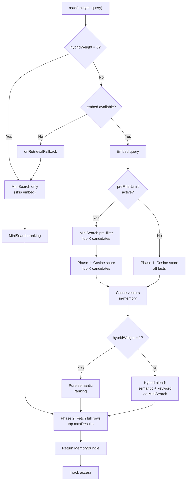

# @equationalapplications/core-llm-wiki

Pure TypeScript business logic for LLM Wiki Memory.

> Inspired by [Andrej Karpathy's LLM Wiki memory spec](https://gist.github.com/karpathy/442a6bf555914893e9891c11519de94f).

## Features

- **Platform-agnostic** — Zero runtime dependencies; works with any SQLite driver via the `SQLiteAdapter` interface
- **Semantic search** — Vector embeddings via your LLM's `embed` function, ranked by cosine similarity
- **Keyword fallback** — MiniSearch in-memory index for offline/degraded scenarios when embeddings unavailable
- **Retrieval tuning** — Per-call overrides for `maxResults`, `preFilterLimit`, and `hybridWeight` blend
- **Full-featured memory** — Facts, tasks, events, maintenance jobs (librarian, heal, reembed, prune)
- **Type-safe** — Built with TypeScript, full type exports

## Installation

```bash
npm install @equationalapplications/core-llm-wiki
```

## Semantic Search with Embeddings

Provide an `embed` function in `llmProvider` to enable vector-based retrieval:

```typescript
import { WikiMemory } from '@equationalapplications/core-llm-wiki';

const wikiMemory = new WikiMemory(db, {
  llmProvider: {
    generateText: async ({ systemPrompt, userPrompt }) => {
      // Your LLM call for extracting facts, tasks
      return 'Model output';
    },
    embed: async (text: string) => {
      // Your embedding service (e.g., OpenAI, Cohere, local)
      const response = await fetch('/api/embed', { method: 'POST', body: JSON.stringify({ text }) });
      const { embedding } = await response.json();
      return embedding; // Float32Array or number[]
    },
  },
});

await wikiMemory.setup();

// Query with semantic matching
const memory = await wikiMemory.read('user-123', 'What should I do this weekend?');
// Returns facts semantically similar to the query, not lexical matches
// E.g., fact "Saturday hiking trip" ranks high even though no lexical overlap
```

**When `embed` is unavailable or throws**, `read()` silently falls back to MiniSearch keyword search and calls `onRetrievalFallback` if provided:

```typescript
const wikiMemory = new WikiMemory(db, {
  llmProvider: {
    generateText: async (...) => { /* ... */ },
    embed: undefined, // or throws on network error
  },
  onRetrievalFallback: (error) => {
    console.warn('Embedding retrieval unavailable, using keyword search:', error);
  },
});

// read() returns MiniSearch results, onRetrievalFallback not called (embed absent is expected)
// read() returns MiniSearch results, onRetrievalFallback called (embed threw)
```

## Retrieval Tuning

Optimize `read()` performance and blend retrieval strategies:

```typescript
const config = {
  // Limit cosine similarity scoring to top-K MiniSearch keyword candidates
  preFilterLimit: 50,
  
  // Blend semantic and keyword scores (0.0 = pure keyword, 1.0 = pure semantic)
  hybridWeight: 0.7,
  
  // Max results returned per read
  maxResults: 10,
};

const wikiMemory = new WikiMemory(db, {
  config,
  llmProvider: { /* ... */ },
});

// Per-call overrides (runtime controls for search dashboards, etc.)
const memory = await wikiMemory.read('user-123', 'my preferences', {
  maxResults: 5,
  preFilterLimit: 20,
  hybridWeight: 0.5,
});
```

**Hybrid scoring blends:**
- `hybridWeight: 1.0` → pure semantic ranking (full cosine scan)
- `hybridWeight: 0.5` → balanced semantic + keyword (50/50 blend)
- `hybridWeight: 0.0` → pure keyword ranking, skips `embed()` entirely (no LLM API cost)

**Pre-filtering optimization:**
When `preFilterLimit: 50` is set with 1000 facts, cosine similarity is computed only for the top 50 MiniSearch keyword matches, reducing O(N) scoring to O(50).

## Usage

```typescript
import { WikiMemory, type SQLiteAdapter } from '@equationalapplications/core-llm-wiki';

// Provide any SQLiteAdapter-compatible driver
const wikiMemory = new WikiMemory(db, {
  llmProvider: {
    generateText: async ({ systemPrompt, userPrompt }) => {
      // Your LLM call here
      return 'Model output';
    },
  },
});

// Initialize schema and run migrations
await wikiMemory.setup();

// Store facts
await wikiMemory.write('user-123', {
  event_type: 'observation',
  summary: 'User prefers async/await over promises',
});

// Query memory
const memory = await wikiMemory.read('user-123', 'coding style preferences');
```

## Adapter Interface

Implement `SQLiteAdapter` to use your platform's SQLite driver:

```typescript
export interface SQLiteAdapter {
  execAsync(sql: string): Promise<void>;
  runAsync(sql: string, params?: unknown[]): Promise<{ changes: number; lastInsertRowId: number }>;
  getAllAsync<T>(sql: string, params?: unknown[]): Promise<T[]>;
  getFirstAsync<T>(sql: string, params?: unknown[]): Promise<T | null>;
  withTransactionAsync<T>(fn: () => Promise<T>): Promise<T>;
  closeAsync(): Promise<void>;
}
```

`@equationalapplications/expo-llm-wiki` provides a pre-built adapter for Expo/React Native. For web and Node.js, implement the interface yourself — examples below.

**Browser (sql.js):**

```typescript
import initSqlJs from 'sql.js';
import type { SQLiteAdapter } from '@equationalapplications/core-llm-wiki';

const SQL = await initSqlJs({ locateFile: (f) => `/wasm/${f}` });
const sqlDb = new SQL.Database();

const adapter: SQLiteAdapter = {
  async execAsync(sql) { sqlDb.run(sql); },
  async runAsync(sql, params = []) {
    sqlDb.run(sql, params as any[]);
    // sql.js doesn't expose lastInsertRowId; hardcode 0 since WikiMemory uses internal ID generation
    return { changes: sqlDb.getRowsModified(), lastInsertRowId: 0 };
  },
  async getAllAsync<T>(sql, params = []) {
    const stmt = sqlDb.prepare(sql);
    stmt.bind(params as any[]);
    const rows: T[] = [];
    while (stmt.step()) rows.push(stmt.getAsObject() as T);
    stmt.free();
    return rows;
  },
  async getFirstAsync<T>(sql, params = []) {
    const stmt = sqlDb.prepare(sql);
    stmt.bind(params as any[]);
    const row = stmt.step() ? stmt.getAsObject() as T : null;
    stmt.free();
    return row;
  },
  async withTransactionAsync(fn) {
    sqlDb.run('BEGIN');
    try { const r = await fn(); sqlDb.run('COMMIT'); return r; }
    catch (e) { sqlDb.run('ROLLBACK'); throw e; }
  },
  async closeAsync() { sqlDb.close(); },
};
```

**Node.js (better-sqlite3):**

```typescript
import Database from 'better-sqlite3';
import type { SQLiteAdapter } from '@equationalapplications/core-llm-wiki';

const db = new Database('wiki.db');

const adapter: SQLiteAdapter = {
  async execAsync(sql) { db.exec(sql); },
  async runAsync(sql, params = []) {
    const info = db.prepare(sql).run(...(params as any[]));
    return { changes: info.changes, lastInsertRowId: Number(info.lastInsertRowid) };
  },
  async getAllAsync<T>(sql, params = []) {
    return db.prepare(sql).all(...(params as any[])) as T[];
  },
  async getFirstAsync<T>(sql, params = []) {
    return (db.prepare(sql).get(...(params as any[])) ?? null) as T | null;
  },
  async withTransactionAsync(fn) {
    db.exec('BEGIN');
    try { const r = await fn(); db.exec('COMMIT'); return r; }
    catch (e) { db.exec('ROLLBACK'); throw e; }
  },
  async closeAsync() { db.close(); },
};
```

## How It Works



The flowchart shows:
1. **Fast-path** when `hybridWeight = 0` (pure keyword, no embed cost)
2. **Fallback chain** when embed unavailable (MiniSearch via `onRetrievalFallback`)
3. **Pre-filtering** to limit cosine scoring to top-K keyword matches (O(N) → O(K))
4. **Two-phase SELECT**: phase 1 scores all/filtered facts with minimal columns, phase 2 fetches full rows for winners
5. **Hybrid scoring** to blend semantic and keyword rankings
6. **Vector caching** of parsed embeddings to avoid re-parsing on repeated reads

## License

MIT

---

Made with ❤️ by Equational Applications LLC. [https://equationalapplications.com/](https://equationalapplications.com/)
