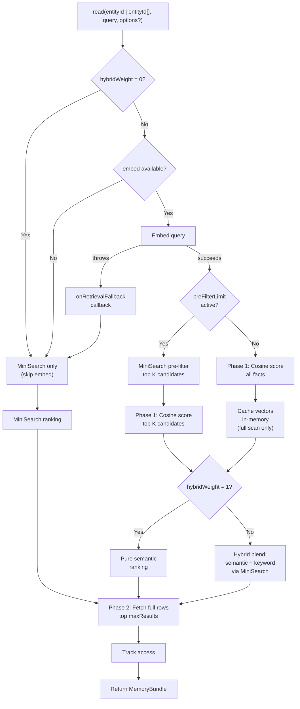

# @equationalapplications/core-llm-wiki

Pure TypeScript business logic for LLM Wiki Memory.

> Inspired by [Andrej Karpathy's LLM Wiki memory spec](https://gist.github.com/karpathy/442a6bf555914893e9891c11519de94f).

## Features

- **Platform-agnostic** — Zero runtime dependencies; works with any SQLite driver via the `SQLiteAdapter` interface
- **Semantic search** — Vector embeddings via your LLM's `embed` function, ranked by cosine similarity
- **Keyword fallback** — MiniSearch in-memory index for offline/degraded scenarios when embeddings unavailable
- **Retrieval tuning** — Per-call overrides for `maxResults`, `preFilterLimit`, `hybridWeight`, `tierWeights`, and `includeZeroWeightEntities`
- **Multi-entity reads** — Search across multiple `entity_id` namespaces in one pass with per-entity score multipliers (`tierWeights`); optional `factScores` and `metadata` for explainability
- **Full-featured memory** — Facts, tasks, events, maintenance jobs (librarian, heal, reembed, prune)
- **Type-safe** — Built with TypeScript, full type exports

## Installation

```bash
npm install @equationalapplications/core-llm-wiki
```

## Semantic Search with Embeddings

Provide an `embed` function in `llmProvider` to enable vector-based retrieval:

```typescript
import { WikiMemory } from '@equationalapplications/core-llm-wiki';

const wikiMemory = new WikiMemory(db, {
  llmProvider: {
    generateText: async ({ systemPrompt, userPrompt }) => {
      // Your LLM call for extracting facts, tasks
      return 'Model output';
    },
    embed: async (text: string) => {
      // Your embedding service (e.g., OpenAI, Cohere, local)
      const response = await fetch('https://your-app.example.com/api/embed', {
        method: 'POST',
        body: JSON.stringify({ text }),
      });
      const { embedding } = await response.json();
      return embedding; // number[]
    },
  },
});

await wikiMemory.setup();

// Query with semantic matching
const memory = await wikiMemory.read('user-123', 'What should I do this weekend?');
// Returns facts semantically similar to the query, not lexical matches
// E.g., fact "Saturday hiking trip" ranks high even though no lexical overlap
```

When `embed` is unavailable, `read()` silently falls back to MiniSearch keyword search. If an embedding attempt throws, `read()` falls back and calls `onRetrievalFallback` if provided:

```typescript
const wikiMemory = new WikiMemory(db, {
  llmProvider: {
    generateText: async () => { /* ... */ },
    embed: undefined, // or throws on network error
  },
  onRetrievalFallback: (error) => {
    console.warn('Embedding retrieval unavailable, using keyword search:', error);
  },
});

// read() returns MiniSearch results, onRetrievalFallback not called (embed absent is expected)
// read() returns MiniSearch results, onRetrievalFallback called (embed threw)
```

## Configuration

All `WikiConfig` fields are optional:

```typescript
const wikiMemory = new WikiMemory(db, {
  llmProvider: { /* ... */ },
  config: {
    tablePrefix: 'llm_wiki_',          // default: 'llm_wiki_'
    maxResults: 10,                    // default: 10
    autoLibrarianThreshold: 20,        // default: 20 — events before librarian auto-runs
    autoHealThreshold: 100,            // default: 100 — events before heal auto-runs
    maxChunkLength: 12000,             // default: 12000 (char count per ingestDocument chunk)
    chunkOverlap: 400,                 // default: 400 (overlap between chunks in characters)
    chunkConcurrency: 1,               // default: 1 (parallel LLM calls per ingestDocument)
    pruneRetainSoftDeletedFor: 7,      // default: 7 (days before hard-deleting soft-deleted facts)
    pruneEventsAfter: 30,              // default: 30 (days before hard-deleting old events)
    orphanAfterDays: 30,               // default: 30 (days before runHeal flags sourceless facts; null to disable)
    staleInferredAfterDays: 60,        // default: 60 (days before runHeal downgrades inferred facts; null to disable)
    preFilterLimit: 50,                // default: undefined — MiniSearch pre-filter before cosine scan; recommended for >500 facts
    hybridWeight: 0.7,                 // default: undefined — blend semantic (1.0) ↔ keyword (0.0); pure semantic when unset
  },
});
```

## Retrieval Tuning

Optimize `read()` performance and blend retrieval strategies:

```typescript
const config = {
  // Limit cosine similarity scoring to top-K MiniSearch keyword candidates
  preFilterLimit: 50,
  
  // Blend semantic and keyword scores (0.0 = pure keyword, 1.0 = pure semantic)
  hybridWeight: 0.7,
  
  // Max results returned per read
  maxResults: 10,
};

const wikiMemory = new WikiMemory(db, {
  config,
  llmProvider: { /* ... */ },
});

// Per-call overrides (runtime controls for search dashboards, etc.)
const memory = await wikiMemory.read('user-123', 'my preferences', {
  maxResults: 5,
  preFilterLimit: 20,
  hybridWeight: 0.5,
});

// Multi-entity with tier weights
const multiMemory = await wikiMemory.read(['tier_wisdom', 'tier_fact', 'tier_working'], 'my preferences', {
  maxResults: 8,
  tierWeights: {
    tier_wisdom: 2,      // high-confidence curated notes boosted 2×
    tier_fact: 1,        // neutral baseline
    tier_working: 0.25,  // recent but unvetted context downranked
  },
  // includeZeroWeightEntities: true — include 0-weight entities as bottom-ranked filler
});
// multiMemory.factScores — optional Record<factId, weightedScore> for returned facts; may be absent/undefined
// multiMemory.metadata  — optional { query, entityIds, tierWeights }; may be absent/undefined
```

**Hybrid scoring blends:**
- `hybridWeight: 1.0` → all-semantic blend with semantic scores clamped to non-negative range (no keyword component)
- `hybridWeight: 0.5` → balanced semantic + keyword (50/50 blend)
- `hybridWeight: 0.0` → pure keyword ranking, skips `embed()` entirely (no LLM API cost)

True cosine-range pure semantic ranking (including negative cosine values) is used when `hybridWeight` is left `undefined`.

**Tier weights:**
- `tierWeights` applies a per-entity multiplier after semantic/keyword scoring: `finalScore = retrievalScore × weight`
- Missing weights default to `1.0`. Negative weights clamp to `0`. Non-finite weights default to `1.0`.
- `tierWeights[entity] = 0` skips that entity's scored retrieval branch (no compute cost).
- `includeZeroWeightEntities: true` includes zero-weight entities as bottom-ranked filler instead of skipping them.
- `factScores` is present for array-shaped `entityId` calls only when the query is non-empty and at least one fact is scored; empty-query ("recent facts") reads leave it absent even when `entityId` is an array. Plain string calls never expose it. `metadata` is present for all array-shaped calls regardless of query.
- `maxResults` applies globally across all requested entities.
- Tasks are capped at `min(20 × entityCount, 200)`; events at `min(10 × entityCount, 100)` for multi-entity reads.

**Pre-filtering optimization:**
When `preFilterLimit: 50` is set with 1000 facts, cosine similarity is computed only for the top 50 MiniSearch keyword matches, reducing O(N) scoring to O(50).

## Pluggable Vector Retrieval

When your entity corpus grows, in-process cosine similarity scoring becomes a bottleneck. The optional **`VectorRanker`** interface lets you delegate semantic ranking to **sqlite-vec**, **sqlite-vss**, or an external vector database while `WikiMemory` handles embedding validation, hybrid scoring, and tier-2 row hydration.

### `VectorRanker` purpose

`VectorRanker` provides an optional injection point for approximate nearest-neighbor (ANN) ranking:

```typescript
export interface VectorRanker {
  /**
   * Return semantic scores for facts in scope, sorted by similarity.
   * - `entityId`: restricts results to one entity
   * - `queryVec`: the embedded query (Float32Array or number[])
   * - `candidateIds` (optional): when set, rank only within this set (MiniSearch pre-filter mode)
   * - `limit`: requested top-K count
   */
  rankBySimilarity(args: VectorRankerRankArgs): Promise<VectorRankerSemanticResult[]>;

  /**
   * Optional hook called after embedding persistence (upsert, reembed, delete).
   * Implementations use this to keep external indexes (sqlite-vec, remote ANN) in sync.
   */
  onEmbeddingPersisted?(event: {
    entityId: string;
    factId: string;
    vector: Float32Array | null; // null = embedding removed
  }): void | Promise<void>;
}
```

**When no ranker is configured**, `WikiMemory` uses built-in JS cosine similarity — the same behavior as today. When a ranker is supplied and embeddings preconditions are met (`embed` available, dimensions match, no mismatches), `WikiMemory` delegates scoring to the ranker and blends results with keyword scores.

### Example: sqlite-vec adapter

```typescript
import { WikiMemory } from '@equationalapplications/core-llm-wiki';
import type { VectorRanker, VectorRankerRankArgs, VectorRankerSemanticResult } from '@equationalapplications/core-llm-wiki';

// Minimal sqlite-vec adapter (pseudo-code)
const sqliteVecRanker: VectorRanker = {
  async rankBySimilarity(args: VectorRankerRankArgs): Promise<VectorRankerSemanticResult[]> {
    const { entityId, queryVec, candidateIds, limit } = args;

    // Build KNN query using sqlite-vec's distance functions.
    // sqlite-vec returns cosine distance (0 = identical, 2 = opposite) ascending.
    // Invert to semanticScore: higher = more similar, matching VectorRanker contract.
    let sql = `SELECT id, (1.0 - distance) AS semanticScore FROM vec_facts 
              WHERE entity_id = ? AND deleted_at IS NULL`;
    const params: any[] = [entityId];

    // Apply pre-filter if provided
    if (candidateIds) {
      sql += ` AND id IN (${candidateIds.map(() => '?').join(',')})`;
      params.push(...candidateIds);
    }

    // KNN search (example syntax; adjust for your sqlite-vec version)
    sql += ` ORDER BY vec MATCH vec_neighbor(?) LIMIT ?`;
    params.push(queryVec, limit);

    const rows = await db.getAllAsync<{ id: string; semanticScore: number }>(sql, params);
    return rows; // sorted descending by semanticScore (closest distance → highest similarity)
  },

  async onEmbeddingPersisted(event) {
    const { entityId, factId, vector } = event;
    if (vector) {
      // Upsert into sqlite-vec table
      await db.runAsync(
        `INSERT OR REPLACE INTO vec_facts (id, entity_id, vec) VALUES (?, ?, ?)`,
        [factId, entityId, vector]
      );
    } else {
      // Delete when embedding is removed
      await db.runAsync(`DELETE FROM vec_facts WHERE id = ?`, [factId]);
    }
  },
};

const wikiMemory = new WikiMemory(db, {
  llmProvider: { /* ... */ },
  vectorRanker: sqliteVecRanker,
});

// read() now uses sqlite-vec for scoring instead of JS cosine
const memory = await wikiMemory.read('user-123', 'my preferences');
```

### Fallback policies

When `rankBySimilarity` rejects (e.g., ANN service outage, misconfiguration), `WikiMemory` applies a recovery policy:

```typescript
export type VectorRankerFallback =
  | 'js-cosine'  // (default) Score candidates in-process with JS cosine — same as no ranker
  | 'keyword'    // Skip semantic ranking; return keyword-only results
  | 'empty'      // Semantic facts list empty for this read; tasks/events still included
  | 'throw';     // Reject read() with the ranker error

const wikiMemory = new WikiMemory(db, {
  llmProvider: { /* ... */ },
  vectorRanker: sqliteVecRanker,
  vectorRankerFallback: 'js-cosine', // default
  onVectorRankerFallback: (info) => {
    console.warn(
      `Ranker failed (policy: ${info.policy}); error:`,
      info.error
    );
  },
});
```

- **`'js-cosine'` (default):** Seamless degradation; same behavior as if no ranker was configured.
- **`'keyword'`:** Useful when semantic ranking is optional; keyword search proceeds normally.
- **`'empty'`:** Return no facts for this query (but tasks/events still load); useful for strict consistency.
- **`'throw'`:** Propagate the error and fail the read.

### `onEmbeddingPersisted` eventual consistency

If `vectorRanker.onEmbeddingPersisted` returns a pending Promise, the hook **may resolve asynchronously**. This supports ANN indexes that rebuild on a schedule (e.g., sqlite-vec triggers on transaction commit) or external services with eventual consistency.

**Best practice:**
- If your adapter has **synchronous guarantees** (in-process sqlite-vec, same transaction), await the promise.
- If your adapter is **eventually consistent** (remote ANN, async rebuild), document the lag and document that queries may miss recently-added facts until the index refreshes.
- The **SQLite blob remains the source of truth**; `WikiMemory` always writes embeddings to `embedding_blob` first before calling the hook.

### Hybrid scoring with ranker

When both `vectorRanker` and `hybridWeight` are configured, `WikiMemory` still applies hybrid blending after the ranker returns scores:

```typescript
const wikiMemory = new WikiMemory(db, {
  config: {
    hybridWeight: 0.7, // 70% semantic, 30% keyword
  },
  vectorRanker: sqliteVecRanker,
});

// ranker returns semanticScore; WikiMemory blends with MiniSearch keyword score
const memory = await wikiMemory.read('user-123', 'my preferences', {
  hybridWeight: 0.5, // per-call override to 50/50 blend
});
```

Note on semantics:
- Leave `hybridWeight` undefined for true pure-semantic cosine-range scoring.
- Set `hybridWeight: 1` for an all-semantic variant that clamps negative semantic scores to 0.

For details on hybrid scoring formulas and trade-offs, see [Retrieval Tuning](#retrieval-tuning) above.

### Spec and issue reference

- **Full spec:** [`docs/superpowers/specs/2026-05-07-pluggable-vector-retrieval.md`](https://github.com/equationalapplications/expo-llm-wiki/blob/main/docs/superpowers/specs/2026-05-07-pluggable-vector-retrieval.md)
- **GitHub issue:** [#15](https://github.com/equationalapplications/expo-llm-wiki/issues/15)

## Vector Cache

Parsed embedding vectors from full-scan `read()` calls are cached in memory, keyed by entity ID (max 16 entities, max 500 vectors per entity). This avoids redundant `Float32Array` parsing on repeated queries for the same entity. When the 16-entity limit is reached, the oldest-inserted entity is evicted to make room; if an entity exceeds 500 facts, its vectors are not cached at all for that read.

After heavy read workloads or on memory-constrained runtimes, you can release the entire cache explicitly:

```typescript
// Release all cached embedding vectors
wikiMemory.clearVectorCache();
```

The cache is also automatically invalidated on any mutation (`runLibrarian`, `runHeal`, `runPrune`, `runReembed`, `ingestDocument`, `importDump`, `forget`).

## Entity Status

`WikiMemory` exposes the in-flight job state for a single entity through two complementary APIs.

### `getEntityStatus(entityId)`

Synchronous point-in-time snapshot:

```typescript
const status = wikiMemory.getEntityStatus('user-42');
// { ingesting: boolean, librarian: boolean, heal: boolean }
```

Use this when you only need the current value (e.g. inside a request handler).

### `subscribeEntityStatus(entityId, callback)`

Push-based change notification — the callback fires synchronously once with the current status, then again on every transition where any of the three booleans flips. There is no polling and no duplicate snapshots.

```typescript
const unsubscribe = wikiMemory.subscribeEntityStatus('user-42', (status) => {
  console.log(status); // { ingesting, librarian, heal }
});

// Later:
unsubscribe(); // idempotent — safe to call more than once
```

Notes:

- The first invocation happens **before** `subscribeEntityStatus` returns. Treat it as the initial render value.
- Each emission may be a fresh object literal. Do not rely on referential equality between callbacks; equality of the three booleans is the contract.
- A throwing callback is caught (logged via `console.error`) and does not block other subscribers or the underlying job.
- Subscriptions are scoped to a single `entityId`. There is no wildcard or "all entities" form.

## Security

`@equationalapplications/core-llm-wiki` enforces multiple security layers:

### VectorRanker Adapter Security

If implementing a custom `VectorRanker`:

- **SQL Injection**: ALWAYS use parameterized queries for `entityId`, `factId`, `candidateIds`. Never concatenate into SQL strings.
- **Entity Isolation**: Filter by `entityId` in all queries to prevent cross-tenant data leaks.
- **Credential Scrubbing**: Strip API keys, tokens, connection strings from thrown errors before surfacing to host.
- **Resource Limits**: Cap `limit` and `candidateIds.length` to prevent DoS. Do NOT retain `vector` references beyond callback scope — blocks GC.

See [SECURITY.md](../../SECURITY.md) for complete adapter security guidance and code examples.

### Host Application Security

When using `VectorRanker`:

- **Error Sanitization**: `sanitizeRankerErrors: true` (default) scrubs ranker errors before mirroring via `error.cause`.
- **Fallback Policy**: Choose `vectorRankerFallback` based on availability vs consistency requirements:
  - `'js-cosine'` (default): Best availability
  - `'keyword'`: Fast fallback without semantic ranking
  - `'empty'`: Strict consistency (no facts on failure)
  - `'throw'`: Fail-fast error propagation
- **Deletion Hook Contract**: `forget()` / `runPrune()` reject on hook timeout/failure. Prevents GDPR violations (deleted vectors still retrievable). Handle failures with retry or queue for reconciliation.
- **Timeout Tuning**: Set `deletionHookTimeoutMs` per deployment (default 30s). Interactive UX: 5s. Background jobs: 60s.

Core WikiMemory provides:
- **Defensive Copies**: Query/embedding vectors copied before ranker/hook calls
- **Input Validation**: `sourceRef`/`sourceHash` normalized; embedding dimensions validated
- **Parameterized Queries**: All SQL uses bind parameters

## Usage

```typescript
import { WikiMemory, type SQLiteAdapter } from '@equationalapplications/core-llm-wiki';

// Provide any SQLiteAdapter-compatible driver
const wikiMemory = new WikiMemory(db, {
  llmProvider: {
    generateText: async ({ systemPrompt, userPrompt }) => {
      // Your LLM call here
      return 'Model output';
    },
  },
});

// Initialize schema and run migrations
await wikiMemory.setup();

// Store facts
await wikiMemory.write('user-123', {
  event_type: 'observation',
  summary: 'User prefers async/await over promises',
});

// Query memory
const memory = await wikiMemory.read('user-123', 'coding style preferences');
```

### Multi-entity weighted reads

`read()` accepts either one entity id or an array of entity ids. Facts are always merged globally before `maxResults` is applied. For single-entity reads, tasks are uncapped and events are capped at 10. For multi-entity reads, tasks are capped at `min(20 × entity count, 200)` and events at `min(10 × entity count, 100)` — per-entity representation in the returned bundle is not guaranteed.

```ts
const memory = await wikiMemory.read(['tier_wisdom', 'tier_fact', 'tier_working'], 'Which source should I trust?', {
  maxResults: 8,
  tierWeights: {
    tier_wisdom: 2,
    tier_fact: 1,
    tier_working: 0.25,
  },
});

console.log(memory.metadata);
console.log(memory.factScores);
```

### Librarian prompt override contract

Core exports prompt utilities for weighted retrieval-based synthesis. Use `mapLibrarianOptionsToReadOptions()` to map `entityWeights` to `tierWeights`, then hydrate a prompt with `query`, `context`, and `tasks`.

```ts
import {
  DEFAULT_LIBRARIAN_SYNTHESIS_PROMPT,
  formatContext,
  hydrateLibrarianPrompt,
  mapLibrarianOptionsToReadOptions,
  validateLibrarianPromptTemplate,
} from '@equationalapplications/core-llm-wiki';

const options = {
  entityWeights: { tier_wisdom: 2, tier_fact: 1, tier_working: 0.25 },
  systemPrompt: `You are a strict fact checker.
Question:
{{query}}

Retrieved context:
{{context}}

{{tasks}}`,
};

const query = 'Which source should I trust for recent project decisions?';

const memory = await wikiMemory.read(['tier_wisdom', 'tier_fact', 'tier_working'], query, {
  ...mapLibrarianOptionsToReadOptions(options),
  maxResults: 8,
});

const template = options.systemPrompt ?? DEFAULT_LIBRARIAN_SYNTHESIS_PROMPT;
const warnings = validateLibrarianPromptTemplate(template, {
  custom: options.systemPrompt != null,
  taskCount: memory.tasks.length,
});

for (const warning of warnings) console.warn(warning);

const finalPrompt = hydrateLibrarianPrompt(template, {
  query,
  context: formatContext(memory, { includeEntityIds: true, includeFactScores: true }),
  tasks: formatContext({ facts: [], tasks: memory.tasks, events: [] }, { format: 'plain' }),
});
```

## Adapter Interface

Implement `SQLiteAdapter` to use your platform's SQLite driver:

```typescript
export interface SQLiteAdapter {
  execAsync(sql: string): Promise<void>;
  runAsync(sql: string, params?: unknown[]): Promise<{ changes: number; lastInsertRowId: number }>;
  getAllAsync<T>(sql: string, params?: unknown[]): Promise<T[]>;
  getFirstAsync<T>(sql: string, params?: unknown[]): Promise<T | null>;
  withTransactionAsync<T>(fn: () => Promise<T>): Promise<T>;
  closeAsync(): Promise<void>;
}
```

`@equationalapplications/expo-llm-wiki` provides a pre-built adapter for Expo/React Native. For web and Node.js, implement the interface yourself — examples below.

**Browser (sql.js):**

```typescript
import initSqlJs from 'sql.js';
import type { SQLiteAdapter } from '@equationalapplications/core-llm-wiki';

const SQL = await initSqlJs({ locateFile: (f) => `/wasm/${f}` });
const sqlDb = new SQL.Database();

const adapter: SQLiteAdapter = {
  async execAsync(sql) { sqlDb.run(sql); },
  async runAsync(sql, params = []) {
    sqlDb.run(sql, params as any[]);
    // sql.js doesn't expose lastInsertRowId; hardcode 0 since WikiMemory uses internal ID generation
    return { changes: sqlDb.getRowsModified(), lastInsertRowId: 0 };
  },
  async getAllAsync<T>(sql, params = []) {
    const stmt = sqlDb.prepare(sql);
    stmt.bind(params as any[]);
    const rows: T[] = [];
    while (stmt.step()) rows.push(stmt.getAsObject() as T);
    stmt.free();
    return rows;
  },
  async getFirstAsync<T>(sql, params = []) {
    const stmt = sqlDb.prepare(sql);
    stmt.bind(params as any[]);
    const row = stmt.step() ? stmt.getAsObject() as T : null;
    stmt.free();
    return row;
  },
  async withTransactionAsync(fn) {
    sqlDb.run('BEGIN');
    try { const r = await fn(); sqlDb.run('COMMIT'); return r; }
    catch (e) { sqlDb.run('ROLLBACK'); throw e; }
  },
  async closeAsync() { sqlDb.close(); },
};
```

**Node.js (better-sqlite3):**

```typescript
import Database from 'better-sqlite3';
import type { SQLiteAdapter } from '@equationalapplications/core-llm-wiki';

const db = new Database('wiki.db');

const adapter: SQLiteAdapter = {
  async execAsync(sql) { db.exec(sql); },
  async runAsync(sql, params = []) {
    const info = db.prepare(sql).run(...(params as any[]));
    return { changes: info.changes, lastInsertRowId: Number(info.lastInsertRowid) };
  },
  async getAllAsync<T>(sql, params = []) {
    return db.prepare(sql).all(...(params as any[])) as T[];
  },
  async getFirstAsync<T>(sql, params = []) {
    return (db.prepare(sql).get(...(params as any[])) ?? null) as T | null;
  },
  async withTransactionAsync(fn) {
    db.exec('BEGIN');
    try { const r = await fn(); db.exec('COMMIT'); return r; }
    catch (e) { db.exec('ROLLBACK'); throw e; }
  },
  async closeAsync() { db.close(); },
};
```

## How It Works



The flowchart shows:
1. **Fast-path** when `hybridWeight = 0` (pure keyword, no embed cost)
2. **Fallback chain** when embed unavailable (MiniSearch silently) or throws (`onRetrievalFallback` callback, then MiniSearch)
3. **Pre-filtering** to limit cosine scoring to top-K keyword matches (O(N) → O(K))
4. **Two-phase SELECT**: phase 1 scores all/filtered facts with minimal columns, phase 2 fetches full rows for winners
5. **Hybrid scoring** to blend semantic and keyword rankings
6. **Vector caching** on full scans only; reads with `preFilterLimit` active skip cache population

## License

MIT

---

Made with ❤️ by Equational Applications LLC. [https://equationalapplications.com/](https://equationalapplications.com/)
