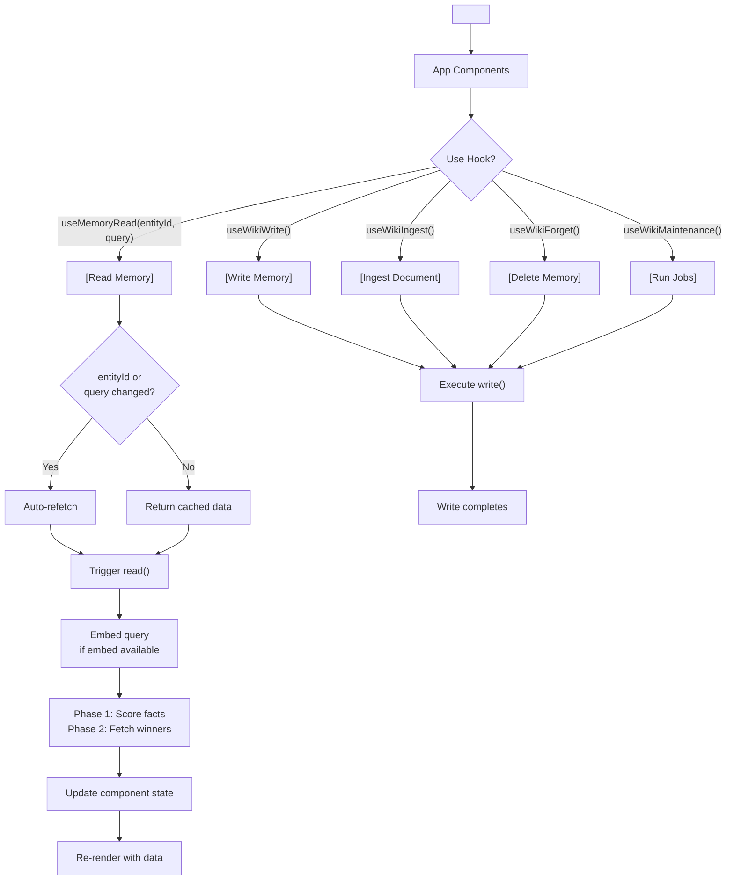
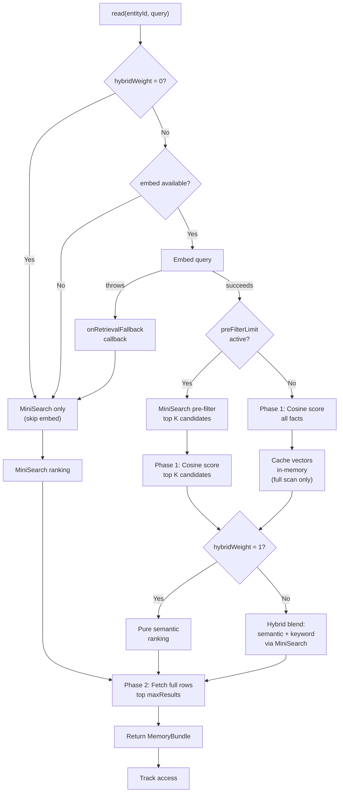

# @equationalapplications/expo-llm-wiki

Expo/React Native adapter for @equationalapplications/core-llm-wiki, powered by `expo-sqlite`.

[](https://www.npmjs.com/package/@equationalapplications/expo-llm-wiki)
[](https://www.npmjs.com/package/@equationalapplications/expo-llm-wiki)
[](https://bundlephobia.com/package/@equationalapplications/expo-llm-wiki)
[](https://www.typescriptlang.org/)
[](LICENSE)

> Inspired by [Andrej Karpathy's LLM Wiki memory spec](https://gist.github.com/karpathy/442a6bf555914893e9891c11519de94f).

## Features

- **Expo-ready** — Pre-configured for React Native + Expo
- **Built on `expo-sqlite`** — Stable, well-supported SQLite driver
- **Semantic search** — Vector embeddings via `embed` function, with MiniSearch fallback
- **Retrieval tuning** — Per-call overrides for search behavior (pre-filter, hybrid blend)
- **React hooks** — `WikiProvider`, `useMemoryRead`, and all other hooks are re-exported directly from `@equationalapplications/expo-llm-wiki`
- **Full-featured memory** — Facts, tasks, events, maintenance jobs (librarian, heal, reembed, prune)

## Installation

```bash
npx expo install expo-sqlite
npm install @equationalapplications/expo-llm-wiki
```

## Semantic Search

Enable vector-based retrieval by providing an `embed` function:

```typescript
import { createWiki } from '@equationalapplications/expo-llm-wiki';
import { openDatabaseSync } from 'expo-sqlite';

const db = openDatabaseSync('wiki.db');

const wiki = createWiki(db, {
  config: {
    // Optimize retrieval for large memory stores
    preFilterLimit: 50,    // Limit cosine scoring to top-50 keyword matches
    hybridWeight: 0.7,     // Blend semantic (0.7) + keyword (0.3)
  },
  llmProvider: {
    generateText: async ({ systemPrompt, userPrompt }) => {
      // Your LLM call — must return the model output as a string
      return 'Model output';
    },
    embed: async (text: string) => {
      // Your embedding service (e.g., OpenAI, Cohere)
      // Use an absolute URL — React Native / Expo apps do not have a browser
      // origin to resolve relative URLs against on device or simulator.
      const response = await fetch('https://your-api.example.com/api/embed', { 
        method: 'POST', 
        body: JSON.stringify({ text }) 
      });
      const { embedding } = await response.json();
      return embedding; // number[]
    },
  },
  onRetrievalFallback: (error) => {
    console.warn('Embedding unavailable, using keyword search:', error);
  },
});

await wiki.setup();

// Semantic query
const memory = await wiki.read('user-123', 'what activities should I do this weekend?');
// Matches facts like "Saturday hiking trip" even with no lexical overlap

// Per-call overrides
const fasterSearch = await wiki.read('user-123', 'activities', {
  maxResults: 5,
  preFilterLimit: 20,      // Tighter pre-filter for speed
  hybridWeight: 0.5,       // More keyword weight
});
```

## Configuration

All `WikiConfig` fields are optional:

```typescript
const wiki = createWiki(db, {
  llmProvider: { /* ... */ },
  config: {
    tablePrefix: 'llm_wiki_',          // default: 'llm_wiki_'
    maxResults: 10,                    // default: 10
    autoLibrarianThreshold: 20,        // default: 20 — events before librarian auto-runs
    autoHealThreshold: 100,            // default: 100 — events before heal auto-runs
    maxChunkLength: 12000,             // default: 12000 (char count per ingestDocument chunk)
    chunkOverlap: 400,                 // default: 400 (overlap between chunks in characters)
    chunkConcurrency: 1,               // default: 1 (parallel LLM calls per ingestDocument)
    pruneRetainSoftDeletedFor: 7,      // default: 7 (days before hard-deleting soft-deleted facts)
    pruneEventsAfter: 30,              // default: 30 (days before hard-deleting old events)
    orphanAfterDays: 30,               // default: 30 (days before runHeal flags sourceless facts; null to disable)
    staleInferredAfterDays: 60,        // default: 60 (days before runHeal downgrades inferred facts; null to disable)
    preFilterLimit: 50,                // default: undefined — MiniSearch pre-filter before cosine scan; recommended for >500 facts
    hybridWeight: 0.7,                 // default: undefined — blend semantic (1.0) ↔ keyword (0.0); pure semantic when unset
  },
});
```

## Retrieval Tuning

Optimize `read()` performance and blend retrieval strategies:

```typescript
const config = {
  // Limit cosine similarity scoring to top-K MiniSearch keyword candidates
  preFilterLimit: 50,
  
  // Blend semantic and keyword scores (0.0 = pure keyword, 1.0 = pure semantic)
  hybridWeight: 0.7,
  
  // Max results returned per read
  maxResults: 10,
};

const wiki = createWiki(db, {
  config,
  llmProvider: { /* ... */ },
});
```

**Hybrid scoring blends:**
- `hybridWeight: 1.0` → pure semantic ranking among the candidates being scored; if `preFilterLimit` is set, semantic scoring is still limited to the top-K MiniSearch matches
- `hybridWeight: 0.5` → balanced semantic + keyword (50/50 blend)
- `hybridWeight: 0.0` → pure keyword ranking, skips `embed()` entirely (no LLM API cost)

**Pre-filtering optimization:**
When `preFilterLimit: 50` is set with 1000 facts, cosine similarity is computed only for the top 50 MiniSearch keyword matches, reducing O(N) scoring to O(50).

## Usage

```typescript
import { createWiki } from '@equationalapplications/expo-llm-wiki';
import { openDatabaseSync } from 'expo-sqlite';

const db = openDatabaseSync('wiki.db');

const wiki = createWiki(db, {
  llmProvider: {
    generateText: async ({ systemPrompt, userPrompt }) => {
      // Your LLM call — must return the model output as a string
      return 'Model output';
    },
  },
});

// Initialize tables (call once on app startup)
await wiki.setup();

// Use wiki instance
await wiki.write('user-123', { event_type: 'observation', summary: '...' });
```

## With React

`@equationalapplications/expo-llm-wiki` re-exports all hooks and `WikiProvider` from `@equationalapplications/react-llm-wiki`:

```typescript
import { WikiProvider } from '@equationalapplications/expo-llm-wiki';

<WikiProvider wiki={wiki}>
  <MyApp />
</WikiProvider>
```

Then use hooks in components:

```typescript
import { useMemoryRead } from '@equationalapplications/expo-llm-wiki';

export function UserProfile({ userId }: { userId: string }) {
  const { data, isPending } = useMemoryRead(userId, 'preferences');
  
  if (isPending) return <Text>Loading...</Text>;
  return <Text>{data?.facts.map(f => f.title).join(', ')}</Text>;
}
```

## Component Lifecycle



**Data flow:**
1. **Wrap app** with `<WikiProvider wiki={wiki}>` — provides wiki context
2. **Use hooks** in components — access memory reactively
3. **Read operations** auto-refetch when `entityId`, `query`, or `wiki` change; call `refetch()` to refresh manually
4. **Write operations** (write, ingest, forget, maintenance) do not automatically re-trigger `useMemoryRead`; call `refetch()` after a write to refresh read results
5. **Re-render** with new data flowing back to UI

## Retrieval Engine Internals



The flowchart shows:
1. **Fast-path** when `hybridWeight = 0` (pure keyword, no embed cost)
2. **Fallback chain** when embed unavailable (MiniSearch silently) or throws (`onRetrievalFallback` callback, then MiniSearch)
3. **Pre-filtering** to limit cosine scoring to top-K keyword matches (O(N) → O(K))
4. **Two-phase SELECT**: phase 1 scores all/filtered facts with minimal columns, phase 2 fetches full rows for winners
5. **Hybrid scoring** to blend semantic and keyword rankings
6. **Vector caching** on full scans only; reads with `preFilterLimit` active skip cache population

## License

MIT

---

Made with ❤️ by Equational Applications LLC. [https://equationalapplications.com/](https://equationalapplications.com/)
