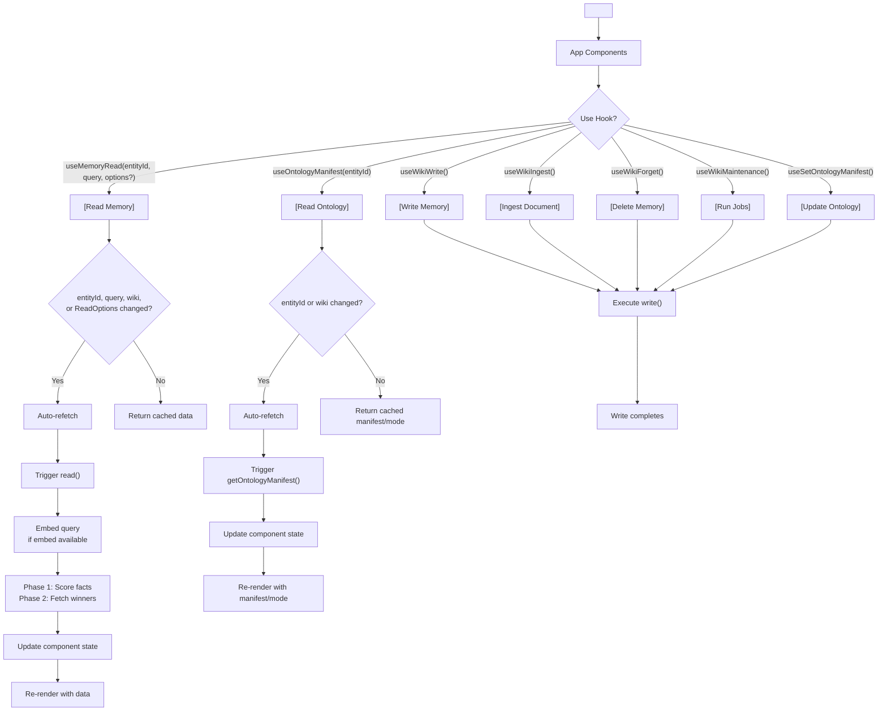
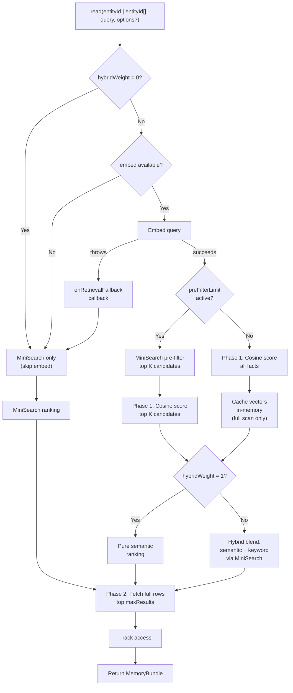

# @equationalapplications/expo-llm-wiki

Local-first LLM memory for Expo and React Native. Combines the core semantic search and extraction engine with [`expo-sqlite`](https://docs.expo.dev/versions/latest/sdk/sqlite/) and ready-to-use React hooks.

[](https://www.npmjs.com/package/@equationalapplications/expo-llm-wiki)
[](https://www.npmjs.com/package/@equationalapplications/expo-llm-wiki) [](https://www.typescriptlang.org/)
[](https://github.com/equationalapplications/expo-llm-wiki/blob/main/packages/expo/LICENSE)

**[GitHub](https://github.com/equationalapplications/expo-llm-wiki)** · **[ScopeLab](https://equationalapplications.github.io/expo-llm-wiki/scopelab/)** · **[WikiDemo](https://equationalapplications.github.io/expo-llm-wiki/wiki-demo/)** · **[Changelog](https://github.com/equationalapplications/expo-llm-wiki/blob/main/CHANGELOG.md)** · **[Issues](https://github.com/equationalapplications/expo-llm-wiki/issues)**

> Inspired by [Andrej Karpathy's LLM Wiki memory spec](https://gist.github.com/karpathy/442a6bf555914893e9891c11519de94f).

## Features

- **Expo-ready** — Pre-configured for React Native + Expo
- **Built on `expo-sqlite`** — Stable, well-supported SQLite driver
- **Hermes-ready** — Secure record ID generation via [`expo-crypto`](https://docs.expo.dev/versions/latest/sdk/crypto/); wired automatically at import (no manual `crypto` polyfill)
- **Semantic search** — Vector embeddings via `embed` function, with MiniSearch fallback
- **Retrieval tuning** — Per-call overrides for search behavior (pre-filter, hybrid blend, tier weights)
- **Multi-entity reads** — Search across multiple `entity_id` namespaces in one pass with `tierWeights`
- **Source provenance** — `WikiFact.source_type` distinguishes immutable document facts (`immutable_document`) from mutable derived/user facts. Immutable document content is protected from librarian/heal rewriting and only changed by `forget()` or re-ingest.
- **Seeded ontologies** — Enforce strict taxonomies or allow emergent graph relationship extraction (`useOntologyManifest`, `useSetOntologyManifest`; Strict, Emergent, or Off; defaults to Off).
- **React hooks** — `WikiProvider`, `useMemoryRead`, `useOntologyManifest`, `useSetOntologyManifest`, `useWikiTraversal`, and all other hooks re-exported from `@equationalapplications/expo-llm-wiki`
- **Full-featured memory** — Facts, tasks, events, maintenance jobs (librarian, heal, reembed, prune)
- **Interoperability:** Supports [Open Knowledge Format (OKF) v0.1](https://github.com/GoogleCloudPlatform/knowledge-catalog/tree/main/okf) import and export.

## Installation

```bash
npx expo install expo-sqlite expo-crypto
npm install @equationalapplications/expo-llm-wiki
```

`expo-crypto` is a peer dependency. The package wires its `getRandomValues` into the core engine at module load — Hermes and React Native lack the Web `crypto` global, and wiki writes need a cryptographically secure random source for record IDs. No extra setup is required after install; importing `@equationalapplications/expo-llm-wiki` (or the `/factory` subpath) activates it before any `createWiki()` call.

## Semantic Search

Enable vector-based retrieval by providing an `embed` function:

```typescript
import { createWiki } from '@equationalapplications/expo-llm-wiki';
import { openDatabaseSync } from 'expo-sqlite';

const db = openDatabaseSync('wiki.db');

const wiki = createWiki(db, {
  config: {
    // Optimize retrieval for large memory stores
    preFilterLimit: 50,    // Limit cosine scoring to top-50 keyword matches
    hybridWeight: 0.7,     // Blend semantic (0.7) + keyword (0.3)
  },
  llmProvider: {
    generateText: async ({ systemPrompt, userPrompt }) => {
      // Your LLM call — must return the model output as a string
      return 'Model output';
    },
    maxOutputTokens: 4096, // optional — your model's output ceiling; lets maintenance passes size their LLM calls
    embed: async (text: string) => {
      // Your embedding service (e.g., OpenAI, Cohere)
      // Use an absolute URL — React Native / Expo apps do not have a browser
      // origin to resolve relative URLs against on device or simulator.
      const response = await fetch('https://your-api.example.com/api/embed', { 
        method: 'POST', 
        body: JSON.stringify({ text }) 
      });
      const { embedding } = await response.json();
      return embedding; // number[]
    },
  },
  onRetrievalFallback: (error) => {
    console.warn('Embedding unavailable, using keyword search:', error);
  },
});

await wiki.setup();

// Semantic query
const memory = await wiki.read('user-123', 'what activities should I do this weekend?');
// Matches facts like "Saturday hiking trip" even with no lexical overlap

// Per-call overrides
const fasterSearch = await wiki.read('user-123', 'activities', {
  maxResults: 5,
  preFilterLimit: 20,      // Tighter pre-filter for speed
  hybridWeight: 0.5,       // More keyword weight
});

// Multi-entity with tier weights
const multiMemory = await wiki.read(['tier_wisdom', 'tier_fact', 'tier_working'], 'activities', {
  maxResults: 8,
  tierWeights: {
    tier_wisdom: 2,      // boost curated notes 2×
    tier_fact: 1,        // neutral baseline
    tier_working: 0.25,  // downrank unvetted context
  },
  // includeZeroWeightEntities: true — include 0-weight entities as bottom-ranked filler
});
// multiMemory.factScores — Record<factId, weightedScore> | undefined (array entityId only, populated when query is non-empty and at least one fact scored)
// multiMemory.metadata  — { query, entityIds, tierWeights }
```

## Configuration

All `WikiConfig` fields are optional:

```typescript
const wiki = createWiki(db, {
  llmProvider: { /* ... */ },
  config: {
    tablePrefix: 'llm_wiki_',          // default: 'llm_wiki_'
    maxResults: 10,                    // default: 10
    autoLibrarianThreshold: 20,        // default: 20 — events before librarian auto-runs
    autoHealThreshold: 100,            // default: 100 — events before heal auto-runs
    maxChunkLength: 12000,             // default: 12000 (char count per ingestDocument chunk)
    chunkOverlap: 400,                 // default: 400 (overlap between chunks in characters)
    chunkConcurrency: 1,               // default: 1 (parallel LLM calls per ingestDocument)
    pruneRetainSoftDeletedFor: 7,      // default: 7 (days before hard-deleting soft-deleted facts)
    pruneEventsAfter: 30,              // default: 30 (days before hard-deleting old events)
    orphanAfterDays: 30,               // default: 30 (days before runHeal flags sourceless facts; null to disable)
    staleInferredAfterDays: 60,        // default: 60 (days before runHeal downgrades inferred facts; null to disable)
    preFilterLimit: 50,                // default: undefined — MiniSearch pre-filter before cosine scan; recommended for >500 facts
    hybridWeight: 0.7,                 // default: undefined — blend semantic (1.0) ↔ keyword (0.0); pure semantic when unset

    // Global prompt overrides — librarianSystemPrompt and healSystemPrompt apply to write() auto-runs;
    // ingestSystemPrompt applies only to explicit ingestDocument() calls.
    // ⚠ Overrides replace the entire default prompt, including the JSON output contract.
    // Your prompt must instruct the LLM to return the required JSON shape — see packages/core/README.md#prompt-management--overrides.
    prompts: {
      ingestSystemPrompt: `Extract core facts from this document: {{documentChunk}}\n\nReturn ONLY valid JSON: { "facts": [{ "title": "string", "body": "string", "tags": ["string"], "confidence": "certain|inferred|tentative" }] }. No markdown.`,
      librarianSystemPrompt: `Synthesize these thoughts into insights:\n{{events}}\n\nReturn ONLY valid JSON: { "facts": [{ "title": "string", "body": "string", "tags": ["string"], "confidence": "certain|inferred|tentative" }], "tasks": [{ "description": "string", "priority": 0 }] }. No markdown.`,
      healSystemPrompt: `Fix the memory graph based on these candidates: {{healCandidates}}\n\nReturn ONLY valid JSON: { "downgraded": ["factId"], "deleted": ["factId"], "newFacts": [{ "title": "string", "body": "string", "tags": ["string"], "confidence": "certain|inferred|tentative" }] }. No markdown.`,
    },
  },
});
```

## Retrieval Tuning

Optimize `read()` performance and blend retrieval strategies:

```typescript
const config = {
  // Limit cosine similarity scoring to top-K MiniSearch keyword candidates
  preFilterLimit: 50,
  
  // Blend semantic and keyword scores (0.0 = pure keyword, 1.0 = pure semantic)
  hybridWeight: 0.7,
  
  // Max results returned per read
  maxResults: 10,
};

const wiki = createWiki(db, {
  config,
  llmProvider: { /* ... */ },
});
```

**Hybrid scoring blends:**
- `hybridWeight: 1.0` → pure semantic ranking among the candidates being scored; if `preFilterLimit` is set, semantic scoring is still limited to the top-K MiniSearch matches
- `hybridWeight: 0.5` → balanced semantic + keyword (50/50 blend)
- `hybridWeight: 0.0` → pure keyword ranking, skips `embed()` entirely (no LLM API cost)

**Pre-filtering optimization:**
When `preFilterLimit: 50` is set with 1000 facts, cosine similarity is computed only for the top 50 MiniSearch keyword matches, reducing O(N) scoring to O(50).

## Usage

```typescript
import { createWiki } from '@equationalapplications/expo-llm-wiki';
import { openDatabaseSync } from 'expo-sqlite';

const db = openDatabaseSync('wiki.db');

const wiki = createWiki(db, {
  llmProvider: {
    generateText: async ({ systemPrompt, userPrompt }) => {
      // Your LLM call — must return the model output as a string
      return 'Model output';
    },
  },
});

// Initialize tables (call once on app startup)
await wiki.setup();

// Auto-runs: uses config.prompts for background librarian/heal triggers
await wiki.write('user-123', { event_type: 'observation', summary: '...' });

// Manual executions: runtime promptOverride applies only to this single call.
// Must include the JSON output contract — overrides replace the entire default prompt.
await wiki.runLibrarian('user-123', {
  promptOverride: `Strict domain extraction task:\n{{events}}\n\nReturn ONLY valid JSON: { "facts": [{ "title": "string", "body": "string", "tags": ["string"], "confidence": "certain|inferred|tentative" }], "tasks": [{ "description": "string", "priority": 0 }] }. No markdown.`,
});

await wiki.ingestDocument('user-123', {
  sourceRef: 'doc-1',
  sourceHash: sha256(content),
  documentChunk: content,
  promptOverride: `Focus strictly on technical APIs: {{documentChunk}}\n\nReturn ONLY valid JSON: { "facts": [{ "title": "string", "body": "string", "tags": ["string"], "confidence": "certain|inferred|tentative" }] }. No markdown.`,
});
```

## With React

`@equationalapplications/expo-llm-wiki` re-exports all hooks and `WikiProvider` from `@equationalapplications/react-llm-wiki`:

```typescript
import { WikiProvider } from '@equationalapplications/expo-llm-wiki';

<WikiProvider wiki={wiki}>
  <MyApp />
</WikiProvider>
```

Then use hooks in components:

```typescript
import { useMemoryRead } from '@equationalapplications/expo-llm-wiki';

export function UserProfile({ userId }: { userId: string }) {
  const { data, isPending } = useMemoryRead(userId, 'preferences');
  
  if (isPending) return <Text>Loading...</Text>;
  return <Text>{data?.facts.map(f => f.title).join(', ')}</Text>;
}
```

For live background-job status (e.g. a loading spinner while a document ingests or the librarian runs):

```typescript
import { useEntityStatus } from '@equationalapplications/expo-llm-wiki';

export function EntityLoadingSpinner({ entityId }: { entityId: string }) {
  const { ingesting, librarian, heal } = useEntityStatus(entityId);
  if (!ingesting && !librarian && !heal) return null;
  return <Spinner label={ingesting ? 'Ingesting…' : librarian ? 'Organizing…' : 'Healing…'} />;
}
```

### `useOntologyManifest(entityId)`

Reactive read — fetches on mount and when `entityId` or `wiki` changes:

```typescript
import { useOntologyManifest } from '@equationalapplications/expo-llm-wiki';

const { manifest, mode, isPending, error, refetch } = useOntologyManifest('user-123');
// manifest: OntologyManifest | null
// mode: OntologyMode | null ('strict' | 'emergent' | 'off' when present)
```

Note: `manifest` and `mode` are `null` when the entity has no persisted or seeded manifest (`getOntologyManifest` returned `null`). Call `refetch()` after mutations to refresh.

### `useSetOntologyManifest()`

Mutation — same `{ execute, isPending, error, lastResult }` contract as `useWikiWrite`:

```typescript
import { useOntologyManifest, useSetOntologyManifest } from '@equationalapplications/expo-llm-wiki';

export function OntologySettings({ entityId }: { entityId: string }) {
  const { manifest, mode, refetch } = useOntologyManifest(entityId);
  const { execute, isPending, error } = useSetOntologyManifest();

  const handleSave = async () => {
    await execute(entityId, {
      node_types: [{ type: 'person', description: 'An individual.' }],
      edge_types: [{
        type: 'reports_to',
        source_type: 'person',
        target_type: 'person',
        description: 'Reporting hierarchy.',
      }],
    }, { mode: 'strict' });
    refetch();
  };

  // render manifest/mode; wire handleSave to a save button
}
```

Global defaults and `seedManifests` bootstrap are configured at construction time via `createWiki(..., { config: { ontology: ... } })`. See the [core package README § Per-Entity Seeded Ontology](https://github.com/equationalapplications/expo-llm-wiki/blob/main/packages/core/README.md#per-entity-seeded-ontology) for mode semantics and manifest schema.

`useSetOntologyManifest` does not automatically refresh `useOntologyManifest` — call `refetch()` after a successful `execute()`, same as `useWikiWrite` + `useMemoryRead`.

### `useWikiTraversal(entityId, options)`

Reactive read — fetches on mount and whenever `entityId` or `options` change. Walks the knowledge graph N hops outward from a fact (`options.sourceId`) using edges written by `runLibrarian()`/`ingestDocument()`'s Seeded Ontology extraction pass:

```typescript
import { useWikiTraversal, formatGraphContext } from '@equationalapplications/expo-llm-wiki';

const { nodes, edges, isPending, error, refetch } = useWikiTraversal('user-123', {
  sourceId: 'fact_42',
  maxDepth: 2,
  direction: 'both',
});

const promptContext = formatGraphContext({ nodes, edges });
```

- `maxDepth` is clamped to `[1, 3]` regardless of input.
- `edgeTypes: []` (explicit empty array) matches nothing; omitting it matches all edge types.
- Defaults (`maxTraversalNodes`, `minTraversalConfidence`, `traversalDirection`, `excludeSourceTypes`) can be set globally via `createWiki(..., { config: { maxTraversalNodes: 20, ... } })` and overridden per-call.
- `formatGraphContext()` is a pure function — call it with the hook's `{ nodes, edges }` to get a dense text block suitable for prompt injection.

## Component Lifecycle



**Data flow:**
1. **Wrap app** with `<WikiProvider wiki={wiki}>` — provides wiki context
2. **Use hooks** in components — access memory reactively
3. **Read operations** auto-refetch when `entityId`, `query`, `wiki`, or `ReadOptions` values change; call `refetch()` to refresh manually
4. **Ontology reads** auto-refetch when `entityId` or `wiki` changes; call `refetch()` manually after ontology mutations
5. **Write operations** (write, ingest, forget, maintenance) do not automatically re-trigger `useMemoryRead`; call `refetch()` after a write to refresh read results
6. **Ontology writes** (`useSetOntologyManifest`) do not automatically re-trigger `useOntologyManifest` in the same component unless `refetch()` is called after `execute()` succeeds
7. **Re-render** with new data flowing back to UI

## Retrieval Engine Internals



The flowchart shows:
1. **Fast-path** when `hybridWeight = 0` (pure keyword, no embed cost)
2. **Fallback chain** when embed unavailable (MiniSearch silently) or throws (`onRetrievalFallback` callback, then MiniSearch)
3. **Pre-filtering** to limit cosine scoring to top-K keyword matches (O(N) → O(K))
4. **Two-phase SELECT**: phase 1 scores all/filtered facts with minimal columns, phase 2 fetches full rows for winners
5. **Hybrid scoring** to blend semantic and keyword rankings
6. **Vector caching** on full scans only; reads with `preFilterLimit` active skip cache population

## Multi-Entity Reads

`read()` accepts a single entity ID or an array to search across namespaces in one retrieval pass. Pass `tierWeights` to control per-entity ranking before the final top-K results:

```typescript
const memory = await wiki.read(
  ['tier_wisdom', 'tier_fact', 'tier_working'],
  'What do I know about this topic?',
  {
    maxResults: 8,
    tierWeights: {
      tier_wisdom: 2,      // boost curated notes 2×
      tier_fact: 1,        // neutral
      tier_working: 0.25,  // downrank unvetted context
    },
  }
);
// memory.factScores — Record<factId, weightedScore> | undefined
//   attached for array-shaped reads when the query is non-empty and at least one fact is scored
// memory.metadata  — { query, entityIds, tierWeights }
// tasks capped at min(20 × entityCount, 200); events at min(10 × entityCount, 100)
```

For full details on `{{mustache}}` prompt templating and the strict distinction between global auto-runs and runtime overrides, see [Prompt Management & Overrides](https://github.com/equationalapplications/expo-llm-wiki/blob/main/packages/core/README.md#prompt-management--overrides) in `@equationalapplications/core-llm-wiki`.

## Concurrency

All write APIs are safe to call from concurrent async contexts. Transactions are
serialized internally on the single database connection — you never need to know that
SQLite forbids nested `BEGIN`, and you never need to throttle callers yourself.

- One connection per database file per process is the supported topology.
- Non-transactional reads are **not** serialized, so read latency is unaffected.
- Inside a transaction callback, use only the provided `tx` handle — never the outer
  database handle. Using the outer handle deadlocks; opening a nested transaction throws.

Driver errors that escape a transaction surface as `WikiTransactionError` (re-exported
from `@equationalapplications/core-llm-wiki`) with a top-level `sqliteErrorCode`.

## Monorepo Ecosystem

| Package | Purpose |
| ----- | ----- |
| [@equationalapplications/core-llm-wiki](https://github.com/equationalapplications/expo-llm-wiki/blob/main/packages/core/README.md) | Persistent episodic memory |
| [**@equationalapplications/expo-llm-wiki**](https://github.com/equationalapplications/expo-llm-wiki/blob/main/packages/expo/README.md) | Persistent episodic memory for Expo/React Native |
| [@equationalapplications/react-llm-wiki](https://github.com/equationalapplications/expo-llm-wiki/blob/main/packages/react/README.md) | Persistent episodic memory for Web |
| [@equationalapplications/prisma-outbox](https://github.com/equationalapplications/expo-llm-wiki/blob/main/packages/prisma-outbox/README.md) | Sync SQLite outbox events to Prisma |
| [@equationalapplications/core-llm-tools](https://github.com/equationalapplications/expo-llm-wiki/blob/main/packages/core-llm-tools/README.md) | Gemini tool schemas and capability injector |
| [@equationalapplications/core-okf](https://github.com/equationalapplications/expo-llm-wiki/blob/main/packages/okf/README.md) | Zero-dependency Open Knowledge Format (OKF) v0.1 primitives — parse and produce interoperable knowledge bundles. |
| [@equationalapplications/schema-org-llm-wiki](https://github.com/equationalapplications/expo-llm-wiki/blob/main/packages/schema-org/README.md) | Curated schema.org warm-agent ontology manifest |

## License

MIT

---

Made with ❤️ by Equational Applications LLC. [https://equationalapplications.com/](https://equationalapplications.com/)
