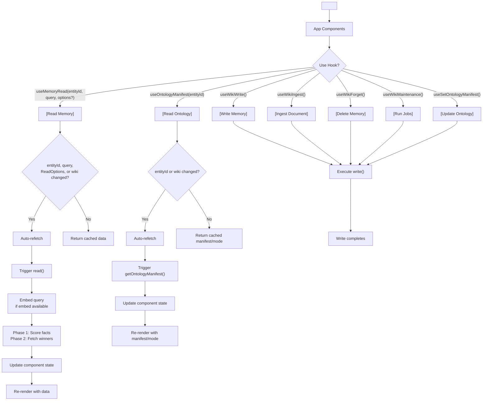
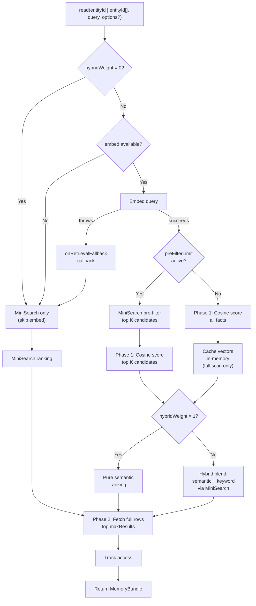

# @equationalapplications/react-llm-wiki

In-browser LLM memory for React web apps. Bring your own SQLite adapter (e.g., [`sql.js`](https://github.com/sql-js/sql.js) WebAssembly) for a complete, zero-server RAG experience.

[](https://www.npmjs.com/package/@equationalapplications/react-llm-wiki) [](https://www.npmjs.com/package/@equationalapplications/react-llm-wiki)
[](https://www.typescriptlang.org/)
[](https://github.com/equationalapplications/expo-llm-wiki/blob/main/packages/react/LICENSE)

**[GitHub](https://github.com/equationalapplications/expo-llm-wiki)** · **[ScopeLab](https://equationalapplications.github.io/expo-llm-wiki/scopelab/)** · **[WikiDemo](https://equationalapplications.github.io/expo-llm-wiki/wiki-demo/)** · **[Changelog](https://github.com/equationalapplications/expo-llm-wiki/blob/main/CHANGELOG.md)** · **[Issues](https://github.com/equationalapplications/expo-llm-wiki/issues)**

> Inspired by [Andrej Karpathy's LLM Wiki memory spec](https://gist.github.com/karpathy/442a6bf555914893e9891c11519de94f).

## Features

- **Semantic search** — Vector embeddings with optional `embed` function and MiniSearch fallback
- **Retrieval tuning** — Per-call overrides for hybrid scoring, pre-filtering, result limits, and tier weights
- **Multi-entity reads** — Search across multiple `entity_id` namespaces in one pass with `tierWeights` and optional `includeZeroWeightEntities`
- **Source provenance** — `WikiFact.source_type` distinguishes immutable document facts (`immutable_document`) from mutable derived/user facts (`librarian_inferred`, `user_stated`, `user_confirmed`). Immutable document facts are preserved from librarian/heal rewriting and only removed by `forget()` or by re-ingesting the source.
- **Seeded ontologies** — Enforce strict taxonomies or allow emergent graph relationship extraction (`useOntologyManifest`, `useSetOntologyManifest`; Strict, Emergent, or Off; defaults to Off).
- **Graph traversal (GraphRAG)** — Walk the knowledge graph N hops from a fact and format the result for LLM prompts (`useWikiTraversal`, `formatGraphContext`). This is the React-web surface of the GraphRAG retrieval layer; pair with `@equationalapplications/schema-org-llm-wiki` for the canonical ontology. See [root README: GraphRAG](../../README.md#graphrag-sql-only-graph-retrieval).
- **Reactive reads** — Auto-refetch on `entityId`, query, or `options` changes
- **Mutation hooks** — `useWikiWrite`, `useWikiIngest`, `useWikiForget`, `useWikiMaintenance`, `useSetOntologyManifest`, etc.
- **Shared context** — Single `WikiProvider` per app, use anywhere
- **Full-featured memory** — Facts, tasks, events, maintenance jobs (librarian, heal, reembed, prune)
- **Interoperability:** Supports [Open Knowledge Format (OKF) v0.1](https://github.com/GoogleCloudPlatform/knowledge-catalog/tree/main/okf) import and export.

## Installation

```bash
npm install @equationalapplications/react-llm-wiki
```

## Semantic Search Setup

Enable vector-based retrieval by providing an `embed` function in `WikiOptions`:

```typescript
import { WikiProvider, createWiki } from '@equationalapplications/react-llm-wiki';

const wiki = createWiki(adapter, {
  config: {
    preFilterLimit: 50,    // Optimize for wikis with 500+ facts
    hybridWeight: 0.7,     // Blend semantic (70%) + keyword (30%)
  },
  llmProvider: {
    generateText: async ({ systemPrompt, userPrompt }) => {
      // Your LLM
      return 'Model output';
    },
    maxOutputTokens: 4096, // optional — your model's output ceiling; lets maintenance passes size their LLM calls
    embed: async (text: string) => {
      // Your embedding service
      const res = await fetch('https://your-app.example.com/api/embed', { 
        method: 'POST', 
        body: JSON.stringify({ text }) 
      });
      const { embedding } = await res.json();
      return embedding; // number[]
    },
  },
  onRetrievalFallback: (error) => {
    console.warn('Embeddings unavailable, using keyword search:', error);
  },
});

await wiki.setup();

<WikiProvider wiki={wiki}>
  <App />
</WikiProvider>
```

## Setup

**React** (with any `SQLiteAdapter`):

```typescript
import { WikiProvider, createWiki } from '@equationalapplications/react-llm-wiki';

// Create wiki instance and initialize tables
const wiki = createWiki(adapter, options);
await wiki.setup();

// Wrap app
<WikiProvider wiki={wiki}>
  <App />
</WikiProvider>
```

**Expo / React Native** (`@equationalapplications/expo-llm-wiki` re-exports both `createWiki` and `WikiProvider`). See [`packages/expo/README.md`](https://github.com/equationalapplications/expo-llm-wiki/blob/main/packages/expo/README.md) for peer dependencies (`expo-sqlite`, `expo-crypto`).

```typescript
import { createWiki, WikiProvider } from '@equationalapplications/expo-llm-wiki';
import { openDatabaseSync } from 'expo-sqlite';

const db = openDatabaseSync('wiki.db');
const wiki = createWiki(db, options);
await wiki.setup();

<WikiProvider wiki={wiki}>
  <App />
</WikiProvider>
```

## Configuration

All `WikiConfig` fields are optional:

```typescript
const wiki = createWiki(adapter, {
  llmProvider: { /* ... */ },
  config: {
    tablePrefix: 'llm_wiki_',          // default: 'llm_wiki_'
    maxResults: 10,                    // default: 10
    autoLibrarianThreshold: 20,        // default: 20 — events before librarian auto-runs
    autoHealThreshold: 100,            // default: 100 — events before heal auto-runs
    maxChunkLength: 12000,             // default: 12000 (char count per ingestDocument chunk)
    chunkOverlap: 400,                 // default: 400 (overlap between chunks in characters)
    chunkConcurrency: 1,               // default: 1 (parallel LLM calls per ingestDocument)
    pruneRetainSoftDeletedFor: 7,      // default: 7 (days before hard-deleting soft-deleted facts)
    pruneEventsAfter: 30,              // default: 30 (days before hard-deleting old events)
    orphanAfterDays: 30,               // default: 30 (days before runHeal flags sourceless facts; null to disable)
    staleInferredAfterDays: 60,        // default: 60 (days before runHeal downgrades inferred facts; null to disable)
    preFilterLimit: 50,                // default: undefined — MiniSearch pre-filter before cosine scan; recommended for >500 facts
    hybridWeight: 0.7,                 // default: undefined — blend semantic (1.0) ↔ keyword (0.0); pure semantic when unset

    // Global prompt overrides — librarianSystemPrompt and healSystemPrompt apply to write() auto-runs;
    // ingestSystemPrompt applies only to explicit ingestDocument() calls.
    // ⚠ Overrides replace the entire default prompt, including the JSON output contract.
    // Your prompt must instruct the LLM to return the required JSON shape — see packages/core/README.md#prompt-management--overrides.
    prompts: {
      ingestSystemPrompt: `Extract core facts from this document: {{documentChunk}}\n\nReturn ONLY valid JSON: { "facts": [{ "title": "string", "body": "string", "tags": ["string"], "confidence": "certain|inferred|tentative" }] }. No markdown.`,
      librarianSystemPrompt: `Synthesize these thoughts into insights:\n{{events}}\n\nReturn ONLY valid JSON: { "facts": [{ "title": "string", "body": "string", "tags": ["string"], "confidence": "certain|inferred|tentative" }], "tasks": [{ "description": "string", "priority": 0 }] }. No markdown.`,
      healSystemPrompt: `Fix the memory graph based on these candidates: {{healCandidates}}\n\nReturn ONLY valid JSON: { "downgraded": ["factId"], "deleted": ["factId"], "newFacts": [{ "title": "string", "body": "string", "tags": ["string"], "confidence": "certain|inferred|tentative" }] }. No markdown.`,
    },
  },
});
```

## Retrieval Tuning

Optimize `read()` performance and blend retrieval strategies:

```typescript
const config = {
  // Limit cosine similarity scoring to top-K MiniSearch keyword candidates
  preFilterLimit: 50,
  
  // Blend semantic and keyword scores (0.0 = pure keyword, 1.0 = pure semantic)
  hybridWeight: 0.7,
  
  // Max results returned per read
  maxResults: 10,
};

const wiki = createWiki(adapter, {
  config,
  llmProvider: { /* ... */ },
});
```

**Hybrid scoring blends:**
- `hybridWeight: 1.0` → pure semantic scoring among the candidates being scored; if `preFilterLimit` is set, semantic scoring is still limited to the top-K MiniSearch matches
- `hybridWeight: 0.5` → balanced semantic + keyword (50/50 blend)
- `hybridWeight: 0.0` → pure keyword ranking, skips `embed()` entirely (no LLM API cost)

**Per-call overrides:**

```typescript
const { data } = useMemoryRead('user-123', 'preferences', {
  maxResults: 5,
  preFilterLimit: 20,      // Tighter pre-filter for speed
  hybridWeight: 0.5,       // More keyword weight
});

// Multi-entity hook — pass array entityId + tierWeights
const { data: multiData } = useMemoryRead(
  ['tier_wisdom', 'tier_fact', 'tier_working'],
  'preferences',
  {
    maxResults: 8,
    tierWeights: {
      tier_wisdom: 2,
      tier_fact: 1,
      tier_working: 0.25,
    },
    // includeZeroWeightEntities: true — include 0-weight entities as bottom-ranked filler
  }
);
// multiData?.factScores — Record<factId, weightedScore> | undefined (array entityId only, populated when query is non-empty and at least one fact scored)
// multiData?.metadata  — { query, entityIds, tierWeights }
```

## Hooks

### `useMemoryRead(entityId, query, options?)`

Fetch memory reactively. `entityId` accepts a string or string array for multi-entity reads. Auto-refetches when `entityId`, `query`, `wiki`, or `options` change on a behavioral level: `maxResults`, `preFilterLimit`, `hybridWeight`, and `tierWeights` are tracked. `tierWeights` entries at the default weight (`1.0`) are normalized to omission (passing `1.0` explicitly is spec-equivalent to omitting that key). `includeZeroWeightEntities: false` and `undefined` are equivalent in core (both skip zero-weight entities); only toggling to `true` triggers a refetch.

```typescript
const { data, isPending, error, refetch } = useMemoryRead('user-123', 'preferences');
// data: MemoryBundle | null

// Multi-entity
const { data: multi } = useMemoryRead(['tier_wisdom', 'tier_fact'], 'preferences');
// multi?.factScores, multi?.metadata available when entityId is array

if (isPending) return <div>Loading...</div>;
if (error) return <div>Error: {error.message}</div>;

return (
  <div>
    {data?.facts.map(fact => (
      <div key={fact.id}>
        <strong>{fact.title}</strong>: {fact.body}
      </div>
    ))}
  </div>
);
```

**With tuning overrides:**

```typescript
const { data } = useMemoryRead('user-123', 'preferences', {
  maxResults: 5,
  hybridWeight: 0.8,
});
```

### `useWikiWrite()`

Record observations and events. The librarian job extracts facts from accumulated events. This does not currently invalidate `useMemoryRead()` results automatically, so existing readers keep their previous `data` until their inputs change or `refetch()` is called.

```typescript
const { execute, isPending, error } = useWikiWrite();

const handleSave = async () => {
  try {
    await execute('user-123', { 
      event_type: 'observation', 
      summary: 'User prefers async/await' 
    });
  } catch (e) {
    console.error('Write failed:', e);
  }
};

return <button onClick={handleSave} disabled={isPending}>Save</button>;
```

### `useWikiIngest()`

Ingest documents into memory. Parses facts and tasks from document chunks.

```typescript
const { execute, isPending, error } = useWikiIngest();

const handleIngest = async (document: string) => {
  const sourceHash = await calculateHash(document);
  try {
    await execute('user-123', {
      sourceRef: 'doc-readme',
      sourceHash,
      documentChunk: document,
      // Optional: runtime override for this specific ingest call only.
      // Must include the JSON output contract — overrides replace the entire default prompt.
      promptOverride: `Strict technical extraction. Focus on APIs: {{documentChunk}}\n\nReturn ONLY valid JSON: { "facts": [{ "title": "string", "body": "string", "tags": ["string"], "confidence": "certain|inferred|tentative" }] }. No markdown.`,
    });
  } catch (e) {
    console.error('Ingest failed:', e);
  }
};
```

### `useWikiForget()`

Delete entries from memory by ID.

```typescript
const { execute, isPending, error } = useWikiForget();

const handleDelete = async (factId: string) => {
  try {
    await execute('user-123', { entryId: factId });
  } catch (e) {
    console.error('Delete failed:', e);
  }
};
```

### `useWikiMaintenance()`

Run background maintenance jobs: librarian (deduplication/fact extraction), heal (LLM-driven fact review: removes orphaned facts, downgrades stale inferences, repairs incorrect facts), reembed (convert TEXT embeddings to BLOB / update after model change), prune (hard-delete soft-deleted entries/tasks after the retention window and prune old events).

```typescript
const { runLibrarian, runHeal, runReembed, runPrune, isPending, error, lastResult } = useWikiMaintenance();

// Deduplicate and consolidate facts from events
await runLibrarian('user-123');

// Run with a one-off runtime override (applies only to this call, not future auto-runs).
// Must include the JSON output contract — overrides replace the entire default prompt.
await runLibrarian('user-123', {
  promptOverride: `One-off extraction task:\n{{events}}\n\nReturn ONLY valid JSON: { "facts": [{ "title": "string", "body": "string", "tags": ["string"], "confidence": "certain|inferred|tentative" }], "tasks": [{ "description": "string", "priority": 0 }] }. No markdown.`,
});

// LLM-driven fact review: remove orphaned/stale facts, repair incorrect inferences
await runHeal('user-123');

// Re-embed all facts with the current provider (e.g. after switching models or
// enabling an embed provider for the first time — default always re-embeds all):
const { embedded, skipped, failed } = await runReembed('user-123');
// After a round-trip export/import on the same model, skip facts that already have vectors:
const { embedded: embeddedRoundtrip, skipped: skippedRoundtrip, failed: failedRoundtrip } = await runReembed('user-123', { skipExisting: true });

// Hard-delete soft-deleted entries/tasks after retention and prune old events
await runPrune('user-123');
```

> **`lastResult` note**: `runLibrarian`, `runHeal`, and `runPrune` each update `lastResult` on success. `runReembed` intentionally does not — it clears `lastResult` to null at start but leaves it null on completion. This avoids a source-breaking change to the `MaintenanceResult` type for consumers that exhaustively switch on `lastResult.operation`. Use the `Promise` return value to inspect reembed results.

### `useWikiHasChanged()`

Check if a source document has changed since last ingest.

```typescript
const { execute, lastResult, isPending, error } = useWikiHasChanged();

const handleCheckChanges = async (sourceRef: string, sourceHash: string) => {
  const changed = await execute('user-123', sourceRef, sourceHash);
  if (changed) {
    console.log('Document has been updated, re-ingest recommended');
  }
};
```

### `useWikiExport()`

Export memory dump.

```typescript
const { execute, lastResult, isPending, error } = useWikiExport();
await execute(['user-123']);
// lastResult: MemoryDump | null
```

### `useEntityStatus(entityId)`

Live status for an entity's background jobs (ingest, librarian, heal). Updates whenever a transition occurs — no polling.

```typescript
const { ingesting, librarian, heal } = useEntityStatus('user-123');

if (ingesting || librarian || heal) {
  return <Spinner label={ingesting ? 'Ingesting…' : librarian ? 'Organizing…' : 'Healing…'} />;
}
```

### `useOntologyManifest(entityId)`

Reactive read — fetches on mount and when `entityId` or `wiki` changes:

```typescript
import { useOntologyManifest } from '@equationalapplications/react-llm-wiki';

const { manifest, mode, isPending, error, refetch } = useOntologyManifest('user-123');
// manifest: OntologyManifest | null
// mode: OntologyMode | null ('strict' | 'emergent' | 'off' when present)
```

Note: `manifest` and `mode` are `null` when the entity has no persisted or seeded manifest (`getOntologyManifest` returned `null`). Call `refetch()` after mutations to refresh.

### `useSetOntologyManifest()`

Mutation — same `{ execute, isPending, error, lastResult }` contract as `useWikiWrite`:

```typescript
import { useOntologyManifest, useSetOntologyManifest } from '@equationalapplications/react-llm-wiki';

export function OntologySettings({ entityId }: { entityId: string }) {
  const { manifest, mode, refetch } = useOntologyManifest(entityId);
  const { execute, isPending, error } = useSetOntologyManifest();

  const handleSave = async () => {
    await execute(entityId, {
      node_types: [{ type: 'person', description: 'An individual.' }],
      edge_types: [{
        type: 'reports_to',
        source_type: 'person',
        target_type: 'person',
        description: 'Reporting hierarchy.',
      }],
    }, { mode: 'strict' });
    refetch();
  };

  // render manifest/mode; wire handleSave to a save button
}
```

Global defaults and `seedManifests` bootstrap are configured at construction time via `createWiki(..., { config: { ontology: ... } })`. See the [core package README § Per-Entity Seeded Ontology](https://github.com/equationalapplications/expo-llm-wiki/blob/main/packages/core/README.md#per-entity-seeded-ontology) for mode semantics and manifest schema.

`useSetOntologyManifest` does not automatically refresh `useOntologyManifest` — call `refetch()` after a successful `execute()`, same as `useWikiWrite` + `useMemoryRead`.

### `useWikiTraversal(entityId, options)`

Reactive read — fetches on mount and whenever `entityId` or `options` change. Walks the knowledge graph N hops outward from a fact (`options.sourceId`) using edges written by `runLibrarian()`/`ingestDocument()`'s Seeded Ontology extraction pass:

```typescript
import { useWikiTraversal, formatGraphContext } from '@equationalapplications/react-llm-wiki';

const { nodes, edges, isPending, error, refetch } = useWikiTraversal('user-123', {
  sourceId: 'fact_42',
  maxDepth: 2,
  direction: 'both',
});

const promptContext = formatGraphContext({ nodes, edges });
```

- `maxDepth` is clamped to `[1, 3]` regardless of input.
- `edgeTypes: []` (explicit empty array) matches nothing; omitting it matches all edge types.
- Defaults (`maxTraversalNodes`, `minTraversalConfidence`, `traversalDirection`, `excludeSourceTypes`) can be set globally via `createWiki(..., { config: { maxTraversalNodes: 20, ... } })` and overridden per-call.
- `formatGraphContext()` is a pure function — call it with the hook's `{ nodes, edges }` to get a dense text block suitable for prompt injection.

## Multi-Entity Reads

`useMemoryRead` accepts a single entity ID or an array to search across namespaces in one pass. Pass `tierWeights` to apply per-entity score multipliers before the global top-K slice:

```typescript
const { data } = useMemoryRead(
  ['tier_wisdom', 'tier_fact', 'tier_working'],
  'What are my preferences?',
  {
    maxResults: 8,
    tierWeights: {
      tier_wisdom: 2,      // boost curated notes 2×
      tier_fact: 1,        // neutral
      tier_working: 0.25,  // downrank unvetted context
    },
  }
);

if (data) {
  console.log(data.facts);      // merged, globally ranked
  console.log(data.factScores); // Record<factId, weightedScore>
  console.log(data.metadata);   // { query, entityIds, tierWeights }
}

For full details on `{{mustache}}` prompt templating and the strict distinction between global auto-runs and runtime overrides, see [Prompt Management & Overrides](https://github.com/equationalapplications/expo-llm-wiki/blob/main/packages/core/README.md#prompt-management--overrides) in `@equationalapplications/core-llm-wiki`.

## Component Lifecycle



**Data flow:**
1. **Wrap app** with `<WikiProvider wiki={wiki}>` — provides wiki context
2. **Use hooks** in components — access memory reactively
3. **Read operations** auto-refetch when `entityId`, `query`, `wiki`, or `ReadOptions` values change; call `refetch()` to refresh manually
4. **Ontology reads** auto-refetch when `entityId` or `wiki` changes; call `refetch()` manually after ontology mutations
5. **Write operations** (write, ingest, forget, maintenance) do not automatically re-trigger `useMemoryRead`; call `refetch()` after a write to refresh read results
6. **Ontology writes** (`useSetOntologyManifest`) do not automatically re-trigger `useOntologyManifest` in the same component unless `refetch()` is called after `execute()` succeeds
7. **Re-render** with new data flowing back to UI

## Retrieval Engine Internals



The flowchart shows:
1. **Fast-path** when `hybridWeight = 0` (pure keyword, no embed cost)
2. **Fallback chain** when embed unavailable (MiniSearch silently) or throws (`onRetrievalFallback` callback, then MiniSearch)
3. **Pre-filtering** to limit cosine scoring to top-K keyword matches (O(N) → O(K))
4. **Two-phase SELECT**: phase 1 scores all/filtered facts with minimal columns, phase 2 fetches full rows for winners
5. **Hybrid scoring** to blend semantic and keyword rankings
6. **Vector caching** on full scans only; reads with `preFilterLimit` active skip cache population

## Monorepo Ecosystem

| Package | Purpose |
| ----- | ----- |
| [@equationalapplications/core-llm-wiki](https://github.com/equationalapplications/expo-llm-wiki/blob/main/packages/core/README.md) | Persistent episodic memory |
| [@equationalapplications/expo-llm-wiki](https://github.com/equationalapplications/expo-llm-wiki/blob/main/packages/expo/README.md) | Persistent episodic memory for Expo/React Native |
| [**@equationalapplications/react-llm-wiki**](https://github.com/equationalapplications/expo-llm-wiki/blob/main/packages/react/README.md) | Persistent episodic memory for Web |
| [@equationalapplications/prisma-outbox](https://github.com/equationalapplications/expo-llm-wiki/blob/main/packages/prisma-outbox/README.md) | Sync SQLite outbox events to Prisma |
| [@equationalapplications/core-llm-tools](https://github.com/equationalapplications/expo-llm-wiki/blob/main/packages/core-llm-tools/README.md) | Gemini tool schemas and capability injector |
| [@equationalapplications/core-okf](https://github.com/equationalapplications/expo-llm-wiki/blob/main/packages/okf/README.md) | Zero-dependency Open Knowledge Format (OKF) v0.1 primitives — parse and produce interoperable knowledge bundles. |
| [@equationalapplications/schema-org-llm-wiki](https://github.com/equationalapplications/expo-llm-wiki/blob/main/packages/schema-org/README.md) | Curated schema.org warm-agent ontology manifest |

## License

MIT

---

Made with ❤️ by Equational Applications LLC. [https://equationalapplications.com/](https://equationalapplications.com/)