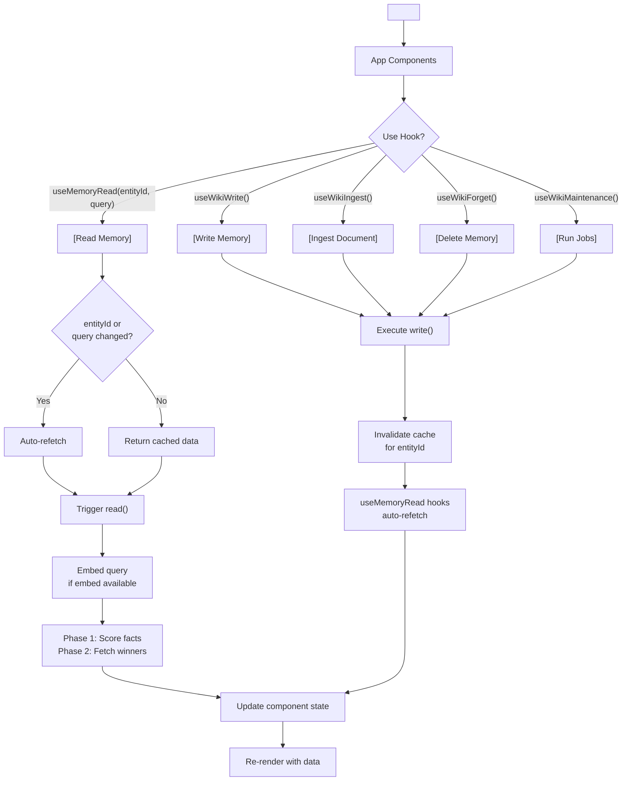
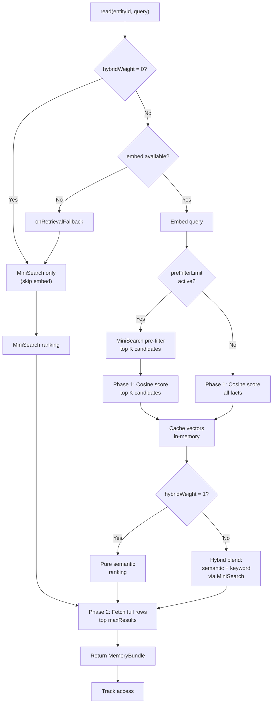

# @equationalapplications/react-llm-wiki

React hooks and web utilities for @equationalapplications/core-llm-wiki, designed for web and Expo.

> Inspired by [Andrej Karpathy's LLM Wiki memory spec](https://gist.github.com/karpathy/442a6bf555914893e9891c11519de94f).

## Features

- **Semantic search** — Vector embeddings with optional `embed` function and MiniSearch fallback
- **Retrieval tuning** — Per-call overrides for hybrid scoring, pre-filtering, result limits
- **Reactive reads** — Auto-refetch on `entityId` or query changes
- **Mutation hooks** — `useWikiWrite`, `useWikiIngest`, `useWikiForget`, `useWikiMaintenance`, etc.
- **Shared context** — Single `WikiProvider` per app, use anywhere
- **Full-featured memory** — Facts, tasks, events, maintenance jobs (librarian, heal, reembed, prune)

## Installation

```bash
npm install @equationalapplications/react-llm-wiki
```

## Semantic Search Setup

Enable vector-based retrieval by providing an `embed` function in `WikiOptions`:

```typescript
import { WikiProvider, createWiki } from '@equationalapplications/react-llm-wiki';

const wiki = createWiki(adapter, {
  config: {
    preFilterLimit: 50,    // Optimize for wikis with 500+ facts
    hybridWeight: 0.7,     // Blend semantic (70%) + keyword (30%)
  },
  llmProvider: {
    generateText: async ({ systemPrompt, userPrompt }) => {
      // Your LLM
      return 'Model output';
    },
    embed: async (text: string) => {
      // Your embedding service
      const res = await fetch('/api/embed', { 
        method: 'POST', 
        body: JSON.stringify({ text }) 
      });
      const { embedding } = await res.json();
      return embedding; // Float32Array or number[]
    },
  },
  onRetrievalFallback: (error) => {
    console.warn('Embeddings unavailable, using keyword search:', error);
  },
});

await wiki.setup();

<WikiProvider wiki={wiki}>
  <App />
</WikiProvider>
```

## Setup

**React** (with any `SQLiteAdapter`):

```typescript
import { WikiProvider, createWiki } from '@equationalapplications/react-llm-wiki';

// Create wiki instance and initialize tables
const wiki = createWiki(adapter, options);
await wiki.setup();

// Wrap app
<WikiProvider wiki={wiki}>
  <App />
</WikiProvider>
```

**Expo / React Native** (`@equationalapplications/expo-llm-wiki` re-exports both `createWiki` and `WikiProvider`):

```typescript
import { createWiki, WikiProvider } from '@equationalapplications/expo-llm-wiki';
import { openDatabaseSync } from 'expo-sqlite';

const db = openDatabaseSync('wiki.db');
const wiki = createWiki(db, options);
await wiki.setup();

<WikiProvider wiki={wiki}>
  <App />
</WikiProvider>
```

## Retrieval Tuning

Optimize `read()` performance and blend retrieval strategies:

```typescript
const config = {
  // Limit cosine similarity scoring to top-K MiniSearch keyword candidates
  preFilterLimit: 50,
  
  // Blend semantic and keyword scores (0.0 = pure keyword, 1.0 = pure semantic)
  hybridWeight: 0.7,
  
  // Max results returned per read
  maxResults: 10,
};

const wiki = createWiki(adapter, {
  config,
  llmProvider: { /* ... */ },
});
```

**Hybrid scoring blends:**
- `hybridWeight: 1.0` → pure semantic ranking (full cosine scan)
- `hybridWeight: 0.5` → balanced semantic + keyword (50/50 blend)
- `hybridWeight: 0.0` → pure keyword ranking, skips `embed()` entirely (no LLM API cost)

**Per-call overrides:**

```typescript
const { data } = useMemoryRead('user-123', 'preferences', {
  maxResults: 5,
  preFilterLimit: 20,      // Tighter pre-filter for speed
  hybridWeight: 0.5,       // More keyword weight
});
```

## Hooks

### `useMemoryRead(entityId, query, options?)`

Fetch memory reactively. Auto-refetches when `entityId` or `query` change.

```typescript
const { data, isPending, error, refetch } = useMemoryRead('user-123', 'preferences');

if (isPending) return <div>Loading...</div>;
if (error) return <div>Error: {error.message}</div>;

return (
  <div>
    {data?.facts.map(fact => (
      <div key={fact.id}>
        <strong>{fact.title}</strong>: {fact.body}
      </div>
    ))}
  </div>
);
```

**With tuning overrides:**

```typescript
const { data } = useMemoryRead('user-123', 'preferences', {
  maxResults: 5,
  hybridWeight: 0.8,
});
```

### `useWikiWrite()`

Record observations and events. The librarian job extracts facts from accumulated events. Invalidates cached reads for that entity.

```typescript
const { execute, isPending, error } = useWikiWrite();

const handleSave = async () => {
  try {
    await execute('user-123', { 
      event_type: 'observation', 
      summary: 'User prefers async/await' 
    });
  } catch (e) {
    console.error('Write failed:', e);
  }
};

return <button onClick={handleSave} disabled={isPending}>Save</button>;
```

### `useWikiIngest()`

Ingest documents into memory. Parses facts and tasks from document chunks.

```typescript
const { execute, isPending, error } = useWikiIngest();

const handleIngest = async (document: string) => {
  const sourceHash = await calculateHash(document);
  try {
    await execute('user-123', {
      sourceRef: 'doc-readme',
      sourceHash,
      documentChunk: document,
    });
  } catch (e) {
    console.error('Ingest failed:', e);
  }
};
```

### `useWikiForget()`

Delete entries from memory by ID.

```typescript
const { execute, isPending, error } = useWikiForget();

const handleDelete = async (factId: string) => {
  try {
    await execute('user-123', { entryId: factId });
  } catch (e) {
    console.error('Delete failed:', e);
  }
};
```

### `useWikiMaintenance()`

Run background maintenance jobs: librarian (deduplication/fact extraction), heal (repair corrupted embeddings), reembed (convert TEXT embeddings to BLOB / update after model change), prune (remove stale facts).

```typescript
const { runLibrarian, runHeal, runReembed, runPrune, isPending, error } = useWikiMaintenance();

// Deduplicate and consolidate facts from events
await runLibrarian('user-123');

// Repair corrupted embeddings
await runHeal('user-123');

// Backfill BLOB embeddings or update after changing embedding model
const { embedded, skipped } = await runReembed('user-123');

// Remove stale/old facts
await runPrune('user-123');
```

### `useWikiHasChanged()`

Check if a source document has changed since last ingest.

```typescript
const { execute, lastResult, isPending, error } = useWikiHasChanged();

const handleCheckChanges = async (sourceRef: string, sourceHash: string) => {
  const changed = await execute('user-123', sourceRef, sourceHash);
  if (changed) {
    console.log('Document has been updated, re-ingest recommended');
  }
};
```

### `useWikiExport()`

Export memory dump.

```typescript
const { execute, lastResult, isPending, error } = useWikiExport();
await execute(['user-123']);
// lastResult: MemoryDump | null
```

## Component Lifecycle



**Data flow:**
1. **Wrap app** with `<WikiProvider wiki={wiki}>` — provides wiki context
2. **Use hooks** in components — access memory reactively
3. **Read operations** auto-refetch when `entityId` or `query` change
4. **Write operations** (write, ingest, forget, maintenance) invalidate cache for that `entityId`
5. **Other components'** `useMemoryRead` hooks for same `entityId` auto-refetch on invalidation
6. **Re-render** with new data flowing back to UI

## Retrieval Engine Internals



The flowchart shows:
1. **Fast-path** when `hybridWeight = 0` (pure keyword, no embed cost)
2. **Fallback chain** when embed unavailable (MiniSearch via `onRetrievalFallback`)
3. **Pre-filtering** to limit cosine scoring to top-K keyword matches (O(N) → O(K))
4. **Two-phase SELECT**: phase 1 scores all/filtered facts with minimal columns, phase 2 fetches full rows for winners
5. **Hybrid scoring** to blend semantic and keyword rankings
6. **Vector caching** of parsed embeddings to avoid re-parsing on repeated reads

## License

MIT

---

Made with ❤️ by Equational Applications LLC. [https://equationalapplications.com/](https://equationalapplications.com/)